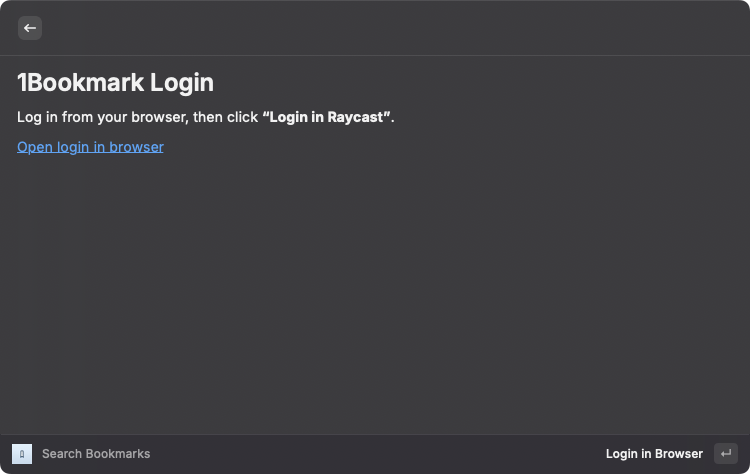
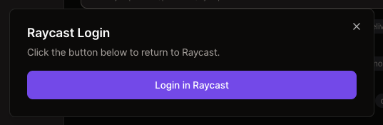

# 1Bookmark - Raycast Extension

One Bookmark Solution for Teams and Personal Use.

The Raycast extension focuses on searching and adding bookmarks. The 1bookmark Desktop app is the main client and covers the rest, including space management and importing bookmarks from browsers.

## Commands

- Search Bookmarks: Search bookmarks and open them.
- Add Bookmark: Create a new bookmark.
- Import Bookmarks: Points you to the 1bookmark Desktop app.

Space details, members, tags, invitation links and member auth policies are managed in the 1bookmark Desktop app, along with creating, leaving and deleting a space. The **Manage Space** and **Add New Space** actions in the Spaces view point you there. Signing in with more than one account is also done in the Desktop app, from **My Account** -> **Add Account**.

## What can you do in 1Bookmark?

**Super Easy, Super Simple**
- Manage your bookmarks simply without complicated settings. The intuitive interface makes it easy for anyone to use.
- Find your bookmarks faster than any other tool.

**Manage your team's bookmarks**
- Share and manage bookmarks with your team members. Collaboration becomes easier.
- Of course, we also provide excellent support for personal use.

**Cross-platform**
- Browser independent. Provides the same experience on any browser.

## Sign-Up and Sign-In

Currently, 1Bookmark supports email login and there is no separate SignUp process.

When you first enter the Raycast 1Bookmark extension, you will see the login view below. Press Enter (or click **"Open login in browser"**) to sign in on the 1Bookmark website.

After signing in on the website, click the **"Login in Raycast"** button to return to Raycast as a signed-in user.

## Sign-Out

You can sign out by **'My Account'** -> **'Sign Out'** Action in Action Panel.

## Features

- Search and open bookmarks
- Add new bookmarks by one shortcut key
- Share bookmarks with your team
- Filter bookmarks by tags, spaces, and creators
- Choose which spaces are searched

## Advanced Search Pattern

You can use special characters in your search query to filter results:

- `!space` - Filter by space name. Example: `!raycast api` searches for "api" in the "raycast" space
- `@user` - Filter by bookmark creator name. Example: `@john documentation` searches for "documentation" created by "john"
- `#tag` - Filter by tag. Example: `#dev tools` searches for "tools" with the "dev" tag
- `##text` - Escape: search for the literal `#text` (e.g. `##general` to find a Slack channel name)

This allows you to first narrow down your bookmarks by space, creator, or tag, and then find specific items within that filtered set. The filtering and searching are handled by separate systems, making the process more efficient and the results more accurate.

You can combine multiple filters:
- `!raycast #api @john documentation` searches for "documentation" in the "raycast" space with the "api" tag created by "john"
