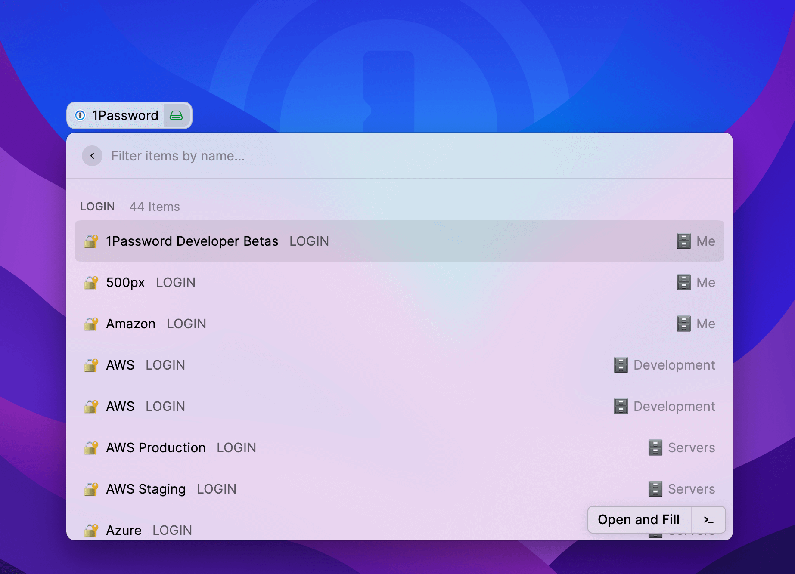

# 1Password extension for Raycast

An extension for [Raycast](https://www.raycast.com) that integrates with 1Password 8.

## Setup

You'll need to perform the following steps to use this extension:

- Install [1Password 8 for Mac](https://1password.com/downloads/mac/#beta-downloads).
- Install the [1Password CLI](https://developer.1password.com/docs/cli/get-started) and enable integration with the 1Password app under 1Password > Preferences > Developer.
- Install and run [opbookmarks](https://github.com/dteare/opbookmarks) to export your item metadata.

## Capabilties

Open in your default browser, view items in 1Password, and open items in 1Password for editing.
