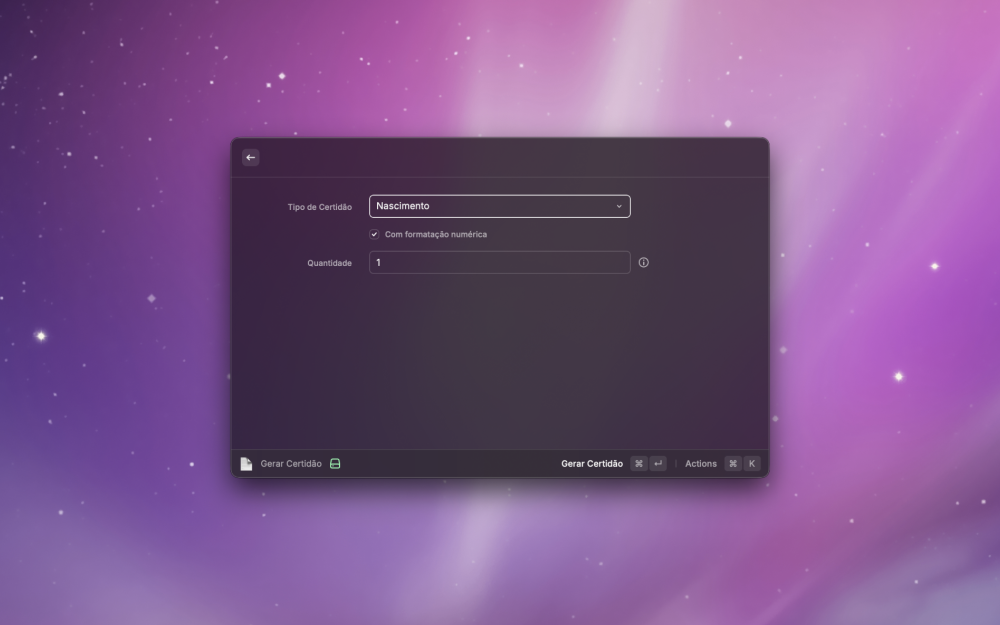

# 4Devs Toolkit for Raycast

Generate valid Brazilian documents and test data directly from Raycast.

## ⚠️ Disclaimer

**This is an UNOFFICIAL extension, not affiliated with [4Devs](https://www.4devs.com.br/).**

This project is a tribute to the excellent work of the 4Devs team, who since 2012 have been helping thousands of Brazilian developers with their free tools. This extension brings some of these functionalities to Raycast, allowing quick access without leaving your workflow.

Visit the official website at [www.4devs.com.br](https://www.4devs.com.br/) to access all the original and complete tools.

## 🎯 Features

### Document Generators
- **CPF**: Generate valid CPF numbers with state-based validation
- **CNPJ**: Generate valid CNPJ numbers for companies
- **CNH**: Generate valid driver's license numbers
- **Certidão**: Generate certificate registration numbers (birth, marriage, death)
- **Credit Card**: Generate valid test credit card numbers (Visa, MasterCard, etc.)

### Additional Features
- 📋 **History**: Keep track of generated documents
- ⭐ **Favorites**: Mark frequently used documents
- 🔄 **Batch Generation**: Generate up to 50 documents at once
- 📊 **Export**: Export in JSON, CSV, or plain text
- 🎭 **Formatting**: With or without mask/punctuation

## 📸 Screenshots




## 🚀 Installation

### Via Raycast Store (Recommended)
1. Open Raycast
2. Search for "4Devs Toolkit"
3. Click Install

### Manual
```bash
git clone https://github.com/thalysguimaraes/4devs-raycast.git
cd 4devs-raycast
npm install
npm run build
npm run publish
```

## 💻 Usage

### Generate CPF
1. Open Raycast (`⌘ Space`)
2. Type "Generate CPF"
3. Choose state (optional)
4. Press `⌘↵` to generate

### Batch Generation
1. In the "Quantity" field, enter desired number (max: 50)
2. Result will be copied in JSON/CSV/Text format

### Keyboard Shortcuts
| Action | Shortcut |
|--------|----------|
| Generate | `⌘↵` |
| Copy | `⌘C` |
| Paste | `⌘V` |
| Favorite | `⌘F` |
| Delete from History | `⌘⌫` |

## 🛠 Development

```bash
# Install dependencies
npm install

# Run in development mode
npm run dev

# Build extension
npm run build

# Run linter
npm run lint
```

## 🤝 Contributing

Contributions are welcome! Please:

1. Fork the repository
2. Create your feature branch (`git checkout -b feature/NewFeature`)
3. Commit your changes (`git commit -m 'Add: New feature'`)
4. Push to the branch (`git push origin feature/NewFeature`)
5. Open a Pull Request

## 📝 Credits

- **Inspiration**: [4Devs](https://www.4devs.com.br/) - The original website with all tools
- **Platform**: [Raycast](https://raycast.com/) - For making extensions like this possible
- **Community**: All Brazilian developers who use and support open source tools

## 🙏 Acknowledgments

Special thanks to the 4Devs team for creating and maintaining such useful tools for the Brazilian developer community for over a decade. This project is a tribute to the incredible work you do.

If you find these tools useful, visit [4Devs](https://www.4devs.com.br/) and consider supporting the original project.

## 📜 License

MIT - See [LICENSE](LICENSE) file for details.

---

**Note**: Generated documents are valid for TESTING and DEVELOPMENT only. Do not use for illegal or fraudulent activities.

Made with ❤️ for the Brazilian developer community