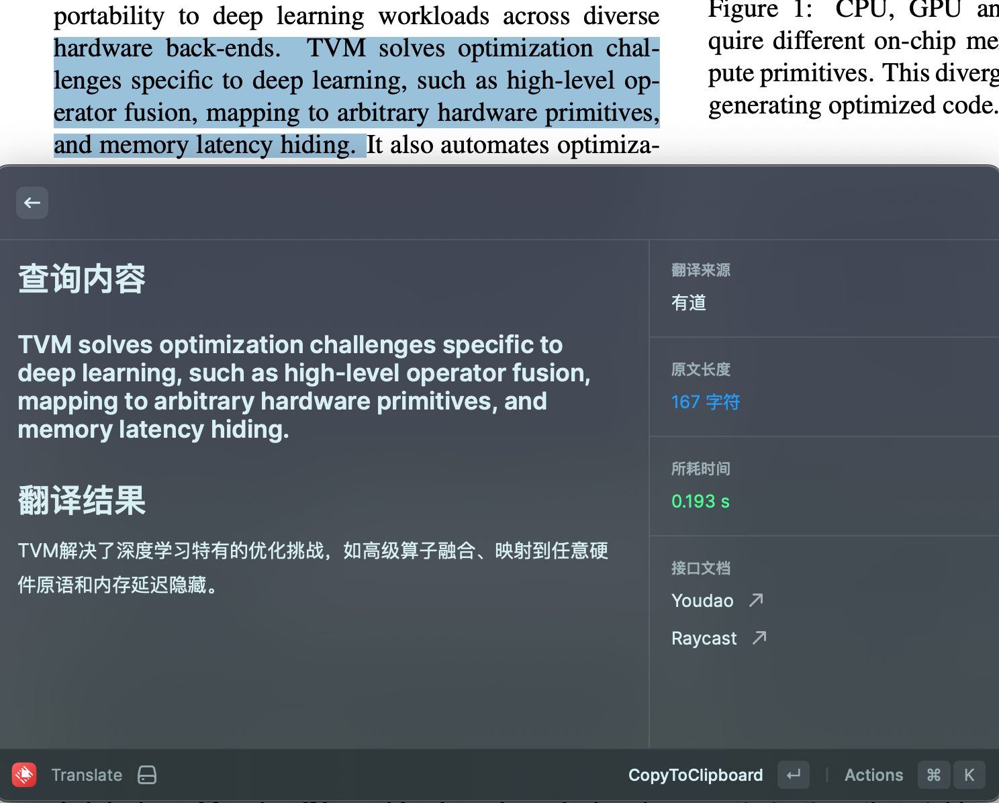

# AcT

 It's  an advanced translation extension tailored for academic and technology texts. Key features include direct text selection from various sources including PDFs, automatic special character filtering, instant translation result saving to the clipboard, and storage of translations in local cache for easy access. Ideal for researchers, technologists, and students, it simplifies and accelerates your translation tasks, ensuring productivity and accuracy.

single word translation as following:

selected sentence translation as following:

ß