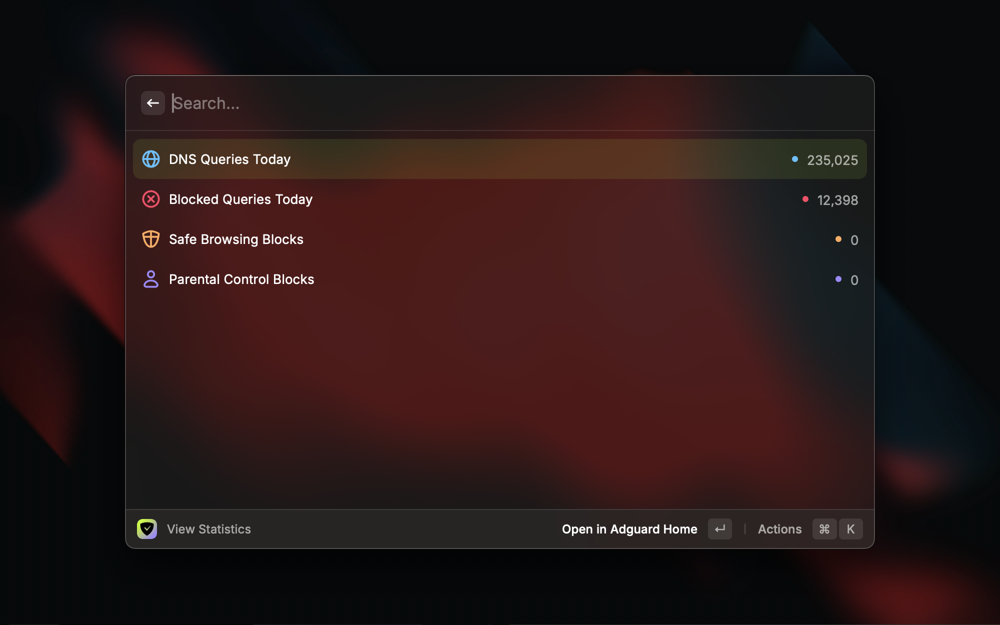
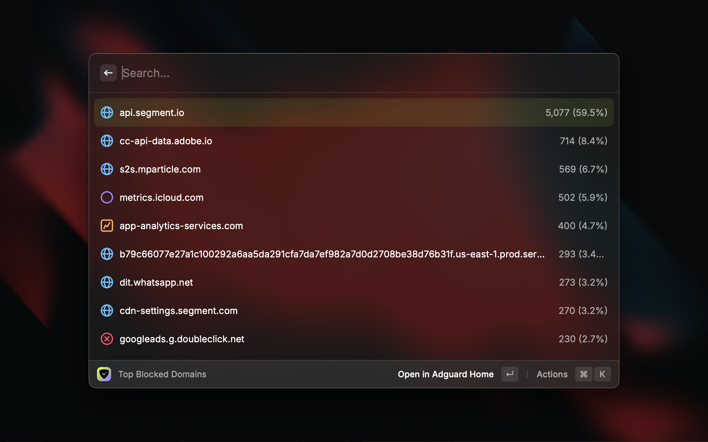
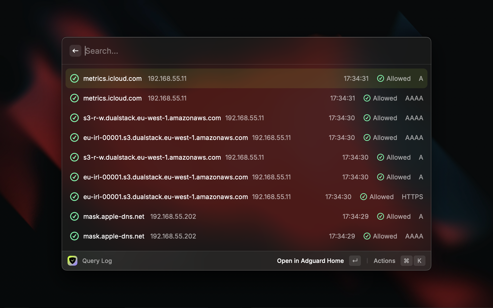
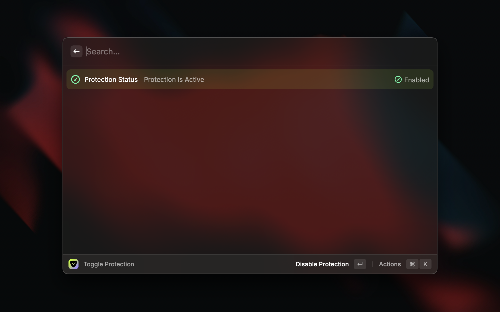

# AdGuard Home Control for Raycast

Control your AdGuard Home instance directly from Raycast. Monitor DNS queries, manage filtering rules, and toggle protection with ease.

## Features

- 🔄 Toggle AdGuard Home protection on/off
- 🔄 Snooze AdGuard Home protection for a specified duration
- 📊 View DNS query statistics and metrics
- 📝 View and manage custom filtering rules
- 📋 Browse recent DNS query logs
- 📈 Monitor top clients, domains, and blocked domains
- 🔄 Auto-refresh capability for nearreal-time monitoring
- 🔒 Secure authentication with your AdGuard Home credentials

## Commands

- **Toggle Protection**: Quickly enable or disable AdGuard Home protection
- **Snooze Protection**: Snooze AdGuard Home protection for a specified duration
- **View Statistics**: See current DNS query statistics
- **Top Clients**: View most active DNS clients
- **Top Queried Domains**: See most queried domain names
- **Top Blocked Domains**: Monitor frequently blocked domains
- **Top Upstreams**: View most used upstream DNS servers
- **Query Log**: Browse recent DNS query history
- **Manage Rules**: Add or remove custom filtering rules

## Installation

1. Install the extension from the Raycast Store
2. Configure your AdGuard Home connection:
   - Server URL (e.g., `http://localhost:3000`)
   - Username
   - Password

## Configuration

The extension requires the following preferences to be set:

- **Server URL**: Your AdGuard Home server URL (including protocol and port)
- **Username**: Your AdGuard Home username
- **Password**: Your AdGuard Home password

## Usage

1. Open Raycast
2. Search for "AdGuard" to see available commands
3. Select desired command to execute

## Keyboard Shortcuts

- `⌘ R`: Refresh data
- `⌘ ⇧ R`: Toggle auto-refresh
- `⌘ K`: Open command palette

## Requirements

- AdGuard Home instance with API access
- Valid credentials for authentication
- Network access to your AdGuard Home server

## Screenshots

## License

MIT License - see LICENSE file for details 
