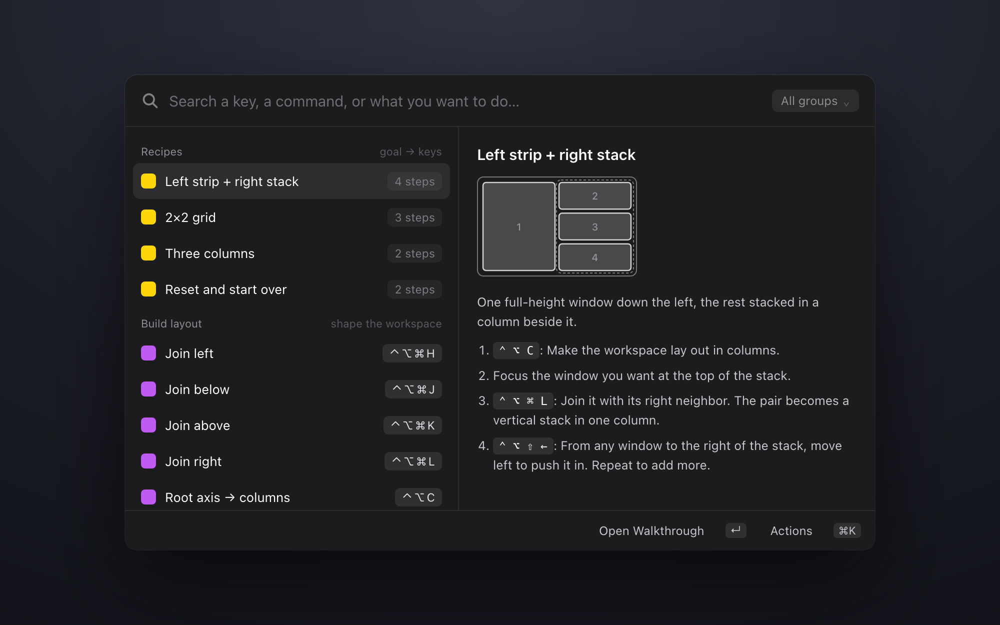
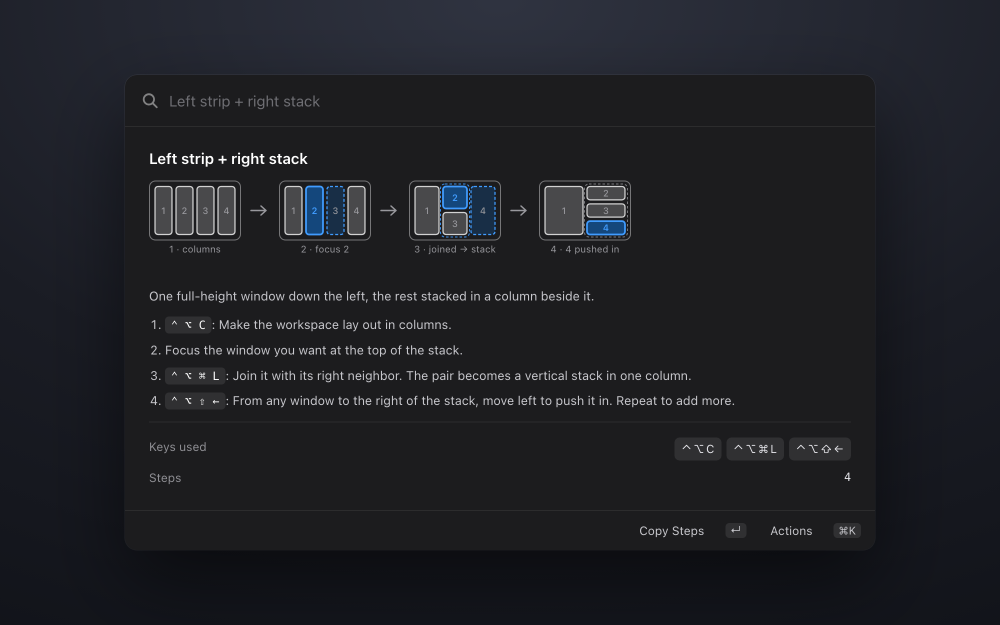
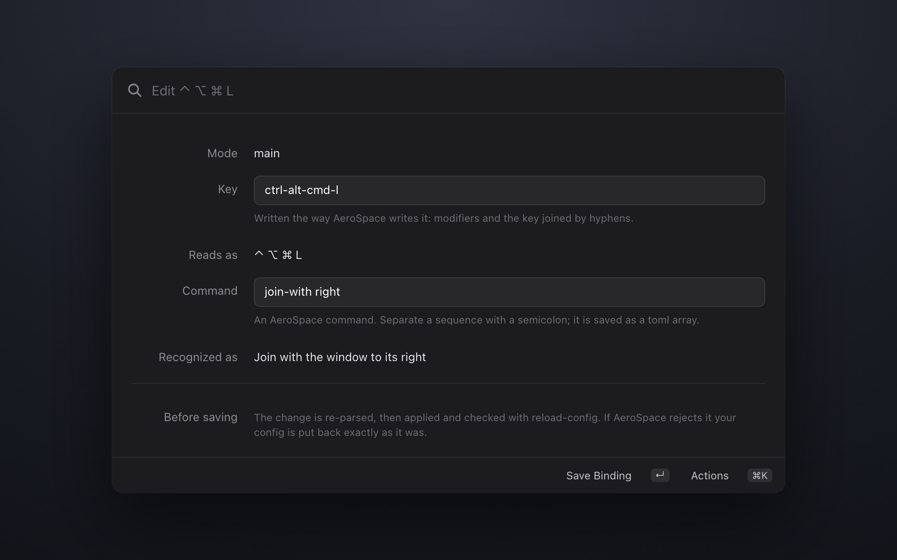

# AeroSpace Cheatsheet

**Look up, learn, run, and edit your [AeroSpace](https://nikitabobko.github.io/AeroSpace/) keybindings, from Raycast.**

It reads your own `aerospace.toml`. Every key it shows is a key you actually have, so it
works the same whether you run the defaults, a config you inherited from someone, or
your own bindings.

## Commands

| Command | What it does |
|---|---|
| AeroSpace Cheatsheet | Your bindings, grouped and named, with diagrams, recipes, and in-place editing |
| Go to Workspace | Switch workspace, showing which apps are on each |
| Switch Windows | Every window grouped by workspace: focus it, pull it here, tile or float it |
| Move Window to Workspace | Send the focused window somewhere, creating the workspace if the name is new |
| Bring Workspace to This Display | Pull a workspace onto the screen you are looking at |
| Toggle AeroSpace | Pause or resume tiling, for screen sharing or an app that fights it |
| Reload AeroSpace Config | Re-read `aerospace.toml`, checking it parses first |
| Show AeroSpace Config | The raw `toml`, syntax-highlighted, with a jump to your editor |
| AeroSpace Menu Bar | Current workspace plus common layout actions |

## The cheatsheet

**Readable names.** A row says "Send window to workspace 1–9", not
`move-node-to-workspace 1`. The raw command is still there in the detail panel when
you want it.

**Real key glyphs.** `ctrl-alt-cmd-l` renders as `⌃ ⌥ ⌘ L`, thin-spaced so the
modifiers don't smear together, and reordered into macOS order. `alt-ctrl-a` and
`ctrl-alt-a` both come out as `⌃ ⌥ A`.

**Less to read.** A config is mostly repetition: arrows and `hjkl` on the same command,
a nine-long run of workspace switches, mirrored `±50` resizes. Three rules collapse it.

| Rule | Example | Becomes |
|---|---|---|
| One command, several keys | `ctrl-alt-left` and `ctrl-alt-h` | one row, second key muted |
| Mirrored pair | `resize width -50` / `+50` | `Width −50 / +50` |
| Numeric run | `workspace 1` … `workspace 9` | `⌃ ⌥ 1–9` |

A typical config goes from 66 bindings to 37 rows.

**Search that finds things.** Every row carries its keys, its command, and plain words
for what it does. Searching `stack`, `⌘L`, `ctrl-alt-cmd-l`, or `join` all reach the
same row.

**Run it from Raycast.** Press return on any row to run that command against the
window you were last in. Handy when you want to see what a binding does before
committing it to muscle memory.

**Diagrams.** Rows that change the window layout show a small before-and-after picture
of what happens on screen. Useful for the ones that are hard to hold in your head, like
why joining a left or right neighbor produces a vertically stacked column.

**Recipes.** Short walkthroughs for shapes you want on screen: a strip down one side
with a stack beside it, a 2×2 grid, even columns, or a reset back to a clean workspace.
Each step names the key from your config.

**Nothing gets hidden.** A binding the extension doesn't recognize still appears, under
"Other", showing its raw command.

**Edit without leaving Raycast.** `⌘E` on any row opens a two-field form for that
binding's key and command; `⌘N` adds a new one. Saving rewrites the single line in your
`aerospace.toml` and leaves every other byte alone, comments and column alignment
included. The change is re-parsed, then applied with `reload-config`, and if AeroSpace
rejects it your config is restored exactly as it was.

## Working from your config

Every row is matched by AeroSpace *command*, never by keystroke, which is what lets the
same dictionary describe anyone's setup. Diagrams contain no key glyphs for the same
reason: they are layout schematics, and the keystroke is drawn next to them from your
config rather than baked into the picture.

Recipes are resolved the same way. If a recipe needs a command you have not bound to
anything, the step says so instead of printing a key that does nothing.

### A note on editing

Edits are made line by line on the raw text, never by parsing the file and writing it
back out. A round-trip through a TOML serializer produces a valid file that has thrown
away every comment, blank line and hand-aligned column, which for a config people write
and annotate by hand is a destructive thing to do quietly.

If your config is a symlink (a dotfiles repo, say) the write follows it, so edits land
in the real file and show up in that repo as changes.

## Requirements

[AeroSpace](https://nikitabobko.github.io/AeroSpace/), with a config at
`~/.aerospace.toml` or `~/.config/aerospace/aerospace.toml`. If yours lives elsewhere,
set the path in this extension's preferences.

## Prior art

Two other AeroSpace extensions exist, and both are worth knowing about.

[limonkufu/aerospace](https://www.raycast.com/limonkufu/aerospace) is published and is
where this started. Its workspace and window commands do much the same job, and its
three window actions are carried over here.

[AeroSpace Control Center](https://github.com/raycast/extensions/pull/29737) is an open
draft PR by bblmian. Its toggle and reload commands are the inspiration for the two
here.

What this one does that neither does: the cheatsheet. Bindings grouped by what they do
rather than listed flat, three merge rules that collapse a 66-binding config to 37 rows,
before-and-after diagrams of the window layout each key produces, goal-oriented recipes
resolved against your own keys, and editing a binding in place without leaving Raycast.

## License

MIT
