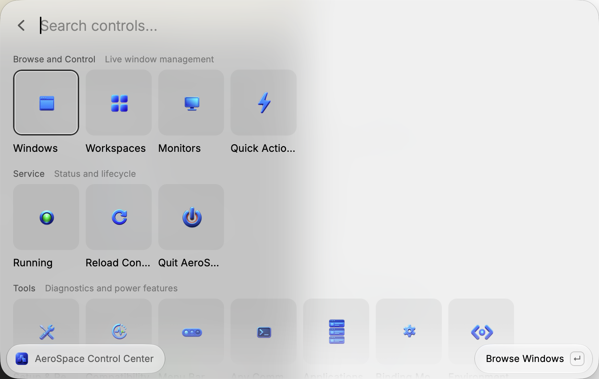
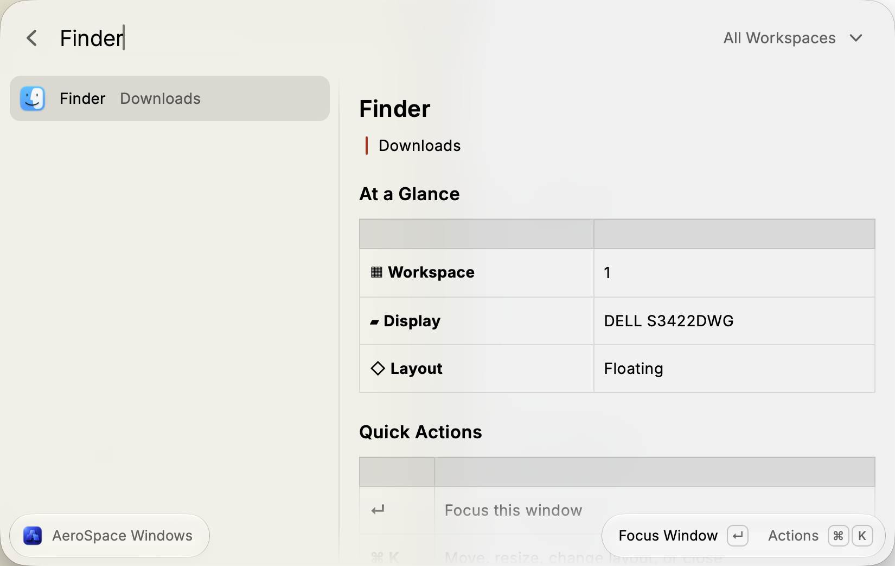
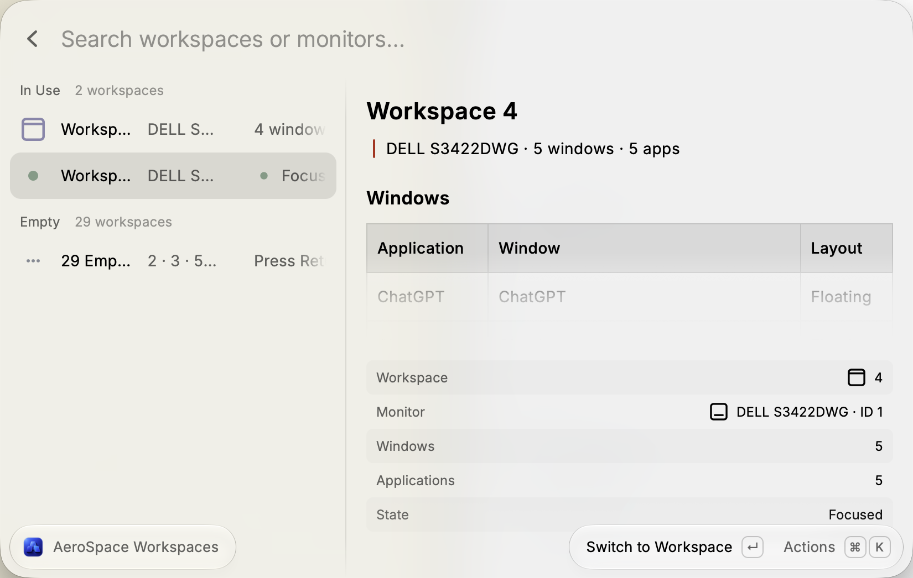
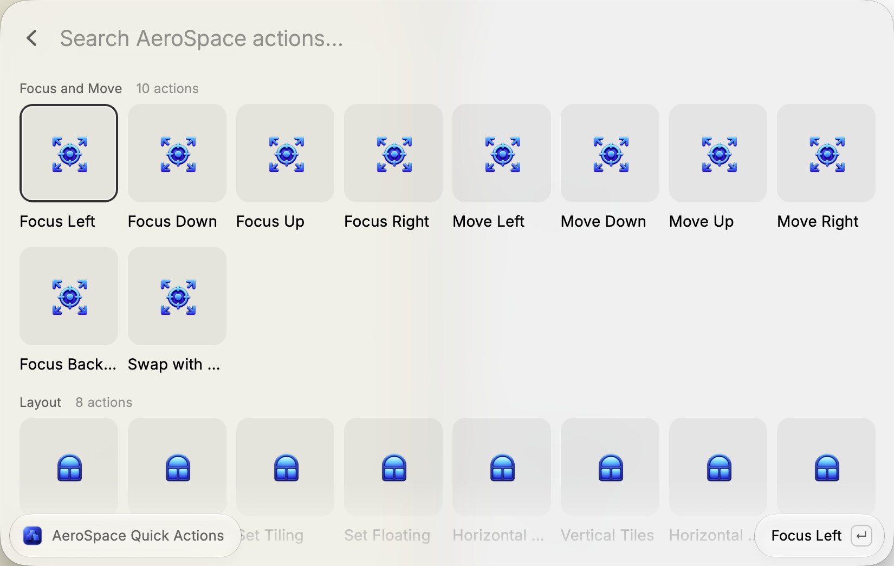

# AeroSpace Control Center

A comprehensive Raycast interface for the
[AeroSpace](https://github.com/nikitabobko/AeroSpace) tiling window manager.

Its unique guided initialization flow lets users install and initialize
AeroSpace end to end without leaving Raycast. With the user's confirmation, the
extension detects the local environment, downloads and verifies AeroSpace,
installs the required components, creates the selected starter configuration,
and checks that everything is ready—removing the usual manual installation and
configuration work.

## Preview

### Control Center



### Window Management



### Workspace Overview



### Quick Actions



## Requirements

- macOS
- AeroSpace with its `aerospace` CLI installed

Homebrew is the recommended installation method:

```bash
brew install --cask nikitabobko/tap/aerospace
```

The extension automatically detects:

- Homebrew installations on Apple Silicon and Intel Macs
- Executables available in Raycast's `PATH`
- `~/.local/bin/aerospace` and `~/bin/aerospace`
- Manual AeroSpace applications in `/Applications` or `~/Applications`
- `~/.aerospace.toml`
- `$XDG_CONFIG_HOME/aerospace/aerospace.toml`

For non-standard installations, set the CLI, application, or configuration path
in Raycast Preferences → Extensions → AeroSpace Control Center. No preferences
are required for a standard installation.

## Features

- Guided first-run setup with installation, configuration, service, version, and permission checks
- User-confirmed AeroSpace installation through Homebrew, with live progress
- Verified direct download from official GitHub releases when Homebrew is unavailable
- Local-versus-latest version checks and optional Homebrew-managed updates
- Safe starter configuration choice: original defaults or recommended chat-app floating rules
- Start, pause, resume, quit, and reload AeroSpace
- Browse, search, and focus windows across every workspace
- Move windows between workspaces and monitors
- Switch, summon, balance, and flatten workspaces
- Change tiling, floating, accordion, split, fullscreen, and window size
- Save persistent floating and workspace rules for applications
- Browse and execute shortcuts from the active AeroSpace configuration
- Run any AeroSpace CLI subcommand without shell interpolation
- Check detected paths, client/server versions, and compatibility issues
- Optional menu bar status and quick controls
- Dedicated no-view commands that can be assigned global Raycast hotkeys

Before the extension edits an application rule, it creates a
`<config>.raycast-backup` backup. Existing unrelated commands in a compatible
single-line rule are preserved. Complex multiline rules are left untouched and
must be edited manually.

## Commands

- **Control Center** — complete visual control panel
- **Setup & Repair** — guided detection, installation, configuration, and repair
- **Switch Window** — search and focus any AeroSpace window
- **Switch Workspace** — switch or manage workspaces
- **Toggle AeroSpace** — start, pause, or resume without opening a view
- **Toggle Floating Window** — toggle the focused window between floating and tiling
- **Reload Configuration** — reload the active configuration
- **Menu Bar Control** — persistent status, workspaces, and quick actions
- **Browse Shortcuts** — inspect and execute configured shortcuts

## Troubleshooting

Open **Setup & Repair** for a guided diagnosis or **Control Center →
Compatibility Check** to see every detected path and version. If the CLI is not
found after a manual AeroSpace installation, either repair the Homebrew
installation, install the CLI in your `PATH`, or select it in the extension
preferences.

The setup assistant never installs software or writes a configuration without
confirmation. Configuration creation uses create-only semantics and never
overwrites an existing file. Ambiguous or invalid user configurations are
opened for review instead of being rewritten automatically.

Homebrew remains the preferred installation method. If Homebrew is unavailable,
the assistant can download an official AeroSpace release to
`~/Applications/AeroSpace.app`, install its CLI in `~/.local/bin`, and verify the
SHA-256 digest published with the GitHub release. Direct installation is refused
when AeroSpace already exists or when a release has no SHA-256 digest.

The recommended starter profile begins with the configuration bundled inside
the installed AeroSpace app, then adds `on-window-detected` rules that float
common communication apps such as Messages, Slack, Teams, WeChat, WeCom,
DingTalk, Telegram, WhatsApp, Signal, ChatGPT, and Claude. The original profile
copies AeroSpace's bundled defaults unchanged.

Before showing first-run setup, the extension checks whether AeroSpace.app, the
CLI, and exactly one configuration are already available. A complete setup is
accepted automatically, including when the AeroSpace service is intentionally
paused or stopped. Opening **Setup & Repair** later shows a read-only health
summary; re-entering the full wizard requires a separate confirmation. An
available update is shown separately and never marks a working setup as
incomplete.

AeroSpace itself needs macOS Accessibility permission to manage windows. This
extension does not request additional system permissions.

## Development

```bash
npm install
npm run dev
```

## License

MIT
