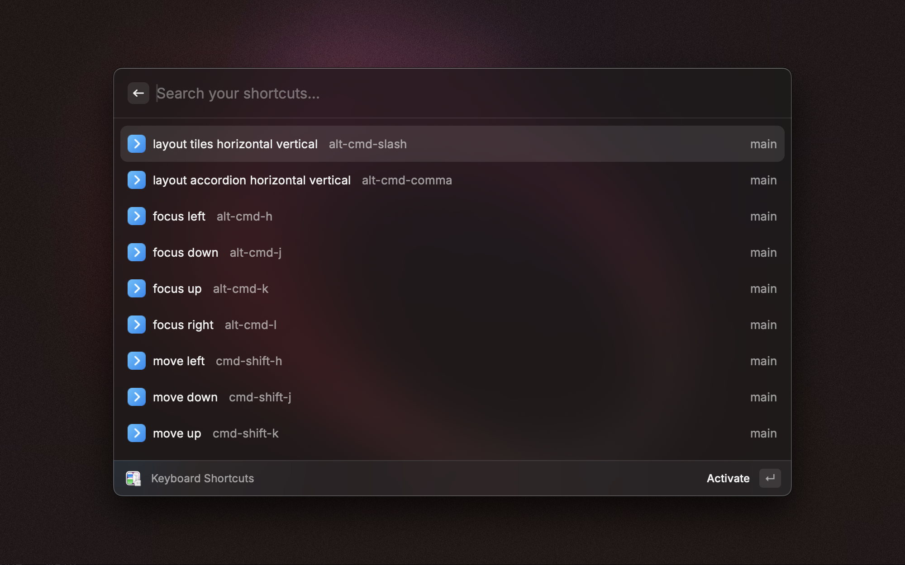
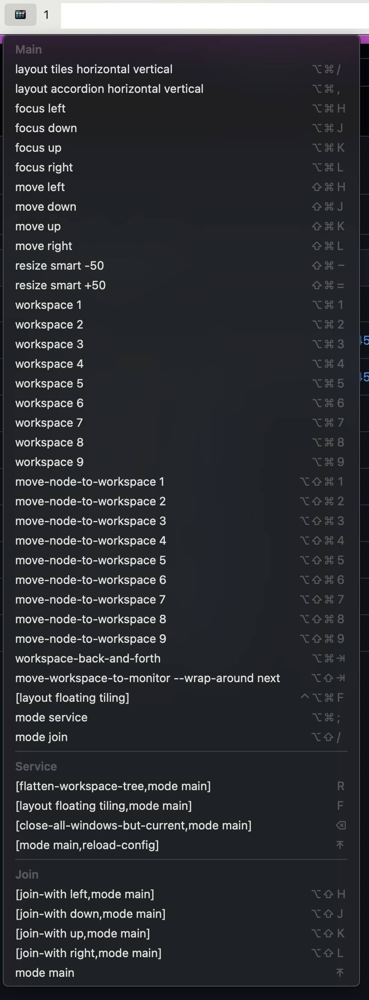
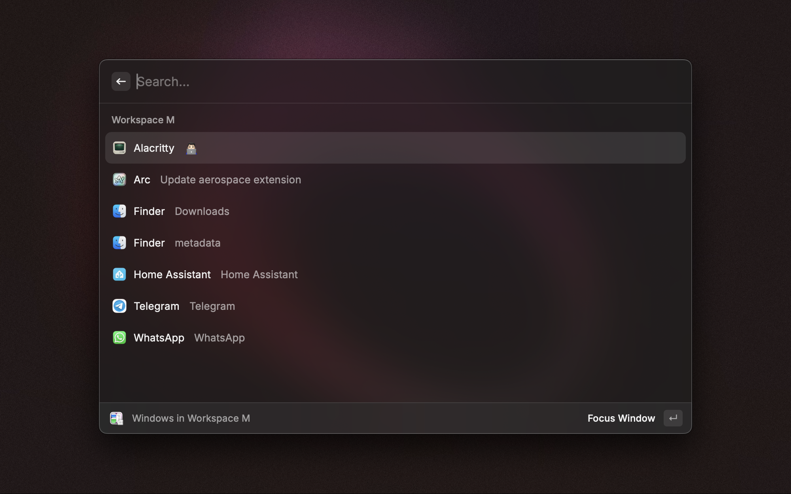
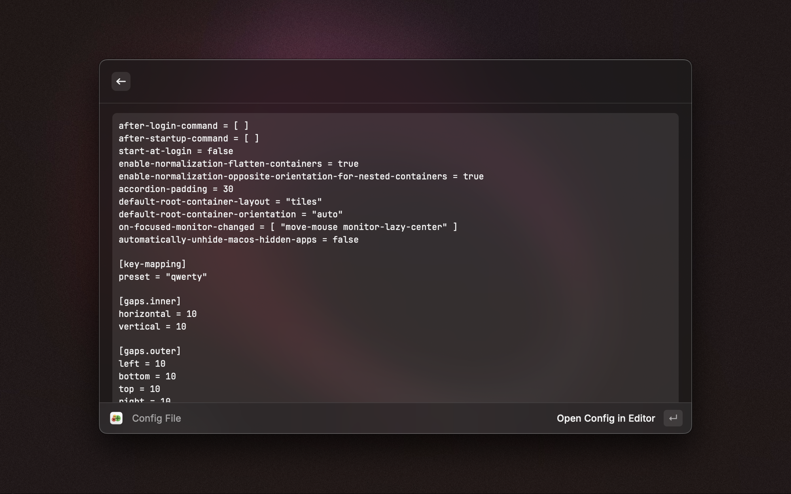

# AeroSpace Tiling Window Management

Control the [AeroSpace](https://github.com/nikitabobko/AeroSpace) tiling window manager from Raycast.

The extension uses AeroSpace's CLI as its runtime interface. It does not synthesize keyboard events or require Accessibility permission to trigger your bindings.









## Features

- Browse human-readable shortcuts, including custom script names and arguments, and trigger them with `aerospace trigger-binding`
- Keep every configured binding visible by default, or show only the main mode with the **Show Full Bindings** preference
- Check runtime, validation, and disk-versus-loaded binding health before inspecting or reloading the complete TOML config
- Keep bindings immediately visible in the menu bar, with optional quick actions and command links below them
- Browse focused, visible, non-empty, then empty workspaces together with their apps, monitor, layout, and binding
- Search windows across the focused, visible, or all workspaces, remember the last scope, then focus, move, float, tile, or fullscreen them
- Generate a reviewable `on-window-detected` rule for an app without automatically changing the config file

## Requirements

- Raycast for macOS
- AeroSpace 0.11 or newer (the first release with `trigger-binding`)

## Installation

1. Install [Raycast](https://raycast.com)
2. Install AeroSpace and make sure it is running
3. Install the extension from the Raycast Store by searching for "AeroSpace"

The extension detects the `aerospace` binary in common Homebrew, Nix, and nix-darwin locations. If you installed AeroSpace elsewhere, set **AeroSpace Binary Path** in the extension preferences to the executable's full path. Run `which aerospace` in a terminal to find it.

## Usage

- Open Raycast and type `AeroSpace` to view the available commands
- Use **Show AeroSpace Shortcuts** to search human-readable binding names, keys, modes, or raw commands
- Use **Show AeroSpace Config** to check configuration health, inspect the complete file, compare loaded bindings, and safely reload
- Use **Go to Workspace** to search workspaces, inspect monitor and visibility state, switch, summon, balance, or change root layout
- Use **Enable AeroSpace Menu Bar Shortcuts** for top-level binding access, live status, and optional quick actions
- Use **Switch Apps in Workspace** to choose a live search scope, remember it for next time, and manage open windows

In extension preferences, turn off **Show Menu Bar Extras** to keep only bindings, status, refresh, and preferences in the menu bar. **Show Full Bindings** remains on by default; turn it off to show only the main mode. The menu bar shows only its icon by default; turn on **Show Workspace Name** to add the live workspace and binding mode beside it. The menu bar's **View What’s New…** item opens the extension's Store page, where Raycast shows its native Version History.

The config view deliberately checks two sources. **View Full Config** opens the complete file returned by `aerospace config --config-path`. **View Loaded Binding Configuration** calls `aerospace config --get . --json`; AeroSpace currently exposes only `mode.*` values through that command. The health summary compares those bindings and runs `reload-config --dry-run --warnings-as-errors`. A real reload only runs after that validation succeeds. Shortcut activation prefers the loaded configuration and falls back to the file for older CLI versions.

The menu bar uses `aerospace subscribe` for live workspace and mode updates when the installed AeroSpace version supports it. The rest of the menu remains usable if live events are unavailable.

## Integration

The extension supports programmatic access via Raycast deeplinks using `launchContext`. This allows integration with window tile manager tools like SketchyBar, Alfred, Keyboard Maestro, or custom scripts.

### Deeplink Format

```bash
raycast://extensions/limonkufu/aerospace/switchApps?context={\"workspace\":\"all\",\"searchText\":\"AppName\"}
```

**Parameters:**

- `context.workspace` - optional `focused`, `visible`, or `all` scope override
- `context.searchText` - optional initial search text

This enables external tools to choose a scope or pre-filter the app switcher without displaying argument input prompts. Normal launches open the command immediately and use the last scope selected inside it.

## Contributing

Contributions are welcome. Please open an issue or submit a pull request.

## License

This project is licensed under the MIT License. See the [LICENSE](LICENSE) file for details.
