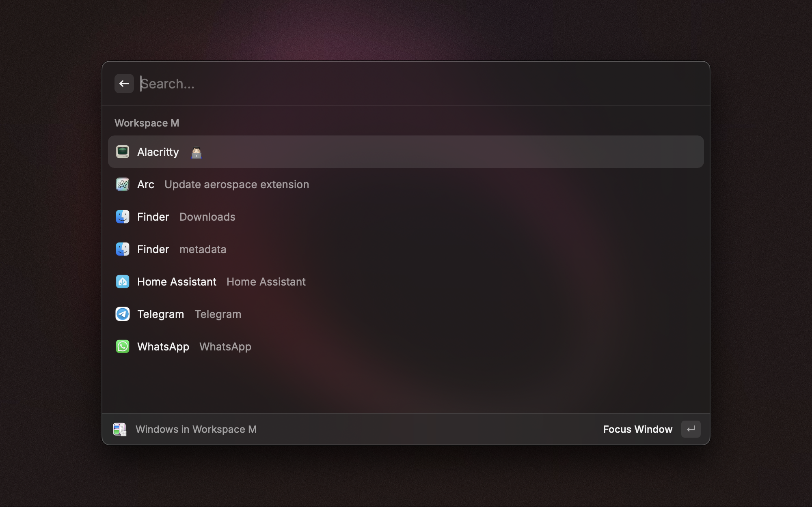

# Aerospace Tiling Window Management

Aerospace is a tiling window management extension for Raycast.

It works with the existing installation of [AeroSpace](https://github.com/nikitabobko/AeroSpace)

## Features

- View all shortcuts parsed from your config file (loads the config path using `aerospace config --config-path`)
- View your Aerospace configuration and open it directly in your editor
- Access your Aerospace shortcuts at a glance from the menu bar
- Switch between apps in the focused or all workspace(s)

## Installation

1. Install [Raycast](https://raycast.com)
2. Install the extension from the Raycast Store by searching for "Aerospace"

## Usage

- Open Raycast and type `Aerospace` to view the available commands
- Use the `Aerospace Shortcuts` command to view all shortcuts parsed from your config file
- Use the `Aerospace Configuration` command to view your Aerospace configuration
- Use the `Aerospace Menubar Shortcuts` command to enable menubar shortcuts
- Use the `Aerospace Switch Apps` command to show the app in current workspace

## Contributing

Contributions are welcome. Please open an issue or submit a pull request.

## License

This project is licensed under the MIT License. See the [LICENSE](LICENSE) file for details.
