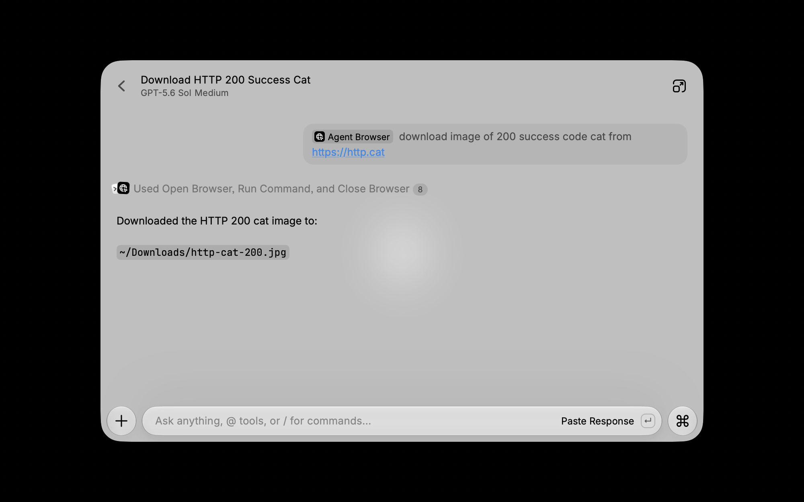
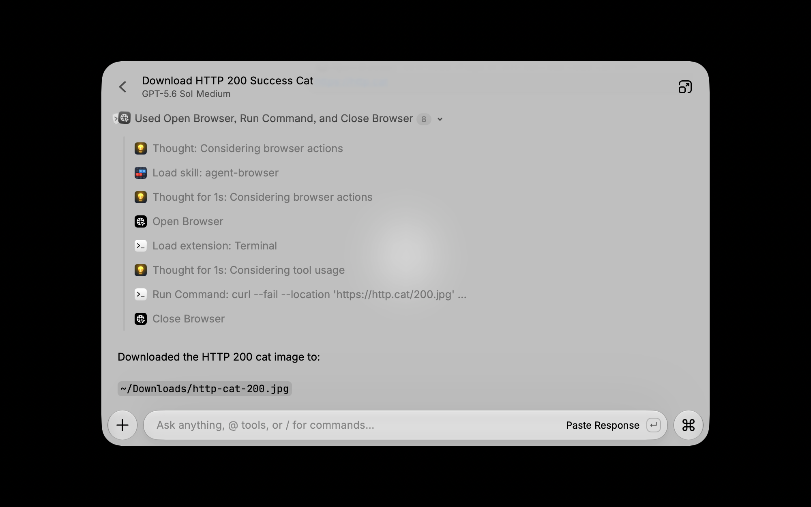

<div align="center">
  <br/>
  <br/>
  
  <h3>Agent Browser</h3>
  <p>Control websites from Raycast and Raycast AI</p>
  <br/>
  <br/>
</div>

Agent Browser is a Raycast extension that connects [agent-browser](https://agent-browser.dev/) to Raycast AI. Open websites in isolated browser sessions, inspect page content, interact with elements, enter text through virtual keyboards, and verify the resulting page state from a Raycast AI conversation.

## Features

- Open websites in visible or headless browser sessions.
- Use an installed CDP-compatible Chromium browser, including Chrome, Brave, Edge, or Vivaldi.
- Reuse a Chromium browser profile through a temporary copy created by the local agent-browser CLI, open a live tab in a named Dia space, or open Safari tabs in the active Safari profile.
- Keep tasks isolated with named sessions and reusable browser state.
- Inspect accessibility snapshots, page content, element state, tabs, and navigation history.
- Click, fill, type, select, scroll, and wait for page updates with explicit confirmation.
- Enter exact text through virtual keyboards with validated key labels and deterministic ordering.
- Wait for animations and state changes before Raycast AI continues.
- Re-inspect settled pages so AI can verify observed results instead of assuming an action succeeded.
- Wrap page-derived output in agent-browser content boundaries and cap large responses.

## Agent Browser in Action

### Complete a browser-assisted task



Ask Raycast AI for the outcome you want. In this example, Raycast opens the requested website with Agent Browser, coordinates with the Terminal extension to save the image, and reports the downloaded file path.

### Review every tool call



Expand the activity summary to review how Raycast completed the task. You can see when Agent Browser opened and closed the session, along with any other extensions Raycast used to finish the request.

## Requirements

- [Raycast](https://www.raycast.com/) with Raycast AI access
- [agent-browser](https://agent-browser.dev/) installed locally
- Chrome installed through agent-browser

## Setup

Install agent-browser with npm:

```bash
npm install -g agent-browser
agent-browser install
```

Or install it with Homebrew on macOS:

```bash
brew install agent-browser
agent-browser install
```

If Raycast cannot find the executable, run `command -v agent-browser` and copy the returned path into the **Agent Browser Executable** extension preference.

## Preferences

| Preference               | Default         | Description                                                                                                               |
| ------------------------ | --------------- | ------------------------------------------------------------------------------------------------------------------------- |
| Agent Browser Executable | `agent-browser` | Command name or full path to the local agent-browser executable.                                                          |
| Browser Application      | Default engine  | Optional installed Chromium browser used for new sessions.                                                               |
| Default Browser Profile or Dia Space | None | Optional Chromium profile or Dia space name used by new sessions.                                                         |
| Browser Data Directory   | Auto-detected   | Optional user-data directory for browsers whose profiles cannot be located automatically.                                |
| Browser Visibility       | Enabled         | Opens Raycast AI sessions in a visible browser window. Disable it for headless automation.                                |
| Post-Interaction Delay   | 500 ms          | Waits after each page interaction before Raycast AI continues. Submission and animation flows can request a longer delay. |

## Raycast Command

### Open in Agent Browser

Opens a URL in a visible agent-browser session. Provide an optional session name to continue work in an existing isolated browser, and an optional profile name to override the configured default.

## Raycast AI Tools

| Tool                       | What it does                                                                                                                              |
| -------------------------- | ----------------------------------------------------------------------------------------------------------------------------------------- |
| Open Browser               | Opens a URL in an isolated session using the configured browser visibility.                                                               |
| Inspect Page               | Reads snapshots, page content, element state, tabs, waits, and navigation history.                                                        |
| Interact with Page         | Clicks, fills, types, selects, focuses, checks, and scrolls after confirmation.                                                           |
| Type with Virtual Keyboard | Validates virtual-key labels, enters text in deterministic order, optionally submits it, waits, and returns a full verification snapshot. |
| Close Browser              | Closes a named session and discards its transient tabs and page state after confirmation.                                                 |

## Example Prompts

```text
@agent-browser Open example.com and list the available links.
```

```text
@agent-browser Open my local app, inspect the login form, and fill in the email field.
```

```text
@agent-browser Open Wordle, enter THROW as the next guess, wait for the tiles to settle, and verify the submitted word.
```

```text
@agent-browser Close the raycast browser session.
```

## How Sessions Work

Each task can use a named agent-browser session. A session keeps its own browser instance, tabs, cookies, storage, navigation history, and authentication state. Raycast AI chooses a short session name when it starts a task and reuses that name for every following step.

Each session is bound to the browser and profile that opened it. For a selected Chrome, Chromium, Brave, Edge, or Vivaldi profile, the extension creates a temporary fake home with a live symbolic link to the browser's real user-data directory. The link is not enforced as read-only by the operating system; it exists so agent-browser can discover the selected browser's profiles at Chrome's standard data location.

The extension passes the selected profile as a name, not the real user-data directory. agent-browser's named-profile flow reads through the link, copies `Local State` and the selected profile into its own temporary user-data directory, and launches Chromium against that copy. Normal browser writes therefore go to the temporary copy rather than the original profile. This protection applies to named profiles: if a directory path is supplied directly to agent-browser as `--profile`, agent-browser treats it as a persistent, writable profile instead.

Close the session before reusing its name with a different browser identity.

Dia is supported explicitly for opening live tabs in a named space and for inspecting or interacting with those pages through Dia's JavaScript automation API. Select Dia and enter the space name exactly as shown in Dia (for example, `BOT`). The first interactive session after upgrading requires quitting Dia once so Agent Browser can relaunch it with JavaScript automation enabled. Arc is still rejected because it exposes neither this API nor a compatible CDP endpoint.

Safari is supported explicitly for opening and closing live tabs in its currently active profile. The profile preference is not applied to Safari because Safari does not expose profile selection through its scripting API. Page inspection and interaction tools remain unavailable for Safari sessions.

Sessions remain available for follow-up requests until they are closed or agent-browser removes them after its idle timeout. Use **Close Browser** when you want to discard a session's transient state.

## Reliability and Safety

- Element interactions use fresh accessibility refs such as `@e2` rather than guessed selectors.
- Virtual-keyboard input validates every key's visible label before clicking, preventing transposed input such as `TRHOW` when `THROW` was requested.
- Interactions wait for the configured delay before another step begins.
- Submissions and animated state changes use longer waits when requested by Raycast AI.
- State-changing actions are followed by settled-page inspection or a verification snapshot.
- Page content is treated as untrusted data and wrapped in agent-browser content boundaries.
- Page interactions and session closure require Raycast confirmation.
- Sensitive credentials, payment information, authentication codes, and private keys are not entered automatically.

## Troubleshooting

### The browser window does not appear

Open the extension preferences and enable **Open AI sessions in a visible browser window**. If the current session was created in headless mode, close it and start a new session.

### Raycast cannot find agent-browser

Run:

```bash
command -v agent-browser
```

Copy the returned path into **Agent Browser Executable**. You can also confirm the installation with `agent-browser --version`.

### Chrome is missing

Run:

```bash
agent-browser install
```

### A page updates too quickly or slowly

Increase **Post-Interaction Delay** in the extension preferences. Raycast AI can also request a longer wait for a specific submission or animation.

### A task uses stale element refs

Ask Raycast AI to inspect the page again. Refs belong to the page and tab that produced the snapshot, so navigation or major page updates require a fresh snapshot.

## Development

Install dependencies and start the Raycast development watcher:

```bash
npm install
npm run dev
```

Run the validation suite before publishing:

```bash
npm run fix-lint
npx tsc --noEmit
npm run lint
npm run build
npx ray evals
```

## Links

- [agent-browser documentation](https://agent-browser.dev/)
- [Raycast extension documentation](https://developers.raycast.com/)
