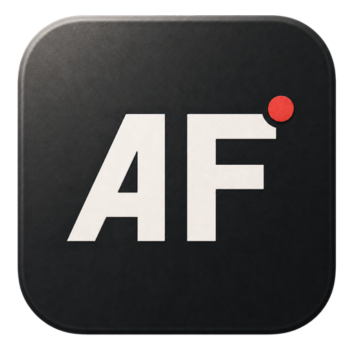

<p align="center">
  
</p>

# Agent Feedback

Record your screen, point at the interface, and say what should change. Agent Feedback turns the recording into local, agent-ready Markdown with a timestamped transcript and screenshots, then copies it to your clipboard.

Everything after the one-time model download runs on your Mac. There is no account, hosted video, transcription API, analytics, or telemetry.

## Workflow

1. Run **Record Agent Feedback** to start screen and microphone capture.
2. Talk naturally while navigating your app.
3. Use phrases such as **“look here,” “this button,” “move this,”** or **“where my cursor is”** while pointing. Agent Feedback recognizes these attention cues and captures the corresponding video frame.
4. For an explicit marker, run **Mark Feedback Moment** to attach an exact screenshot and timestamp.
5. Run **Record Agent Feedback** again to stop.
6. Agent Feedback transcribes locally, assembles the report, and copies it to your clipboard so you can paste it into your agent when ready.

While capture is active, the command subtitle changes to **Recording — Run to Stop**. Stopping immediately confirms that recording has ended before local transcription begins.

Voice cues are detected locally from the transcript. When `ffmpeg` is installed, Agent Feedback extracts the exact frame from the recording; otherwise it uses the nearest periodic screenshot. If there are no manual markers or voice cues, it selects periodic frames evenly.

Recognized English cue patterns include:

- Direct attention: “look here,” “notice this,” “take a look at that”
- Cursor and pointing: “where my cursor is,” “I’m pointing at,” “hovering over”
- UI references: “this button,” “that section,” “the title here”
- Change references: “move this,” “remove that,” “resize this”
- Visual comparison or emphasis: “like this,” “this is the problem,” “specifically here”

The detector requires compound cues like these; a bare “this” or “there” does not create a screenshot.

## Recommended Hotkeys

| Command | Hotkey |
| --- | --- |
| Record Agent Feedback | `⌘ ⇧ F` |
| Mark Feedback Moment | `⌘ ⇧ M` |

Set hotkeys from Raycast by selecting a command and choosing **Configure Command** from the Action Panel.

## Local Setup

Agent Feedback requires [`whisper-cli`](https://github.com/ggml-org/whisper.cpp) for local transcription:

```sh
brew install whisper-cpp
```

For exact screenshots at spoken attention cues, install `ffmpeg` (optional):

```sh
brew install ffmpeg
```

Then run **Download Local Whisper Model** once in Raycast. It downloads the Whisper base multilingual model.

The download comes from the official whisper.cpp Hugging Face repository and is verified against a pinned SHA-256 digest before installation.

On first use, macOS asks for Raycast's **Screen & System Audio Recording** and **Microphone** permissions.

## Install From Source

```sh
git clone https://github.com/vojtaholik/agent-feedback.git
cd agent-feedback
npm install
npm run dev
```

## Output

Each session contains:

- `recording.mov` — screen, cursor, click highlights, and microphone
- `transcript.json` — timestamped local Whisper output
- `frames/` — manually marked or automatically captured screenshots
- `dom-context.jsonl` — optional DOM targets hovered during the recording
- `feedback.md` — the report copied to your clipboard

Use **Open Feedback Sessions** to inspect or delete these artifacts in Finder.

## Advanced: DOM Context for Websites

For richer feedback on a website you are developing, add this development-only loader to the page. It connects to Agent Feedback only while a recording is active, then records the DOM identity of elements you dwell over for about 300 ms. The report pairs those selectors, attributes, text, and ancestors with the relevant transcript moments and screenshots.

```html
<script>
  (() => {
    const origin = "http://127.0.0.1:43127";
    let session;

    async function connect() {
      try {
        const response = await fetch(`${origin}/status`, { cache: "no-store" });
        if (!response.ok) throw new Error();
        const status = await response.json();
        if (session !== status.session) {
          const script = document.createElement("script");
          script.src = `${origin}/agent-feedback.js?t=${Date.now()}`;
          document.head.appendChild(script);
          session = status.session;
        }
      } catch {
        session = undefined;
      }
    }

    connect();
    setInterval(connect, 2000);
  })();
</script>
```

The bridge listens only on `127.0.0.1:43127`, starts and stops with each recording, and uses a new session token every time. A small **AF recording** badge appears in the top-right when connected; hover capture does not outline or restyle page elements. If the loader is absent or disconnected, screen, voice, transcript, and screenshot capture continue normally.

Only include the loader in local development. Do not ship it in a public production build. Chrome supports this loopback workflow; browser security policy may prevent it in Safari.

## Privacy

- Recordings and reports remain in Raycast's local extension support directory.
- Model inference is local.
- The only external network requests are the explicit one-time model downloads.
- Model files are integrity checked before use.
- Nothing is uploaded automatically.
- Optional DOM context is sent only from your development page to the loopback bridge while recording.

Remember that screen recordings can contain private information. Review a report before sharing it outside your machine.

## Development

```sh
npm install
npm run build
npm run lint
```

Agent Feedback is macOS-only because it uses the system `screencapture` and `afconvert` tools.

## License

MIT. See [LICENSE](LICENSE) and [THIRD_PARTY_NOTICES.md](THIRD_PARTY_NOTICES.md).
