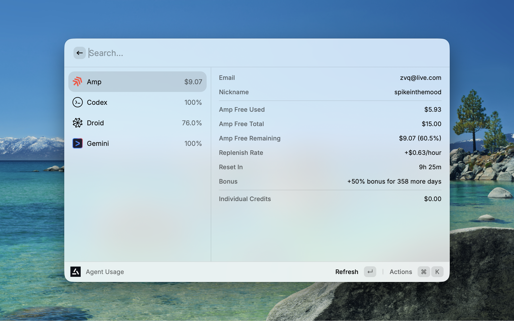
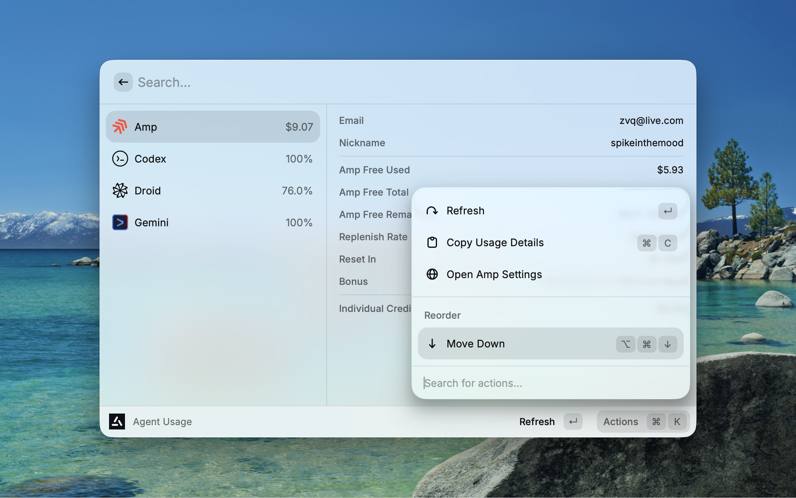

# Agent Usage

Track usage across your AI coding agents in one place.




## Features

- **Multi-Agent Support** - View usage for AIHubMix, Amp, Antigravity, Claude, ClinePass, Codex, Copilot, Cursor, DeepSeek, Droid, Gemini, Grok, Kimi, MiniMax, MinimaxCN, OpenCode Go, Synthetic, and z.ai (GLM)
- **Multi-Account Support** - Manage multiple API keys per provider with named accounts ("Work", "Personal", etc.)
- **Quick Overview** - See remaining quotas and usage at a glance with ASCII progress bars
- **Detailed Breakdown** - Expand each agent for full usage details
- **Menu Bar** - Quick overview from the menu bar with click-to-navigate
- **Zero Config** - Most agents are auto-detected from local credentials
- **OpenCode Integration** - Auto-detect credentials from OpenCode for supported providers, with visual indicator showing which account is currently active in OpenCode
- **Refresh & Copy** - Quickly refresh data or copy usage details to clipboard
- **Customizable** - Show/hide agents, reorder list, and configure display preferences

## Supported Agents

| Agent           | Data Source                 | Manual Key | OpenCode | Env Var | Multi-Account | Setup                                                                                            |
| --------------- | --------------------------- | :--------: | :------: | :-----: | :-----------: | ------------------------------------------------------------------------------------------------ |
| **AIHubMix**    | AIHubMix user self API      |     ✓      |    —     |    ✓    |       —       | Paste the Access Key from https://console.aihubmix.com/setting, or set `AIHUBMIX_ACCESS_KEY`     |
| **Amp**         | Local SQLite database       |     —      |    —     |    —    |       —       | Auto-detected from local database                                                                |
| **Claude**      | Anthropic OAuth Usage API   |     —      |    ✓     |    —    |       —       | Auto-detected after `claude` login                                                               |
| **ClinePass**   | Cline API                   |     ✓      |    —     |    —    |       ✓       | Auto-detected from the local Cline login, or add a user ID and API key via Manage Accounts       |
| **Codex**       | OpenAI API                  |     ✓      |    —     |    —    |       ✓       | Run `codex login`, add additional `CODEX_HOME` paths in preferences, or paste a token manually   |
| **Copilot**     | GitHub Copilot internal API |     ✓      |    —     |    ✓    |       ✓       | Add named accounts, sign in with GitHub CLI, or use `GH_TOKEN`/`GITHUB_TOKEN`                    |
| **Cursor**      | Cursor API                  |     ✓      |    —     |    —    |       —       | Auto-detected from Cursor app login, or paste cookie header in preferences                       |
| **DeepSeek**    | DeepSeek balance API        |     ✓      |    ✓     |    ✓    |       —       | Use OpenCode `deepseek`, set `DEEPSEEK_API_KEY`/`DEEPSEEK_KEY`, or paste an API key              |
| **Droid**       | Factory AI API              |     —      |    —     |    —    |       —       | Run `droid` command to login                                                                     |
| **Gemini**      | Local state file            |     —      |    —     |    —    |       —       | Auto-detected from local state                                                                   |
| **Grok**        | grok.com billing API        |     —      |    —     |    —    |       —       | Auto-detected from `~/.grok/auth.json` after `grok login`                                        |
| **Kimi**        | Moonshot API                |     ✓      |    ✓     |    —    |       ✓       | Use OpenCode `kimi-for-coding`, or paste token from https://www.kimi.com/code/console            |
| **Antigravity** | Google API                  |     —      |    —     |    —    |       —       | Auto-detected from local API                                                                     |
| **Synthetic**   | Synthetic API               |     ✓      |    ✓     |    —    |       ✓       | Use OpenCode `synthetic`, or paste API key from https://synthetic.new/billing                    |
| **MiniMax**     | MiniMax API                 |     ✓      |    ✓     |    ✓    |       —       | Use OpenCode `minimax-coding-plan`, set `MINIMAX_API_KEY` env var, or paste token in preferences |
| **MinimaxCN**   | MinimaxCN API (国内版)      |     ✓      |    —     |    ✓    |       —       | Set `MINIMAX_CN_API_KEY` env var, or paste token in preferences                                  |
| **OpenCode Go** | OpenCode API                |     ✓      |    —     |    —    |       —       | Set workspace ID and auth cookie in preferences                                                  |
| **z.ai (GLM)**  | Zhipu API                   |     ✓      |    ✓     |    ✓    |       ✓       | Paste token, use OpenCode `zai-coding-plan`, or set `ZAI_API_KEY`/`GLM_API_KEY` env var          |

**Legend:**

- **Manual Key** — Enter API key/token directly in Raycast extension preferences
- **OpenCode** — Auto-detected from `~/.local/share/opencode/auth.json`
- **Env Var** — Auto-detected from shell environment variables
- **Multi-Account** — Support for multiple named accounts via "Manage Accounts" action (⌘M)

### ClinePass Credentials

ClinePass reads the shared Cline login from `~/.cline/data/settings/providers.json`, with `~/.cline/data/secrets.json` supported as a legacy fallback. Expired file-backed sessions are refreshed through Cline and saved atomically to the source file while preserving unrelated settings. If Cline replaces the credential while Agent Usage is fetching, Agent Usage rereads the file and uses Cline's newer value instead of overwriting it.

Additional ClinePass accounts can be added from the in-view **Manage Accounts** action. Each manual account requires a Cline user ID beginning with `usr-` and an API key beginning with `sk_`.

### AIHubMix Credentials

Agent Usage shows your AIHubMix account balance. Copy the **Access Key** from [AIHubMix Settings](https://console.aihubmix.com/setting), then paste it into the **AIHubMix Access Key** extension preference, or set `AIHUBMIX_ACCESS_KEY` in your shell. The preference takes priority if both are set.

### DeepSeek Credentials

Agent Usage shows your DeepSeek API balance, including total, topped-up, and granted balances. Create an API key from the [DeepSeek Platform](https://platform.deepseek.com/api_keys), then configure it using one of these methods:

1. Paste it into the **DeepSeek API Key** extension preference
2. Sign in to DeepSeek through OpenCode using the `deepseek` provider
3. Set `DEEPSEEK_API_KEY` or `DEEPSEEK_KEY` in your shell environment

Manual preferences take priority, followed by OpenCode and environment variables.

## OpenCode Active Indicator

When you have multiple accounts configured for a provider (e.g., multiple Kimi API keys), the extension shows a ⚡ bolt icon next to the account that is currently being used by OpenCode. This helps you identify which account is actively being consumed.

The indicator appears in:

- **List View** — Green bolt icon in the accessory area with tooltip "Currently used in OpenCode"
- **Menu Bar** — ⚡ prefix before the account name

This works by comparing your stored account tokens with the keys configured in `~/.local/share/opencode/auth.json`.

### Copilot Token

1. Use a GitHub OAuth token that the Copilot internal API accepts, such as the token from `gh auth token`
2. Agent Usage first reads the active GitHub CLI login with `gh auth token`
3. If GitHub CLI has no token, `GH_TOKEN` and `GITHUB_TOKEN` are shown as separate auto-detected accounts; Agent Usage resolves them from your login shell when Raycast doesn't inherit the shell environment
4. Add additional tokens as named accounts with the in-view **Manage Accounts** action
5. Standard personal access tokens may not work with `https://api.github.com/copilot_internal/user`

The legacy `Copilot Authorization Token` preference remains supported as a `Preference` account.

## Preferences

- **Visible Agents** - Toggle which agents to show in the list
- **Amp Display Mode** - Show remaining as amount or percentage
- **Agent Order** - Use `⌘⌥↑` / `⌘⌥↓` to reorder agents in the list

## Keyboard Shortcuts

| Shortcut | Action                                 |
| -------- | -------------------------------------- |
| `↵`      | Refresh usage data                     |
| `⌘C`     | Copy usage details                     |
| `⌘⇧C`    | Copy API key (multi-account providers) |
| `⌘M`     | Manage Accounts (multi-account)        |
| `⌘⌥↑`    | Move agent up                          |
| `⌘⌥↓`    | Move agent down                        |

## Development

```bash
# Install dependencies
npm install

# Run in development mode
npm run dev

# Build for production
npm run build

# Run linter
npm run lint
```

## Roadmap

More agents coming soon.

## License

MIT
