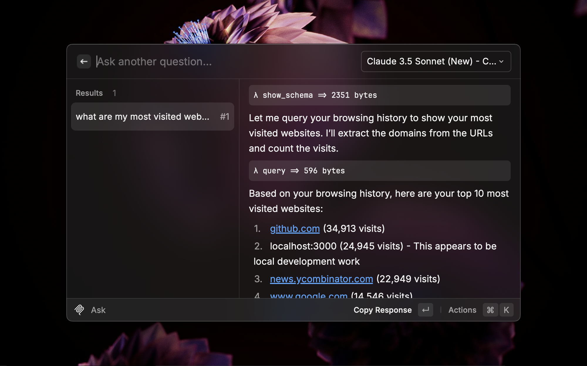
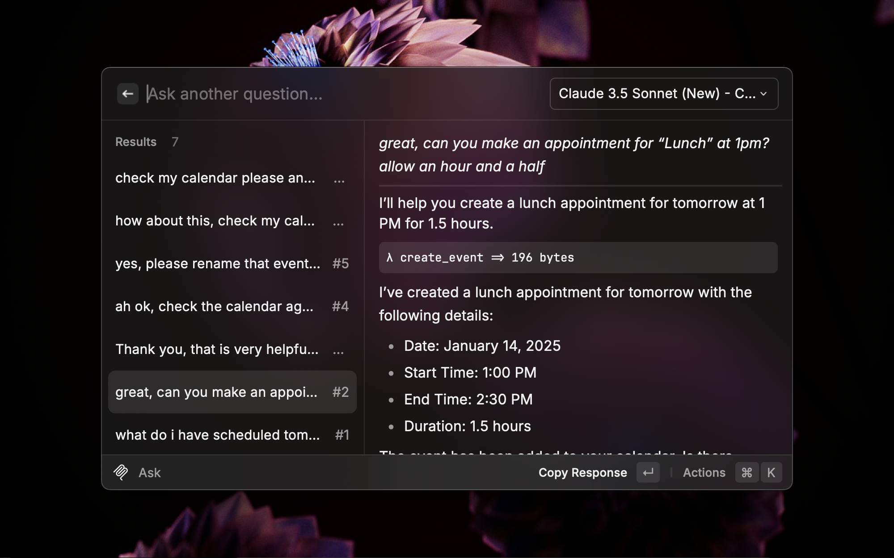

<p align="center">

</p>

<h1 align="center">AI Chat with MCP Support</h1>

<h3 align="center">
Interact with MCP servers right from your command bar
</h3>



# Features

## Model Context Protocol (MCP) support

This means you can easily connect to various tools to do your bidding. Examples:

- Google Calendar
- Linear
- Slack

You can find other MCP servers via the official MCP repo and community lists:

- Official Tools Repo: https://github.com/modelcontextprotocol/servers
- Community list of MCP projects: https://github.com/punkpeye/awesome-mcp-servers

Technically speaking this extension is an MCP host, which manages a number of MCP clients that maintain a 1-to-1 connection with the MCP servers you choose.

## Chat directly via Raycast

Straight from your command bar, ask anything you want answered.



# How to use

This package requires a valid API key from [Anthropic](https://docs.anthropic.com/claude/reference/getting-started-with-the-api).


> All the preference values will be stored locally using [Preferences API](https://developers.raycast.com/api-reference/preferences)

Once you add an API key you can chat with Anthropic's API. At this point the extension is like ay other AI chat extension. If you want to interact with other systems via MCP you will need an MCP config.

## Configuring MCP servers

Run the "View MCP Config" command from this extension. This will show you your config if you have one and allow you to open the file directly or copy the file path.

If you open the file directly your default text editor for JSON files will be used.

You will want to add one more more MCP servers to your config to get the most out of this extension.

Here is an example configuration, which is located in the extensions application support directory at `~/Library/Application Support/com.raycast.macos/extensions/ai-chat-mcp/config.json`:

```json
{
  "mcpServers": {
    "memory": {
      "command": "npx",
      "args": ["-y", "@modelcontextprotocol/server-memory"]
    },
    "filesystem": {
      "command": "npx",
      "args": ["-y", "@modelcontextprotocol/server-filesystem", "/path/to/allowed/files"]
    },
    "github": {
      "command": "npx",
      "args": ["-y", "@modelcontextprotocol/server-github"],
      "env": {
        "GITHUB_PERSONAL_ACCESS_TOKEN": "<YOUR_TOKEN>"
      }
    }
  }
}
```

This extension follows the configuration format of Claude Desktop, so the documentation is relevant for both: https://modelcontextprotocol.io/examples#configuring-with-claude

# Using other LLMs

Unfortunately other LLMs are not currently supported. This due to slight differences in the Anthropic API and the OpenAI API. Support could be added, and perhaps I should have started out using OpenAI as the LLM for broader compatibility, but as of this writing only Anthropic's API is suppoed.

If you're interested in trying out MCP I'd suggest using Claude Sonnet first and if you find it useful then considering how to run against other LLMs.

---

_This extension was initially a fork of the [Raycast Claude Extension](https://github.com/raycast/extensions/tree/main/extensions/claude)._
