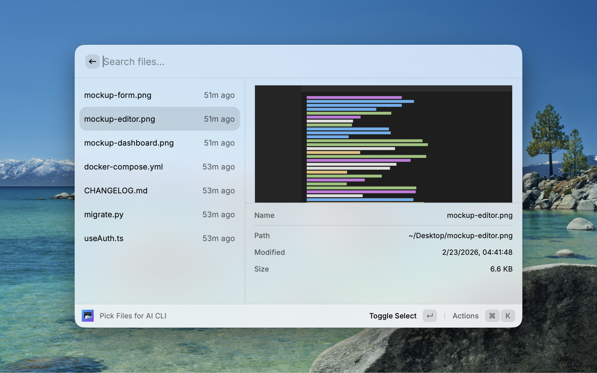

# AI CLI File Picker

A Raycast extension to pick recent files and copy them as `@path` format for AI CLI tools (e.g., Claude Code, Aider, Cursor).

## Features

- Browse recent files aggregated from multiple sources: your screenshot directory, Downloads, and any custom directories
- Select multiple files — output order follows your selection order
- Instant preview panel: images are rendered visually; text and code files show their contents
- Relative timestamps (e.g., "5m ago", "2h ago")
- Fuzzy search by filename

## Screenshot



## Output Format

Selected file paths are copied to the clipboard in the following format, ready to paste into an AI CLI prompt:

```
@/Users/you/Desktop/screenshot.png
@/Users/you/Desktop/notes.md
```

## Commands

| Command | Description |
|---------|-------------|
| Pick Files for AI CLI | Browse and select files, then copy their paths |

## Keyboard Shortcuts

| Key | Action |
|-----|--------|
| `↩` | Toggle select / deselect the focused file |
| `⌘↩` | Copy selected files (falls back to the focused file if none selected) |
| `⌘⇧X` | Clear all selections |

## Preferences

| Name | Default | Description |
|------|---------|-------------|
| Additional Directories | — | Colon-separated list of extra directories to scan. Tilde (`~`) is supported. |
| Max Recent Files | 30 | Maximum number of files shown in the list |
| Include Downloads | Enabled | Include `~/Downloads` in the file list |

## File Preview

| Type | Extensions |
|------|------------|
| Images | `.png` `.jpg` `.jpeg` `.gif` `.webp` `.heic` `.tiff` |
| Text / Code | `.md` `.txt` `.json` `.yaml` `.yml` `.toml` `.csv` `.log` `.ts` `.tsx` `.js` `.jsx` `.py` `.sh` |

## Development

```bash
npm install
npm run dev    # start in Raycast dev mode
npm run build  # production build
```

## License

MIT
