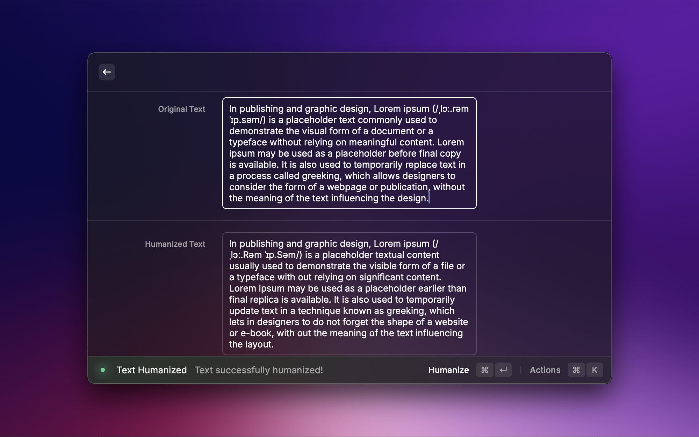

# Raycast AI Humanizer Extension

## Overview

This Raycast extension allows you to easily humanize text using an AI-powered service. Simply paste your original text, click the "Humanize" button, and the humanized result will be displayed. You can then copy the humanized text to the clipboard with a single shortcut.

## API Keys
To get API Keys for this extension please head over to [Rephrasy](https://rephrasy.ai) and create an account.

## Features

- **Humanization**: Utilize an external API to humanize the provided text.
- **Clipboard Integration**: Copy the humanized text to the clipboard effortlessly.

Enjoy humanizing your text with this Raycast extension!

