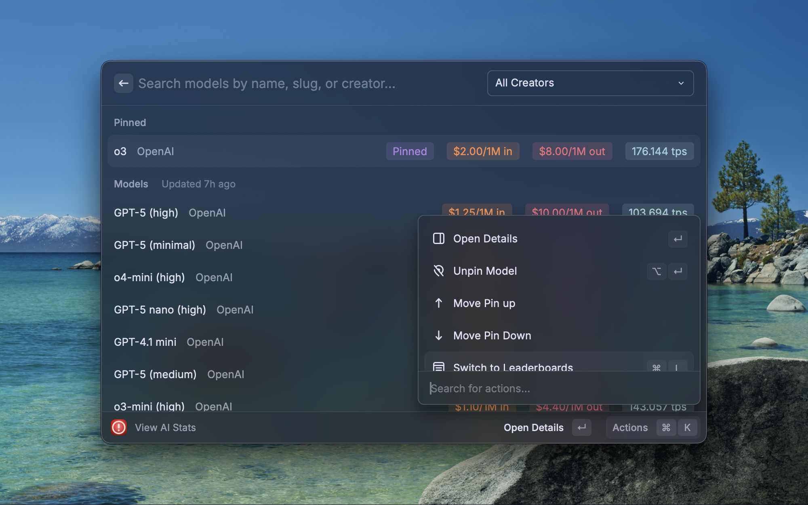
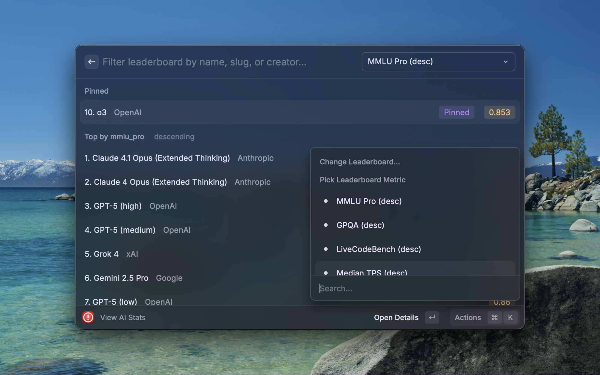

# AI-Stats (Raycast Extension)

A Raycast extension that provides quick access to AI model statistics & leaderboards.
It syncs with [ArtificialAnalysis.ai's](https://artificialanalysis.ai/) API for model data.
Search models, view benchmark results, compare prices, and check leaderboards all without leaving Raycast.

## Screenshots

## Usage

- Command: `View AI Stats`
- Switch Views (Search ↔ Leaderboards): Cmd+L
- Creator Filter: Cmd+P
- Reset Filters: Cmd+Backspace
- Pinned Models: Pin/Unpin from list or detail (Option+Enter); Move Up/Down

## Commands

- View AI Stats (single unified command for Search and Leaderboards).

## Action Menu (Quick Reference)

- Search
  - Switch to Leaderboards (Cmd+L)
  - Filter by Creator… (Cmd+P)
  - Reset Filters (Cmd+Backspace)
  - Pin / Unpin (Option+Enter) / Move Pin Up / Move Pin Down
  - Open Details (Enter)
  - Refresh

- Leaderboards
  - Open Details (Enter)
  - Switch to Search (Cmd+L)
  - Change Leaderboard… (Cmd+P)
  - Pin / Unpin (Option+Enter)
  - Refresh

## Features

- 🔍 **Search Models** Find models by name, slug, or creator. Most recent models shown first.
- 🏷️ **Price Badges** Input & output prices per 1M tokens at a glance.
- 🚀 **Throughput** Median tokens/sec and TTFT, with clear color cues.
- 🏆 **Leaderboards** Rank by MMLU, GPQA, TPS, TTFT, prices, and more.
- 📄 **Model Detail Pages** “About” pages with overview, pricing, throughput, benchmarks, and raw JSON.
- 📌 **Pin a Model** Pin up to 10 models from Search, Leaderboards, and Detail. Universal pins update instantly.
- 📶 **Smooth Loading** Skeleton placeholders and a centralized spinner avoid flicker during fetches.

## Setup

1. Install the extension in Raycast
2. Run the command: `View AI Stats`
   - Use the search list and Action menu (or Cmd+K) to switch to leaderboards.

## Preferences

You can optionally override the default read-only Supabase project via Raycast Preferences for this extension:

- `SUPABASE_URL` (textfield) – e.g., `https://YOUR-PROJECT.supabase.co`
- `SUPABASE_ANON_KEY` (password) – your project's publishable anon key

If left empty, the extension uses a hosted, read-only Supabase instance to fetch public AI stats.

## Data Source & Configuration

- 📡 Stats come from [ArtificialAnalysis.ai](https://artificialanalysis.ai/) (via their free API) and are mirrored into a read-only Supabase database for fast, reliable queries from Raycast.
- 🔧 You can point the extension at your own Supabase project if you prefer. Configure via Raycast Preferences (`SUPABASE_URL`, `SUPABASE_ANON_KEY`).
- ⚙️ Resolution order for configuration:
  1. Raycast Preferences: `SUPABASE_URL`, `SUPABASE_ANON_KEY`
  2. Environment variables: `DEFAULT_SUPABASE_URL`, `DEFAULT_SUPABASE_ANON_KEY`
  3. Built-in publishable read-only defaults (fastest & most reliable out-of-the-box)

## Privacy

- No account is required & no personal data is collected by this extension.
- The extension stores only local preferences (e.g., pinned models, filters) using Raycast's local storage.
- Network requests are made to a read-only Supabase endpoint to fetch public AI model data.

## Support

- Open an issue in this repository if you encounter a bug or have a feature request.
- For general questions, feel free to reach out via the Raycast Store listing.

## License

MIT License

## Disclaimer

This is a hobbyist project. Data is owned by ArtificialAnalysis.ai.
The Supabase database is hosted and maintained by Jonathan Reed.
