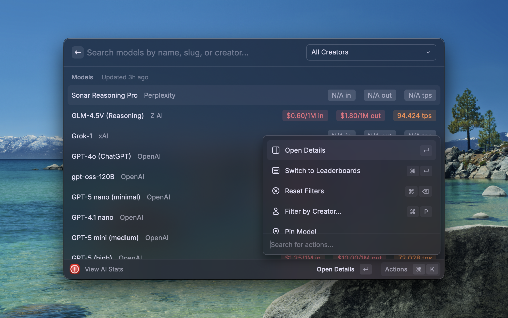
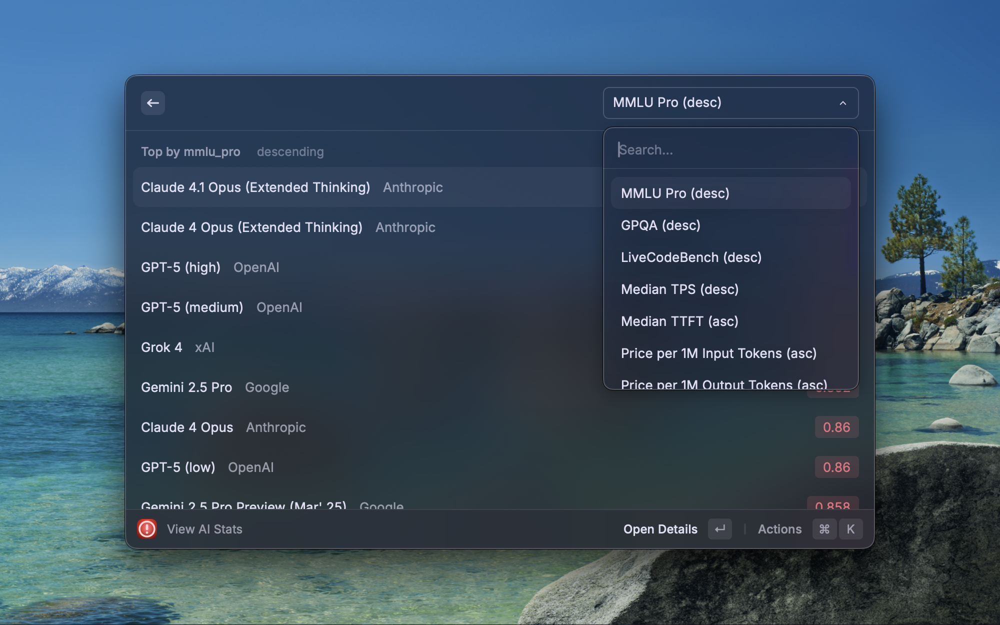

# AI-Stats (Raycast Extension)

A Raycast extension that provides quick access to AI model statistics & leaderboards.
It syncs with [ArtificialAnalysis.ai's](https://artificialanalysis.ai/) API for model data.
Search models, view benchmark results, compare prices, and check leaderboards all without leaving Raycast.

## Screenshots

## Usage

- Command: `View AI Stats`
- Creator Filter: Cmd+P
- Reset Filters: Cmd+Backspace
- Pinned Models: Pin/Unpin from list or detail; Move Up/Down; optional Pinned section (enabled by default) in preferences.

## Commands

- View AI Stats (single unified command for Search and Leaderboards).

## Action Menu (Quick Reference)

- Search
  - Switch to Leaderboards
  - Filter by Creator… (Cmd+P)
  - Reset Filters (Cmd+Backspace)
  - Pin / Unpin / Move Pin Up / Move Pin Down
  - Open Details (Enter)
  - Refresh

- Leaderboards
  - Open Details (Enter)
  - Switch to Search
  - Change Leaderboard… (Cmd+K)
  - Refresh

## Features

- 🔍 **Search Models** Find models by name, slug, or creator. Most recent models shown first.
- 🏷️ **Price Badges** Input & output prices per 1M tokens at a glance.
- 🚀 **Throughput** Median tokens/sec and TTFT, with clear color cues.
- 🏆 **Leaderboards** Rank by MMLU, GPQA, TPS, TTFT, prices, and more.
- 📄 **Model Detail Pages** “About” pages with overview, pricing, throughput, benchmarks, and raw JSON.
- 📌 **Pin a Model** Pin up to 10 models and have them at the top of the list when the extension launches.

## Setup

1. Install the extension in Raycast
2. Run the command: `View AI Stats`
   - Use the search list and Action menu (or Cmd+K) to switch to leaderboards.

## Preferences

You can optionally override the default read-only Supabase project via Raycast Preferences for this extension:

- `SUPABASE_URL` (textfield) – e.g., `https://YOUR-PROJECT.supabase.co`
- `SUPABASE Publish API Key` (password) – your project's publish API key
- `SHOW_PINNED_SECTION` (checkbox) – show a Pinned section at the top of Search (default: enabled)

If left empty, the extension uses a hosted, read-only Supabase instance to fetch public AI stats.

## Data Source

- 📡 Stats come from [ArtificialAnalysis.ai](https://artificialanalysis.ai/) (via their free API).
- Data and benchmarks are owned by ArtificialAnalysis.ai. A read-only Supabase database mirrors this data to reduce API calls.

## Privacy

- No account is required & no personal data is collected by this extension.
- The extension stores only local preferences (e.g., pinned models, filters) using Raycast's local storage.
- Network requests are made to a read-only Supabase endpoint to fetch public AI model data.

## Support

- Open an issue in this repository if you encounter a bug or have a feature request.
- For general questions, feel free to reach out via the Raycast Store listing.

## License

MIT License

## Disclaimer

This is a hobbyist project. Data is owned by ArtificialAnalysis.ai.
The Supabase database is hosted and maintained by Jonathan Reed.
