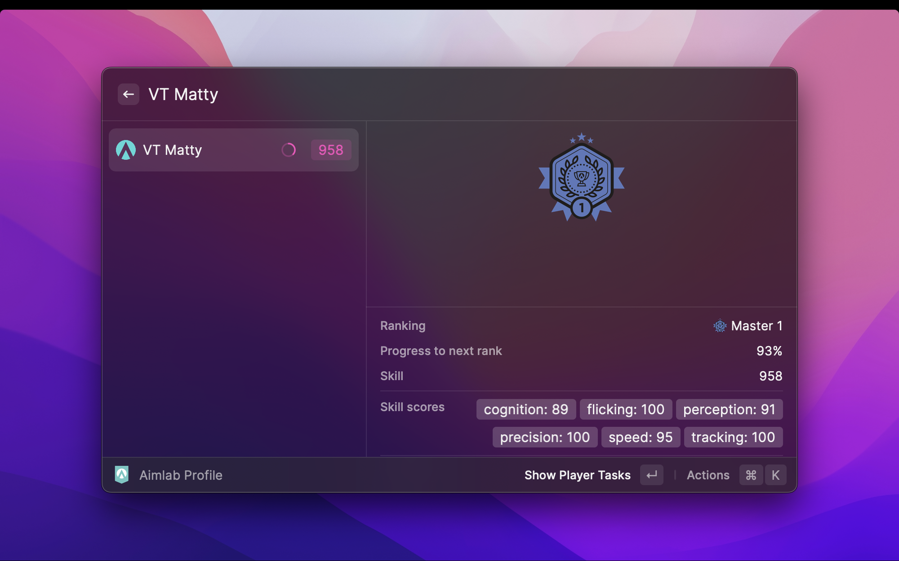
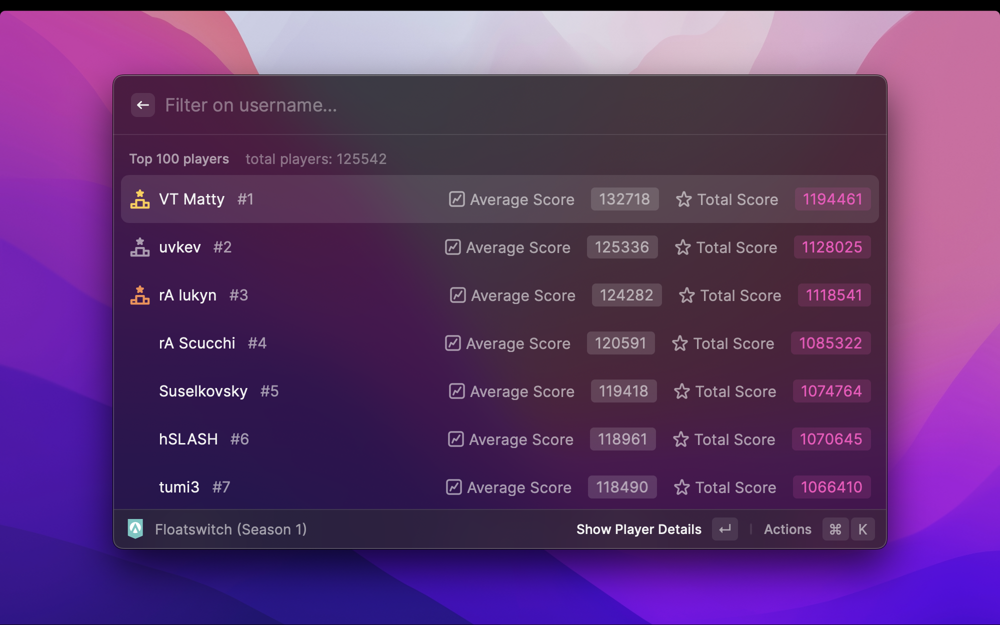

# Aimlab Tracker

## **Introduction**

Track Player profiles, Seasonal Leaderboards and Top Creators from Aimlab

## **How to use**

### **Profile**

To conveniently access your own profile, you must set your username at the beginning.

To search for a player, enter their username. Make sure to enter the correct username, otherwise no results will be displayed.

### **Leaderboards**

In theory, there should not be more than one active season. Aimlab will determine the currently active season.
You can filter the displayed seasons based on their active status. There are two options available: 'All Seasons' or 'Only Active Seasons'.

Seasons are divided into multiple tasks, and you can view the leaderboard for each task.

### **Top Creators**

The 'Top Creators' section showcases the leaderboard of the top 10 creators who have the highest number of plays and users on the tasks they have created.

### **Player Tasks**

You can search for custom player created workshop tasks and this section showcases the leaderboard of that task.

# Extra Info

Special thanks to user [iShott](https://aimlab.gg/u/iShott) for providing valuable knowledge and assistance in the development.
