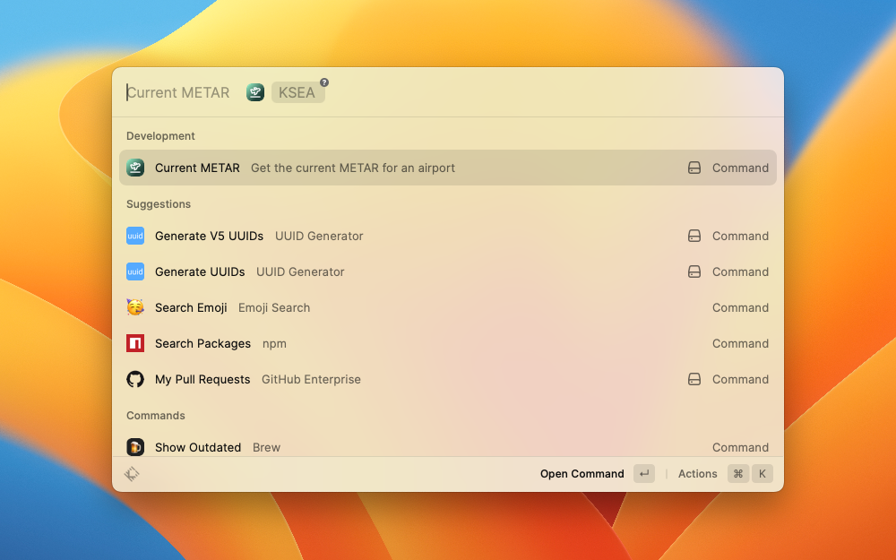
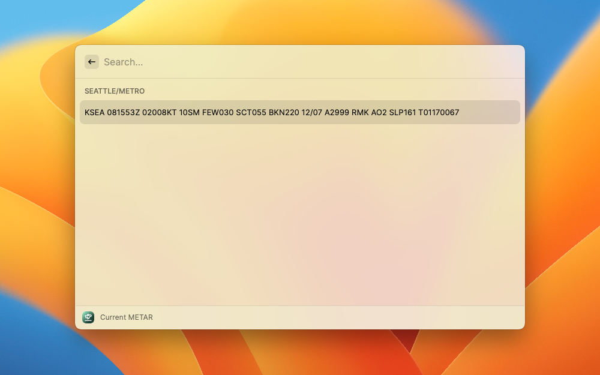

# Airport Weather

This extension is supposed to be convenient for pilots, either private or professionals, who constantly need to access airport weather information.
The extension uses the NOAA weather API which does not actually require any API key and does not place any rate limit.

## Features

- Provide the latest current METAR for an airport station via NOAA API

## Screenshots

Request a METAR for an airport

Result of a METAR

## TODO

- [ ] Add TAFs
- [ ] Provide historical METARs
- [ ] Provide METARs for a list of airport in a single command
- [ ] Provide METARs and TAFs for all stations in a range from a provided station
