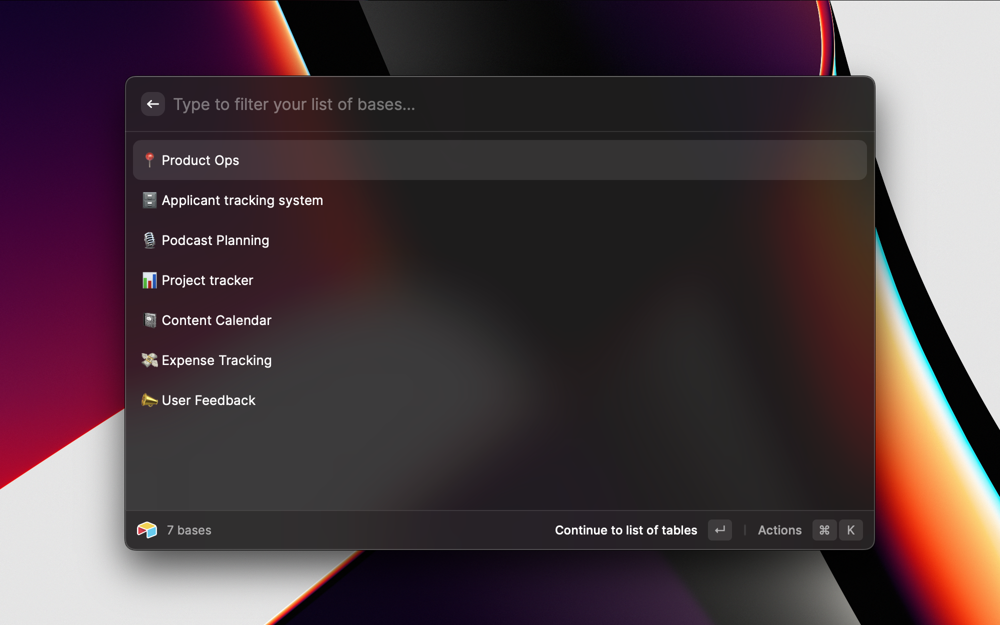
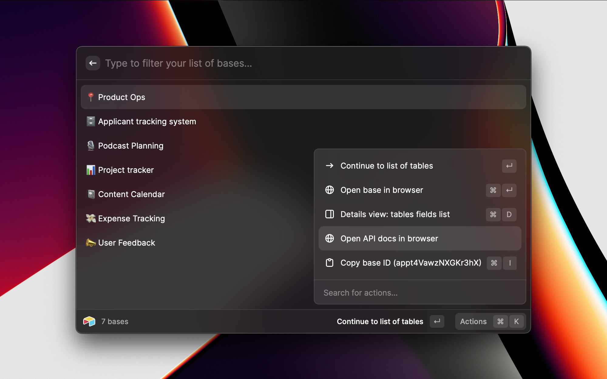
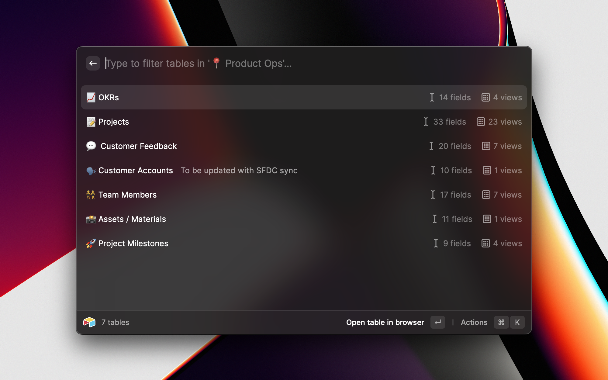
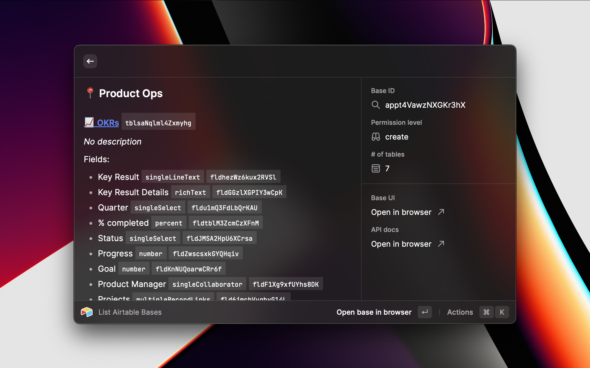
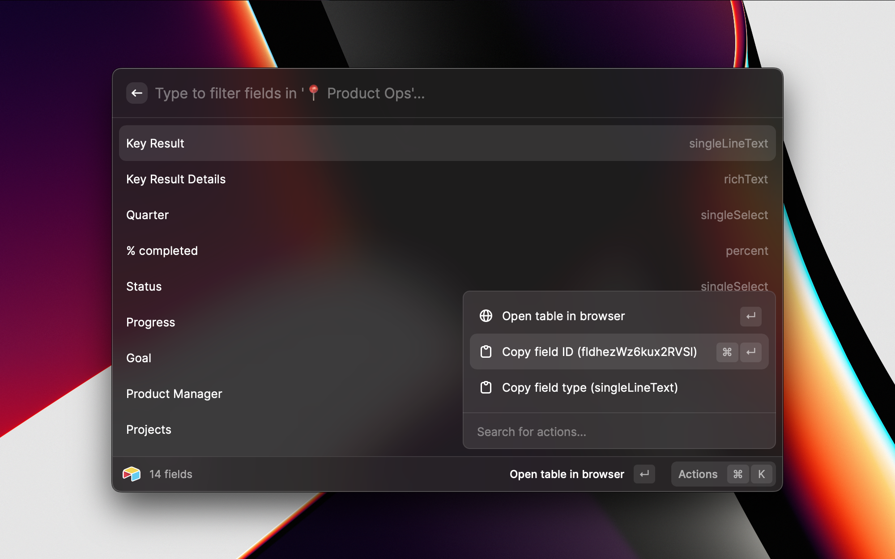

    

# Airtable

[Airtable](https://www.airtable.com) is a connected apps platform for building collaborative app. It allows you to create (data)bases to organize your data in tables and fields -- as well as build interfaces to display information to users and automations to automate processes.

This extension uses Airtable's [OAuth support](https://airtable.com/developers/web/guides/oauth-integrations) and/or [Personal access tokens](https://airtable.com/developers/web/guides/personal-access-tokens) to allow a user to browse the bases, tables, fields, and views they granted the application access to (a part of the Airtable OAuth flow).

---

The software made available from this folder is not supported by Formagrid Inc (Airtable) or part of the Airtable Service. It is made available on an "as is" basis and provided without express or implied warranties of any kind.

---

| Description | Preview |
|---|---|
| List/filter bases |  |
| Deep link into API docs from list of bases |  |
| List/filter a base's tables |  |
| Preview base details including a list of tables, fields, and links to open the base and API docs in your browser |  |
| List/filter a table's fields and copy/paste field IDs (similar functionality is available for a table's views) |  |

## Setup

1. **Install extension**: Click the `Install Extension` button in the top right of [this page](https://www.raycast.com/marks/raycast-airtable-extension)

2. **Authenticate with Airtable**: The first time you use the extension, you'll need to follow a few steps to authenticate with Airtable:

    a. Open the `List Airtable Bases` command in Raycast

    b. Click `Sign in with Airtable` to securely connect the Raycast extension to your Airtable account using OAuth
  
    c. Follow the Airtable OAuth flow to authorize the Raycast extension to access `All current and future bases in all current and future workspaces`. You can choose only a specific base or workspace if you'd prefer.

    d. You should be redirected by to Raycast and see a success message. After a few seconds, you will be sent to the result of the `List Airtable Bases` command you originally requested.

    e. You're done! You can now use the `List Airtable Bases` command directly without going through these setup/configuration steps in the future

3. (ALTERNATIVELY) **Authenticate using Personal Access Token**: If you prefer to use long-lived PAT w/o going through OAuth flow:

    a. Refer to [GUIDE](https://airtable.com/developers/web/guides/personal-access-tokens) and create your token

    b. Enter this token in `Preferences`

## 🗒️ NOTE

If you prefer to use your own OAuth, do the following:

1. **Log In to Airtable**

2. **Go to Builder Hub > OAuth integrations** https://airtable.com/create/oauth

3. **Register new OAuth integration**

4. **Fill Details**

    a. Name e.g. "Raycast Airtable"

    b. OAuth redirect URL - https://www.raycast.com/redirect?packageName=Extension

5. **Scopes** - Tick the following

    a. `schema.bases:read` - needed to view a Base

    b. `data.records:read` - needed to view Records of a Base

    c. `data.records:write` - needed to edit Records of a Baase

6. **Copy the Client ID** and **Paste** in Preferences

7. Follow the steps from the previous section 

## 🙏 Acknowledgement/Thank yous

Many thanks to the following resources and people:

- [Raycast OAuth extension examples](https://github.com/raycast/extensions/tree/main/examples/api-examples)
- [Raycast Slack community](https://www.raycast.com/community)
- Airtable Developer Platform & Ecosystem team
- @marks and @SeanKeenan-at built this extension
- @xmok currently managing the OAuth App