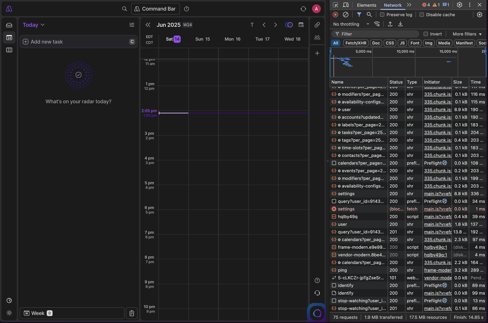
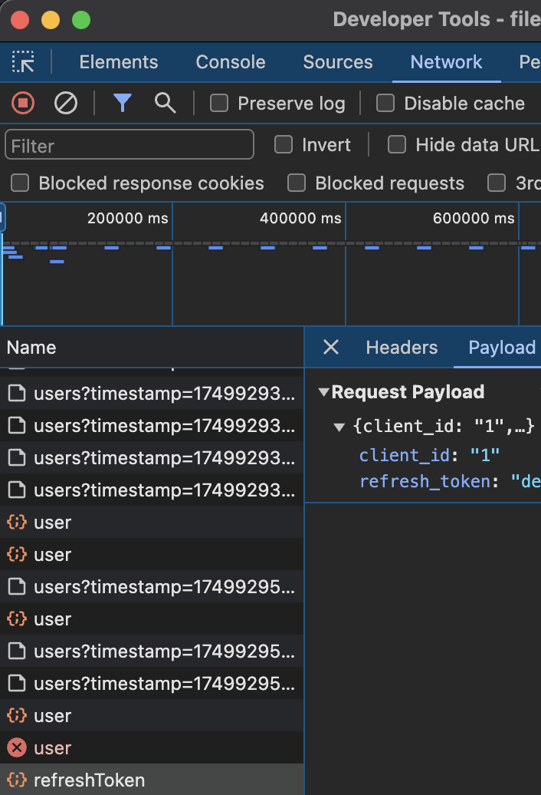

# Akiflow

Manages your tasks in Akiflow

## Set-Up Guide
Unfortunately, the lack of a public API for Akiflow means that setting this up is difficult and can be time-consuming (30min)

1. Open the Akiflow desktop app, and then open the developer tools by pressing "Cmd+Shift+I". (You can also do this in the web app, but the keyboard shortcut might not work)
2. Go to the "Network" tab. This contains all of your network requests and it is where you will find the refresh token.

**It should look something like this:**

(It may be in a separate window rather than a side panel)
3. Wait a maximum of 30 minutes - the token used expires every 30 minutes and a new one is generated by your refresh token.  
Eventually, you will see a refresh_token request in the network tab. You can do anything else while waiting, just ensure that the network tab remains open - history is not kept between sessions.

4. Copy the refresh token and paste it into the "Akiflow Extension" preferences in Raycast. Only copy what is inside the quotation marks. 
5. You're done! You can now use the extension.

@ me in Slack if you have any questions or need help.
