# Raycast Extension for Akkoma

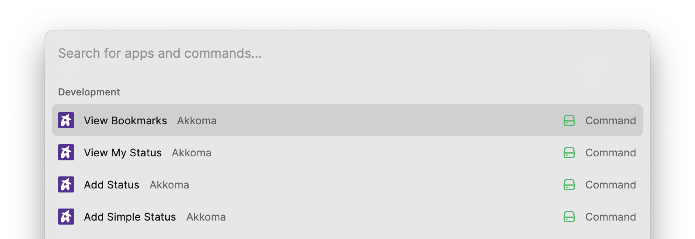

 
-  [Akkoma](https://akkoma.social/) 
-  [Raycast](https://raycast.com)

**Features**:
- Write status with markdown support.
- Publish simple status with text.
- Publish scheduled status with natural date format.
- Publish status with attachments (image, video, files); add alt text to the image when only one image is attached.
- Save draft status.
- View your bookmarked statuses.
- View your latest statuses.
- Open the latest published status that was published from Raycast through the actions.

## Settings

Input your Akkoma / Pleroma instance's URL, then click the "Continue" button in the bottom-right corner.

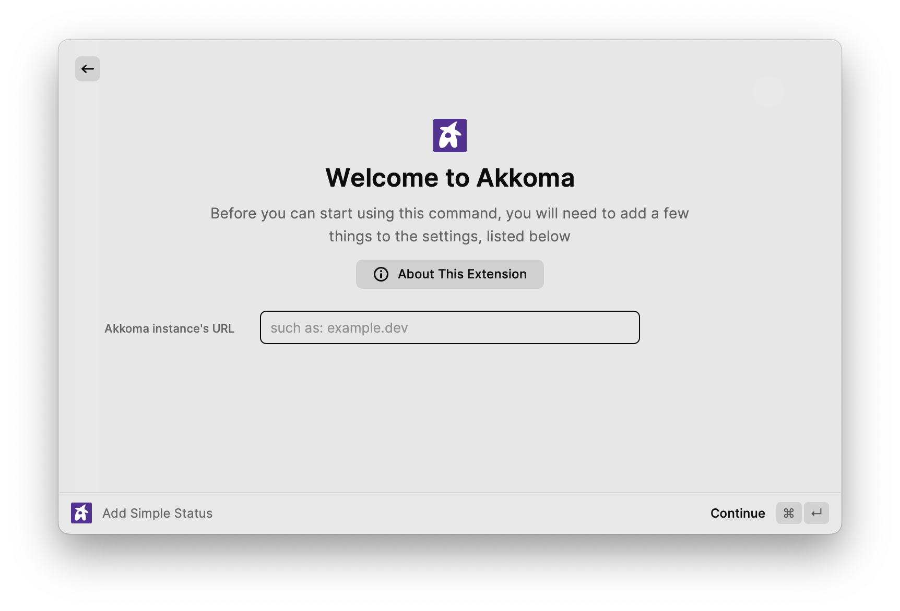

## Examples:

### Add simple status with text

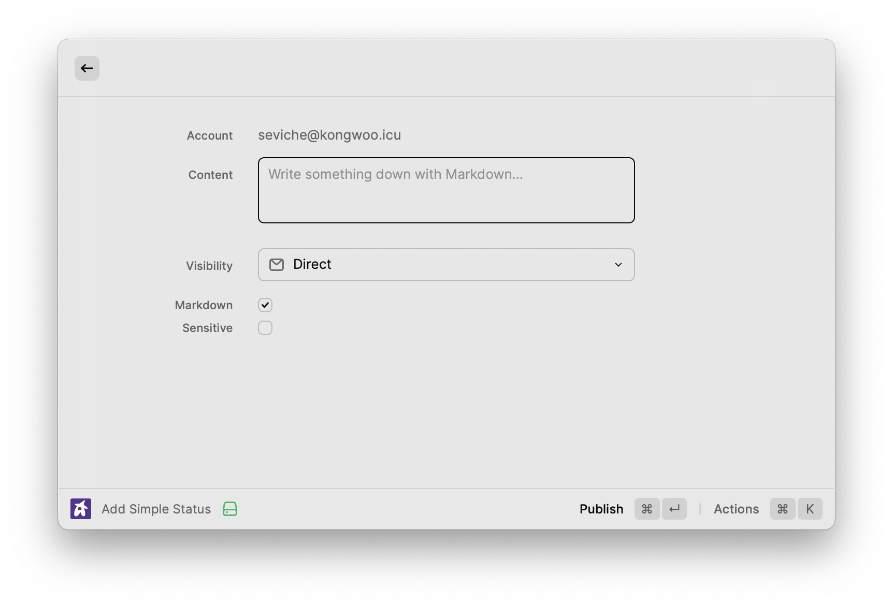

### Add scheduled status
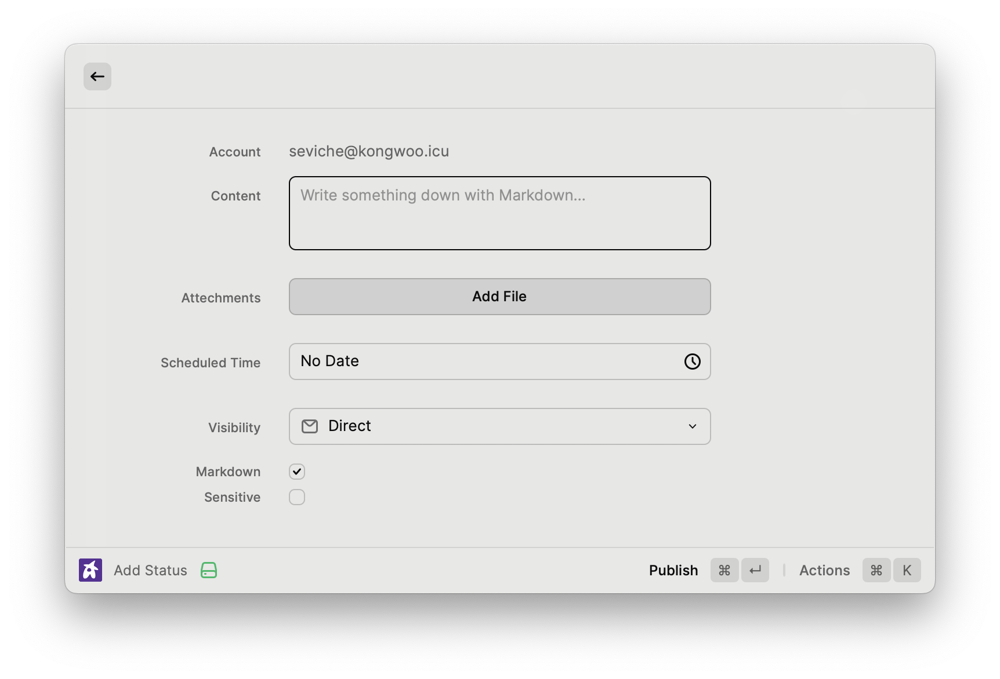

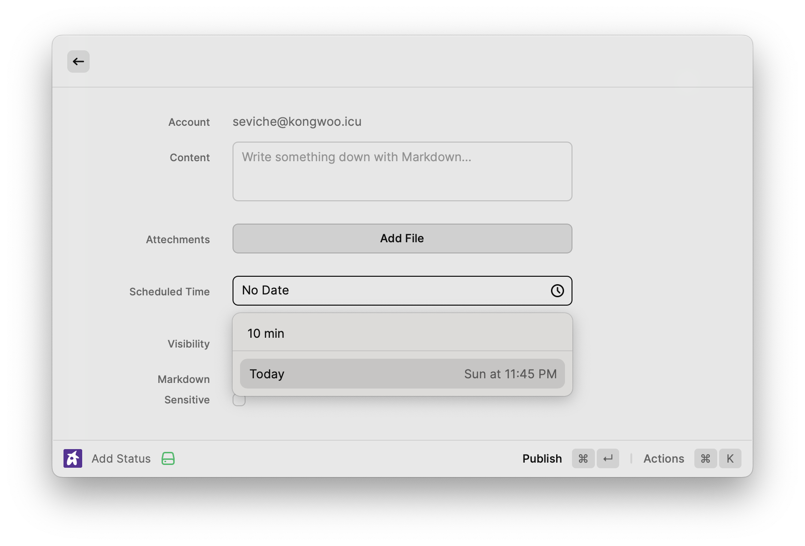

### Add status with image and alt text

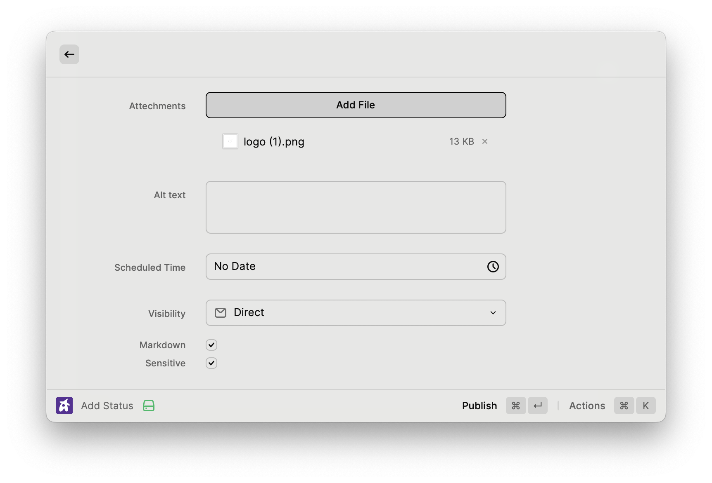

### View bookmarked status 

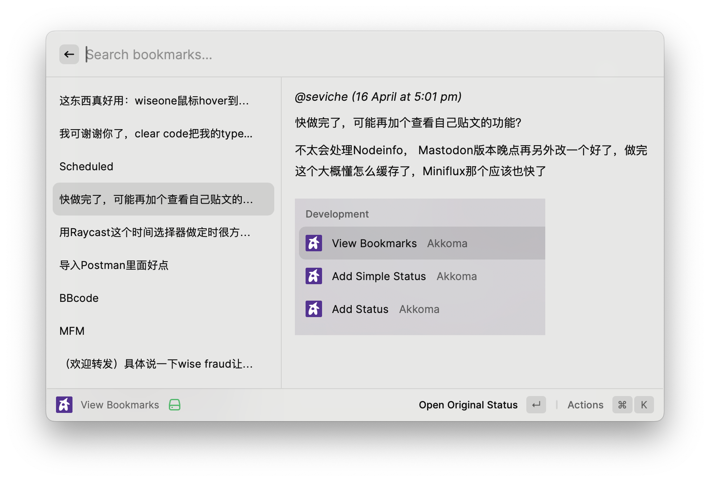

### View your latest status

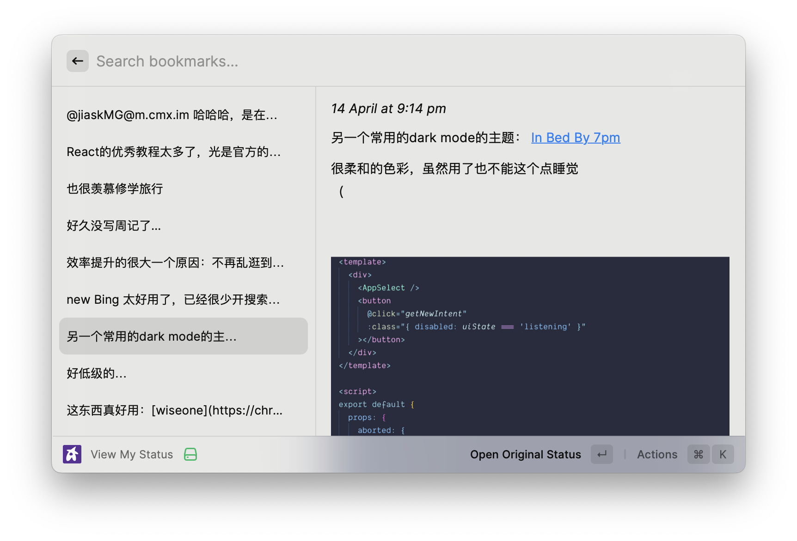

### Mark status as sensitive 
Toggle the "Sensitive" checkbox to mark the attached image as sensitive, or add a content warning to the status.

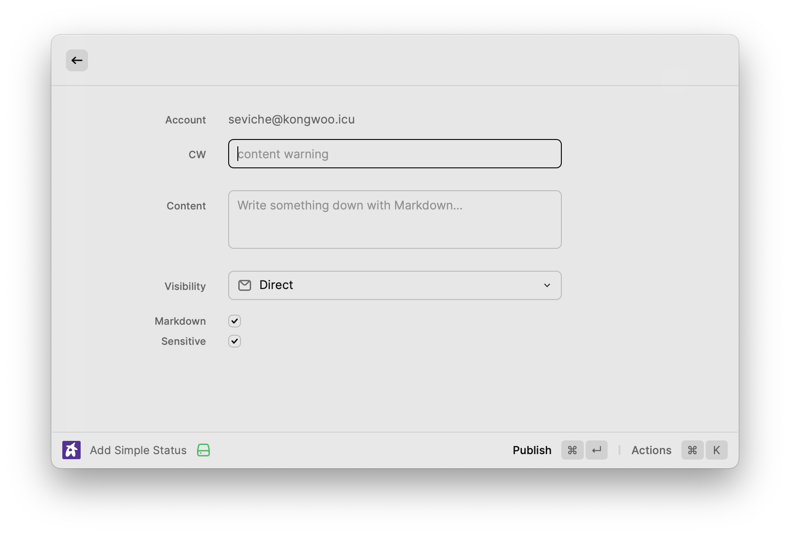

### Write status with markdown
Toggle the "Markdown" checkbox to render markdown in the text file. Markdown shortcuts are also supported (e.g., pressing `⌘` + `B` will add `**bold**` around the selected text, `⌘` + `I` will make the selected text italic, etc.).

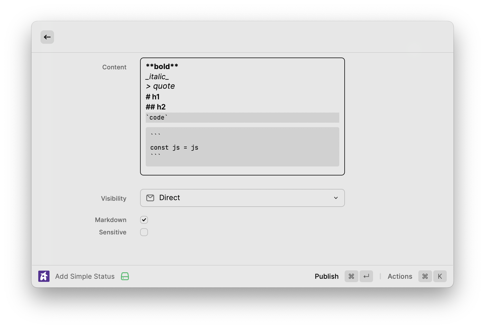

### Draft status 

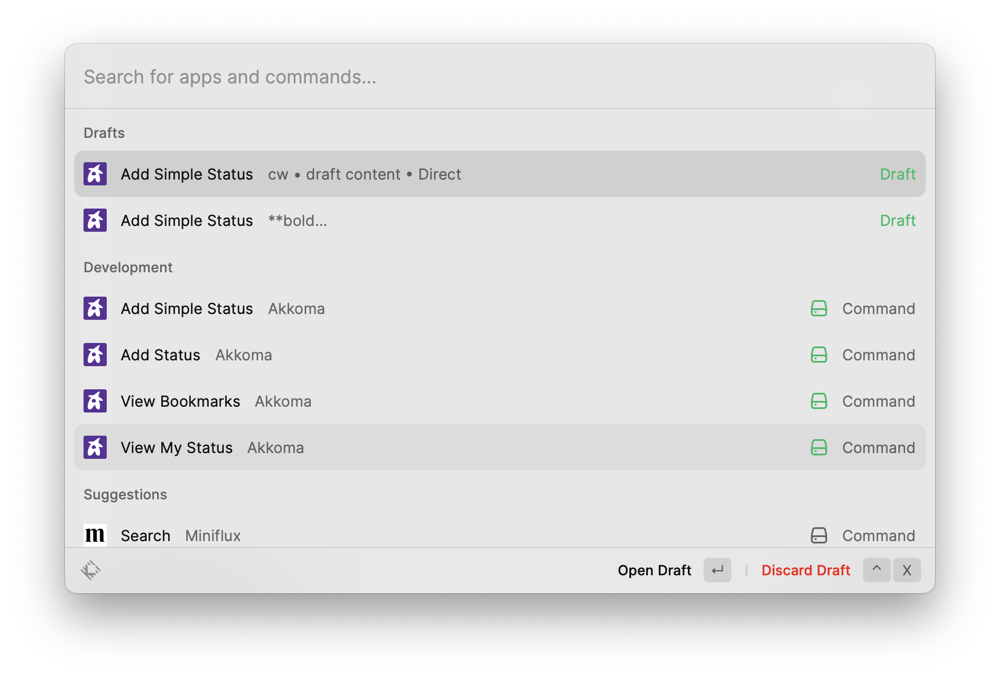
## Available Settings

### Status limit
Based on performance considerations, the number of statuses displayed is limited, with the default being 20. You can adjust this limit in the extension settings.

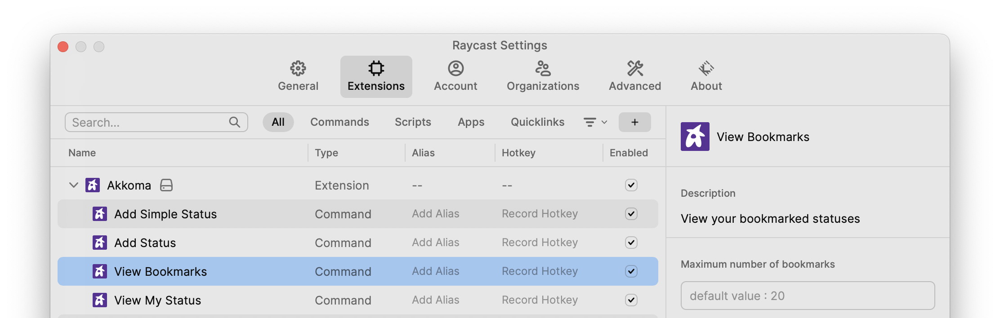

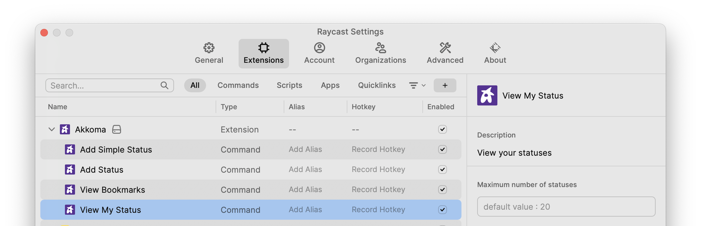

### Default visibility

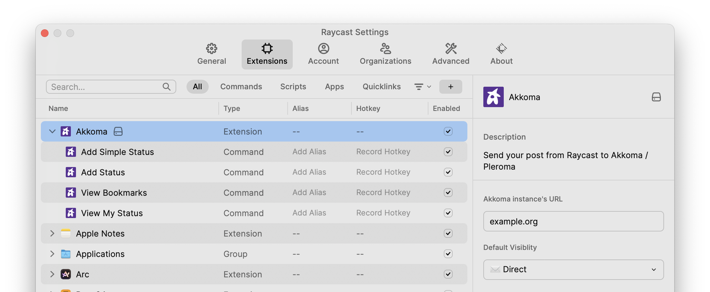

## Actions 
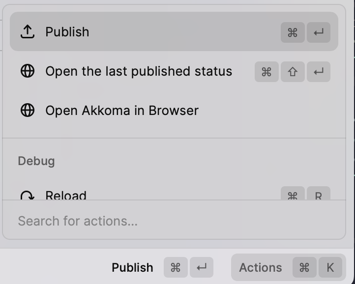

## TODO
- [ ] Fork to Mastodon
