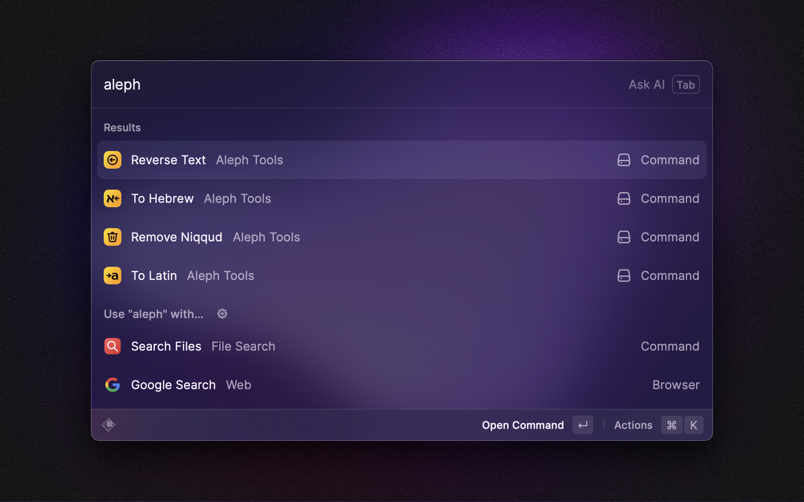

    
<h1 align="center">Aleph Tools </h1>

A set of text manipulation tools, useful for Hebrew and Yiddish typesetters and designers. 

 

## How to use 

Select any text that you wish to manipulate, and run the command! Your currently selected text will be replaced with the updated text.

## Commands

### Reverse Text

Reverses the order of the currently selected text and replaces the current selection.

> Example:  `קחצי ימש ,םולש` will become  `שלום, שמי יצחק`

### Remove Niqqud

Removes all [niqqud](https://en.wikipedia.org/wiki/Niqqud) from the currently selected text and replaces the current selection.

> Example:  `שָלוֹם, שְמִי יִצְחָק` will become  `שלום, שמי יצחק`

### To Hebrew

Converts the currently selected text to Hebrew keycode and replaces the current selection.

> Example:  `akuo' anh hmje` will become  `שלום, שמי יצחק`

### To Latin

Converts the currently selected text to Latin (common QUERTY) keycode and replaces the current selection.

> Example:  `יקךךםת צט משצק ןד טןאזביםל` will become  `Hello, my name is Yitzchok`
