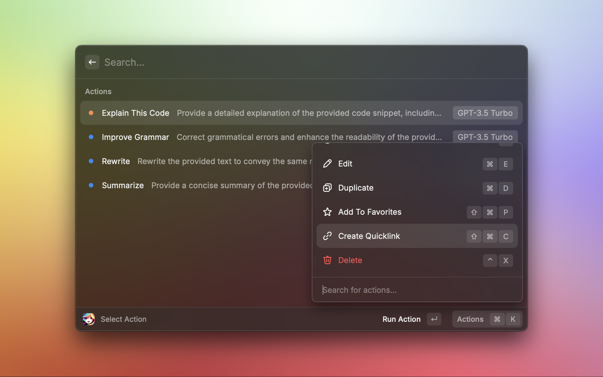

  

<h1 align="center">Alice AI - Your ChatGPT Actions Companion</h1>

Before you start using Alice AI, you need to set up your OpenAI API key.

# 🎉 Features

## Browse your actions 📚

Alice AI allows you to browse your actions and easily run them.

## Execute your actions ⚡️

Alice AI uses your selected text for executing actions.

## Always go back to your action history 🔙

Alice AI keeps track of your actions and allows you to go back to them.

## Easily customize your actions ✏️

Alice AI allows you to easily customize your actions. You can add new actions, edit existing actions, and delete actions.

## Quicklink to your actions 🔗

Alice AI allows you to quickly access your actions from the raycast root. Just create a quicklink to your actions.

# 🚀 Supported OpenAI models

Alice AI supports the following models:
- GPT3.5 Turbo
- GPT4 Turbo

---

## About the Author

Alice AI is created by [Wojciech Król](https://github.com/wojciechkrol). If you have any questions or feedback, feel free to reach out to me on [Twitter](https://twitter.com/_wojciechkrol). I'd love to hear from you! 🚀