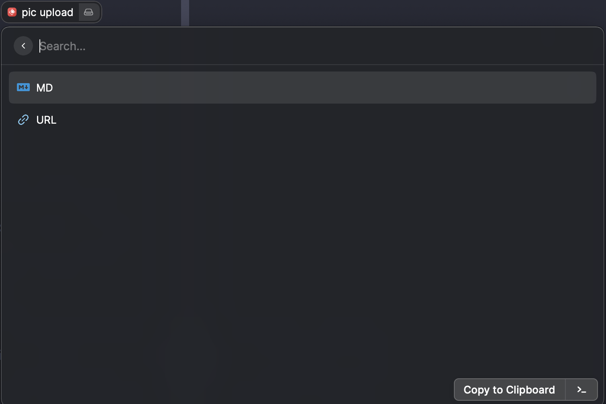

# Upload your pictures to OSS



https://user-images.githubusercontent.com/32320149/156487976-94ec9ec1-cb5f-4c90-af60-792314daecd0.mov

## Introduce

OSS is An object storage service provided by Alibaba.

This extension is a easy way for you to upload a picture to OSS,

and return the url.

Just copy a image type file or screen capture successfully,

then open Raycast and typing oss.

## Dependences

Please install [pngpaste](https://github.com/jcsalterego/pngpaste) before use OSS.

```
brew install pngpaste
```
