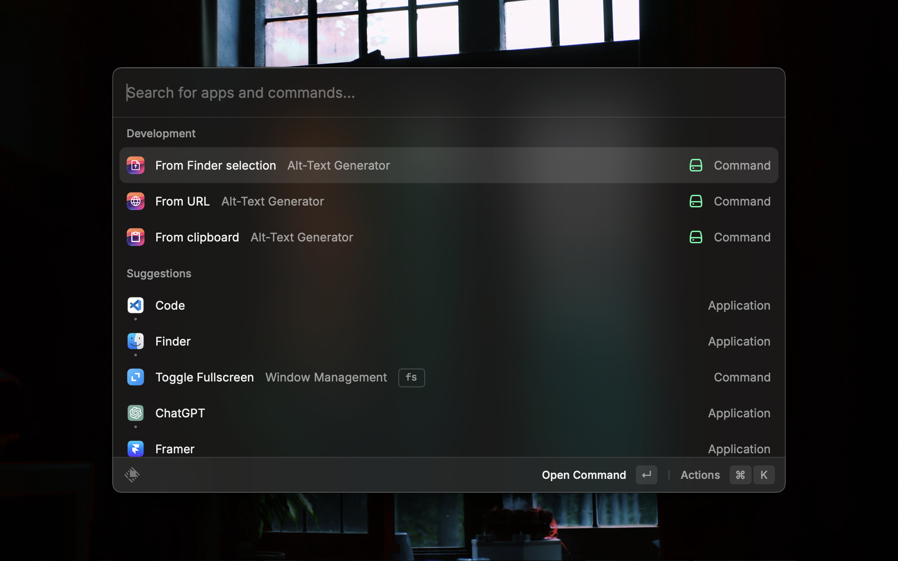
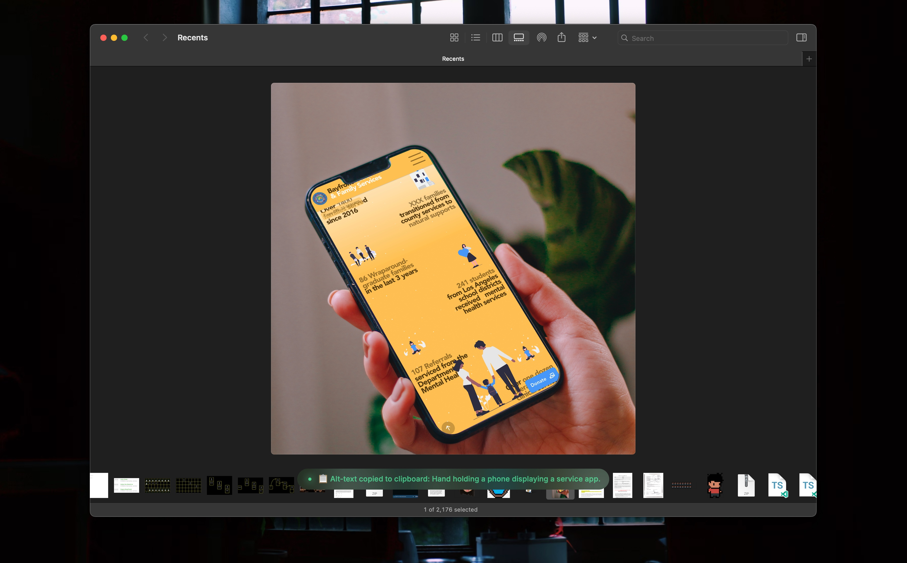
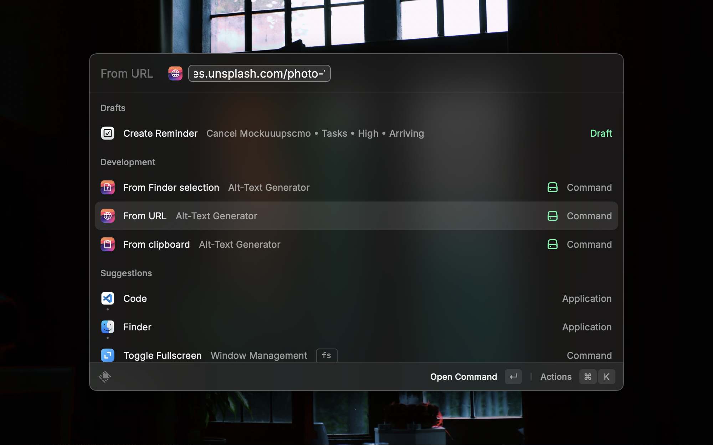

# Alt Text Generator

This extension makes it easy to generate descriptive alt-text for images. Simply provide an image using one of the three commands, and the extension will make a call to the OpenAI API to create a concise and descriptive alt text.

## Requirements

This extension is Bring-Your-Own-Key (support for OpenAI only at the moment). If you don't have an API key yet, you can sign up for one at [OpenAI - Api Keys](https://platform.openai.com/api-keys).

## Commands

You can generate alt-text in three ways:

**From URL**: This command will generate alt-text from a hosted image URL.

**From Clipboard**: This command will generate alt-text from an image copied to the clipboard.

**From File Selection**: This command will generate alt-text from a single file selection in Finder. Supported image types and file sizes are set by the OpenAI API. For more information, refer to the [OpenAI API Vision documentation](https://platform.openai.com/docs/guides/vision)

## Good to know

- The extension works local images too. If you want to generate alt-text for a local image, you can use the `Generate Alt-Text` command and provide the relative or absolute path to the image file.
- Once generated, the alt text is copied to the clipboard by default
- Supported image types and file sizes are set by the OpenAI API. For more information, refer to the [OpenAI API Vision documentation](https://platform.openai.com/docs/guides/vision).

## Extension Settings

This extension contributes the following settings:

- `prompt`: Customize the prompt message that is sent to OpenAI for generating alt-text.

## Known Issues

File path resolution for local images is still WIP, so you may run into some issues there.

## Contributing

If you have any suggestions or issues, feel free to open a PR or an issue on the [Raycast Extensions Repository](https://github.com/raycast/extensions)

## Roadmap

- [ ] Add support for more image types like svg.

## Images

