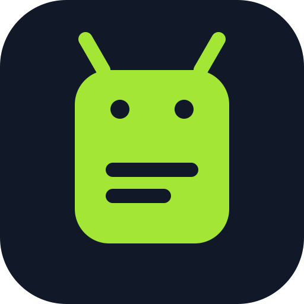
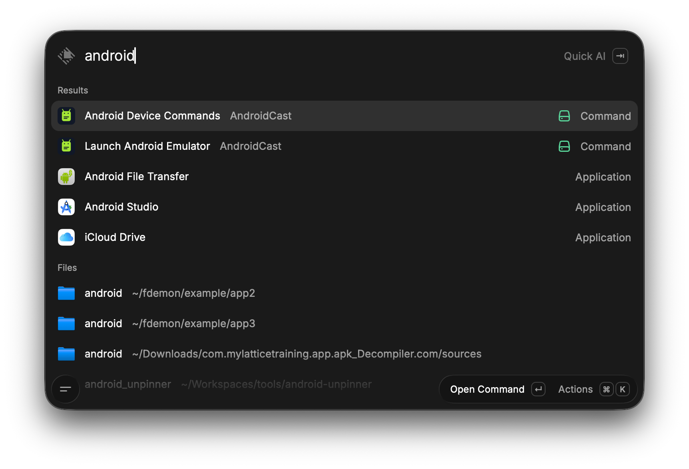
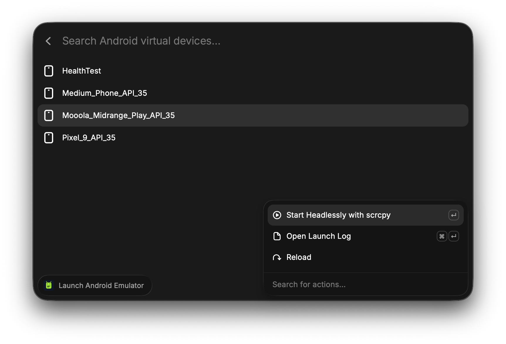
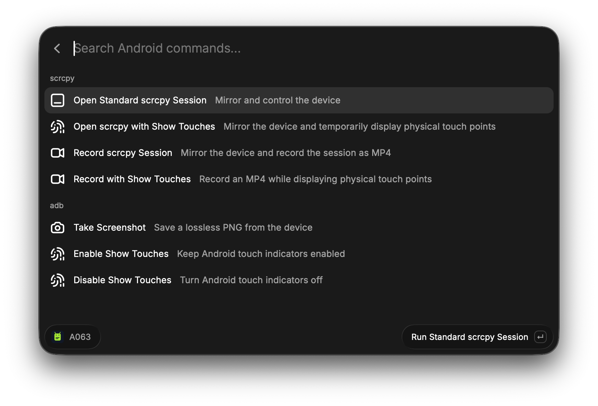

<div align="center">
  

  # AndroidCast

  **Launch, mirror, record, and capture Android devices from Raycast.**

  [](https://www.apple.com/macos/)
  [](https://www.raycast.com/)
  [](https://developer.android.com/tools/adb)
  [](https://github.com/Genymobile/scrcpy)
  [](LICENSE)
</div>

AndroidCast brings common Android Emulator, `adb`, and `scrcpy` workflows into two fast, searchable Raycast commands. It works with installed Android Virtual Devices and connected physical devices without requiring Android Studio to remain open.

## Highlights

- List every installed Android Virtual Device and see which ones are already running.
- Start an emulator headlessly and open it through scrcpy when Android finishes booting.
- Open a standard scrcpy session for any connected emulator or physical device.
- Record MP4 sessions, with optional touch indicators.
- Capture lossless PNG screenshots through adb.
- Enable or disable Android's persistent **Show touches** setting.
- Keep detached process logs in Raycast's extension support directory for troubleshooting.

## Commands

<p align="center">
  
  <br>
  <em>Open emulator and device tools directly from Raycast.</em>
</p>

### Launch Android Emulator

Lists installed Android Virtual Devices and provides actions to:

- start an AVD headlessly and open it with scrcpy;
- reopen a running AVD in scrcpy;
- stop a running emulator;
- open the persistent emulator launch log.

AndroidCast assigns the next free emulator port, waits for the device to complete booting, and then launches scrcpy.

<p align="center">
  
  <br>
  <em>Choose any installed Android Virtual Device and start it headlessly with scrcpy.</em>
</p>

### Android Device Commands

Lists connected physical devices and emulators. Select a device to search these actions:

| Action | Result |
| --- | --- |
| Open Standard scrcpy Session | Mirror and control the selected device |
| Open scrcpy with Show Touches | Mirror the device with temporary touch indicators |
| Record scrcpy Session | Mirror and save the session as MP4 |
| Record with Show Touches | Record an MP4 with touch indicators |
| Take Screenshot | Save a lossless PNG using `adb screencap` |
| Enable Show Touches | Keep Android touch indicators enabled |
| Disable Show Touches | Turn persistent touch indicators off |
| Output Folders | Configure where screenshots and recordings are saved |

Recordings are finalized when the scrcpy window closes.

<p align="center">
  
  <br>
  <em>Mirror, record, capture screenshots, and control touch indicators from one searchable list.</em>
</p>

## Output folders

| Output | Default location |
| --- | --- |
| Screenshots | `~/Documents/screenshots` |
| Recordings | `~/Documents/recordings` |

Change either location from **Output Folders** inside **Android Device Commands**, or under **Raycast Settings**, **Extensions**, **AndroidCast**. Both preferences are optional; AndroidCast uses the defaults above when a custom folder is not selected.

Folders are created automatically when first needed. Files include the device name and an ISO-style timestamp.

## Requirements

- macOS
- [Raycast](https://www.raycast.com/)
- Node.js 22 or later
- Android SDK Platform Tools (`adb`)
- Android Emulator command-line tools for AVD launching
- [scrcpy](https://github.com/Genymobile/scrcpy)

AndroidCast checks `ANDROID_SDK_ROOT`, `ANDROID_HOME`, and the default macOS SDK location at `~/Library/Android/sdk`. It also searches common Homebrew locations and `PATH` for scrcpy.

If you use Homebrew, scrcpy can be installed with:

```bash
brew install scrcpy
```

Create and manage Android Virtual Devices from Android Studio's Device Manager before launching them from AndroidCast.

## Install from source

```bash
git clone https://github.com/imprisonedmind/android-cast.git
cd android-cast
npm install
npm run dev
```

Raycast registers both commands while the development process is running.

## Device setup

For a physical device, enable **Developer options** and **USB debugging**, connect it, and accept the computer authorization prompt. Confirm the connection with:

```bash
adb devices -l
```

The device must appear with the state `device`. Entries marked `unauthorized` or `offline` are intentionally not shown in AndroidCast.

## Troubleshooting

### An emulator starts but scrcpy does not open

Open the selected AVD's **Launch Log** action in Raycast. The log preserves Android Emulator startup and boot-wait errors even after Raycast closes.

### No devices are listed

Run `adb devices -l`, accept any authorization prompt on the device, then reload the Raycast list.

### A recording seems incomplete

Close the scrcpy window normally before opening or moving the MP4. scrcpy writes the recording trailer when the session ends.

## Development

```bash
npm run dev
npm run lint
npm run build
```

## License

[MIT](LICENSE)
