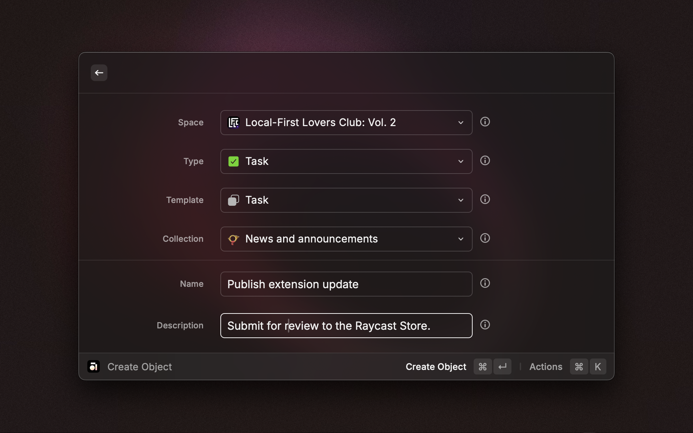

# Anytype for Raycast

Create, browse and search in Anytype - right at your fingertips, anywhere on your Mac.

## Setup

To get started, grant the extension access to your account using the local pairing process. Follow these steps:

1. **Install the Extension**: Add the Anytype extension via the Raycast Store.
2. **Open Anytype Desktop**: Ensure the app is running and you are logged in.
3. **Run a Command**: Trigger any extension command.
4. **Authenticate**: When prompted, press <kbd>Enter</kbd> to start the pairing process.
5. **Enter the Code**: A popup in Anytype Desktop will display a 4-digit code. Input this code in the extension’s `Verification Code` field. Press <kbd>Command</kbd> + <kbd>Enter</kbd> to confirm.
6. **Confirmation**: Once successfully paired, the extension is ready to use.

## Commands

### Create Object

Create new objects in your spaces directly from Raycast.

- **Choose**: Specify the `Space` and `Type` of object (e.g., Bookmark, Note, Task).
- **Input**: Fill in details like the object name, description, or body text.
- **Save**: Press <kbd>Command</kbd> + <kbd>Enter</kbd> to save the object. It will immediately appear in your vault.

### Browse Spaces

Navigate through your spaces and explore their contents.

- **View**: A list of available spaces will appear.
- **Explore**: Select a space to view its objects, types, and members.
- **Interact**: Press <kbd>Enter</kbd> to view an object in Raycast or <kbd>Command</kbd> + <kbd>Enter</kbd> to open it in Anytype.

### Search Anytype

Perform a global search across all spaces in your vault.

- **Search**: Enter your search term in the search bar.
- **Filter**: Use the dropdown menu to filter results by type.
- **Interact**: Press <kbd>Enter</kbd> to view the object in Raycast or <kbd>Command</kbd> + <kbd>Enter</kbd> to open it in Anytype.

## Tips

Make the most of the Anytype extension with the following tips:

- **Open**: Use <kbd>Command</kbd> + <kbd>Enter</kbd> to instantly open the currently selected space or object in Anytype.
- **Refresh**: Manually refresh data with <kbd>Command</kbd> + <kbd>R</kbd>.
- **Deletion**: Quickly delete objects with <kbd>Ctrl</kbd> + <kbd>X</kbd>.
- **Drafts**: Leave the Object Creation command with unsaved changes, and the current state is automatically saved as a draft, allowing you to resume later.
- **Quicklinks**: Leverage even faster object creation:
  - Select the `Space` and `Type`.
  - Prefill object fields as needed.
  - Use the `Create Quicklink` option in the action menu and save with <kbd>Command</kbd> + <kbd>Enter</kbd>.
  - The Quicklink will appear in the root search under the specified name.

## Troubleshooting

### Error: API Not Reachable

- Verify the app version is **v0.45.0** or later.
- Ensure the Anytype Desktop app is running.
- Confirm you are logged into your vault.

### Objects, Types or Spaces Not Displaying Completely

For performance reasons, the extension only fetches a limited amount of items at a time.

- Pagination is supported in lists to access additional items when scrolling down. However, the extension might refuse to paginate further if the available memory is exhausted.
- For dropdowns in `Create Object` command the limitation remains.
- The API limit can be adjusted in the extension settings - default is 50 items.
