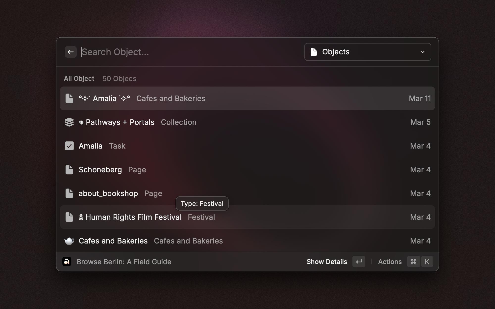

# Anytype for Raycast

Create, browse and search in Anytype - right at your fingertips, anywhere on your Mac.

## Setup

To get started, grant the extension access to your Anytype vault using the local pairing process. Follow these steps:

1. **Install the Extension**: Add the Anytype Raycast extension via the Raycast Store.
2. **Open Anytype Desktop**: Ensure the app is running and you are logged into your vault.
3. **Run a Command**: Trigger any extension command.
4. **Authenticate**: When prompted, press Enter to start the local pairing process.
5. **Enter the Code**: A popup in Anytype Desktop will display a 4-digit code. Input this code in the extension’s 'Verification Code' field.
6. **Confirmation**: Once successfully paired, the extension is ready to use.

## Commands

### Create Object

Create new objects in your Anytype vault directly from Raycast.

- **Choose**: Specify the `Space` and `Type` of object (e.g., Bookmark, Note, Task).
- **Input**: Fill in details like the object name, description, or body text.
- **Save**: Press <kbd>Command</kbd> + <kbd>Enter</kbd> to save the object. It will immediately appear in your vault.

### Browse Spaces

Navigate through your Anytype spaces and explore their contents.

- **View**: A list of available spaces will appear.
- **Explore**: Select a space to view its objects, types, and members.
- **Interact**: Press <kbd>Enter</kbd> to view an object in Raycast or <kbd>Command</kbd> + <kbd>Enter</kbd> to open it in Anytype.

### Search Anytype

Perform a global search across all spaces in your Anytype vault.

- **Search**: Enter your search term in the search bar.
- **Filter**: Use the dropdown menu to filter results by type.
- **Open**: Press <kbd>Enter</kbd> to view the object in Raycast or <kbd>Command</kbd> + <kbd>Enter</kbd> to open it in Anytype.

## Tips

Enhance your experience with the extension using following tips:

- Use <kbd>Command</kbd> + <kbd>Enter</kbd> to instantly open the currently selected space or object in Anytype.
- Drafts are supported for object creation, allowing you to save objects as drafts and continue editing them later.
- Quicklink creation is available for even faster object creation. Select the `Space` and `Type`, prefill the object fields as desired, and select the `Create Quicklink` option from the action menu. Save the Quicklink with <kbd>Command</kbd> + <kbd>Enter</kbd>. It will appear in the root search under the specified name.
- Manually refresh the data anytime by pressing <kbd>Command</kbd> + <kbd>R</kbd>.
- Quickly delete objects with <kbd>Ctrl</kbd> + <kbd>X</kbd>.

## Troubleshooting

### Error: API not reachable

- Ensure the Anytype Desktop app is running.
- Verify the app version is **v0.44.0** or later.
- Confirm you are logged into your vault.
