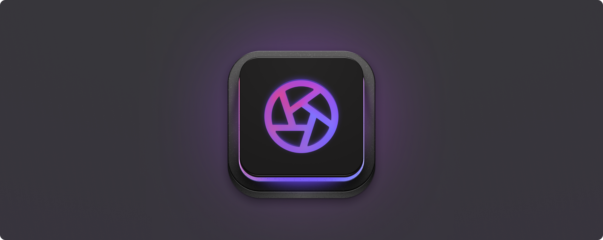
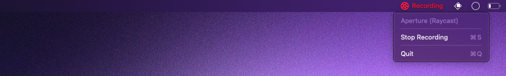

  
   
  <h1>Aperture</h1>
  
🖥️ Record your screen directly from Raycast 🎥

# Commands

## Start/Stop Recording Your Screen

Single command to start and stop recording your screen. The recording will be saved to the specified folder and post save actions can be configured in the extension preferences.

An indicator icon is displayed in the menu bar while the screen is being recorded. This icon can be left clicked to stop the recording or right clicked to show a menu with more options.

## Preferences

Command where you're able to configure the recording options such as frames per second, show cursor, highlight clicks, video codec, etc.

# Development

## Native modules

-  `aperture-cli` - Native screen recorder. This binary is the output of the `build:aperture-cli` command, which builds the Swift CLI application from [aperture-none](https://github.com/wulkano/aperture-node).
-  `aperture-indicator` - Native macOS application that shows a menu bar indicator when the screen is being recorded. This app can be built by running the `build:aperture-indicator` command. Its source code is located in the [Sources/aperture-indicator](Sources/aperture-indicator/) directory.

# Acknowledgements

This extension uses and is inspired by tools like:

-  [aperture](https://github.com/wulkano/aperture) - The same recorder used in [Kap](https://github.com/wulkano/Kap)
-  [aperture-none](https://github.com/wulkano/aperture-node) - Node wrapper around aperture, in which I based my code on.

Thanks to the authors of these tools ❤️