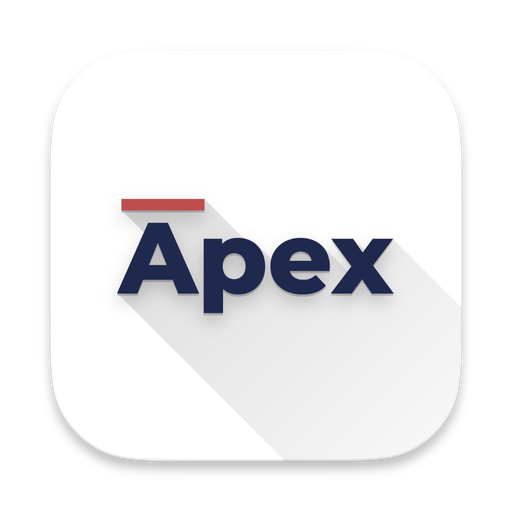
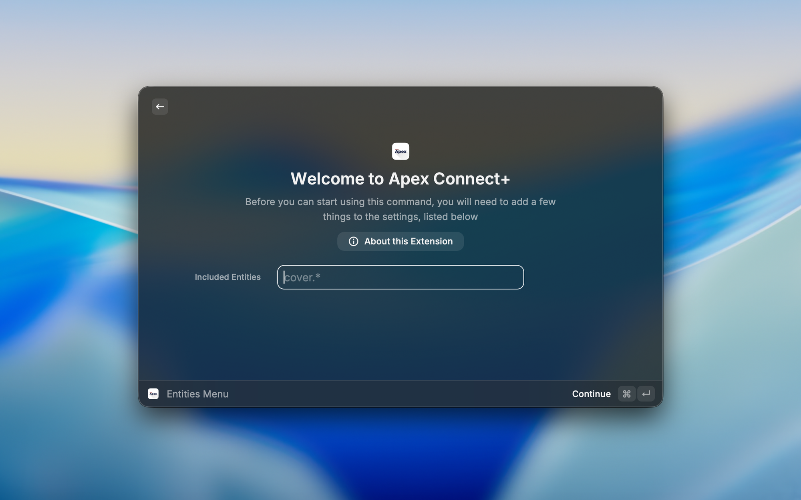
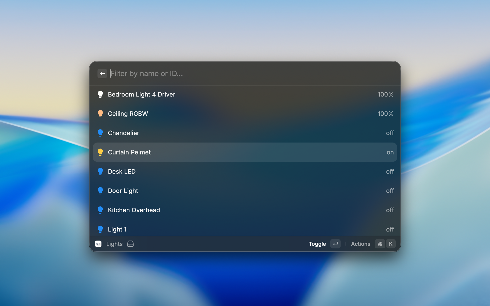
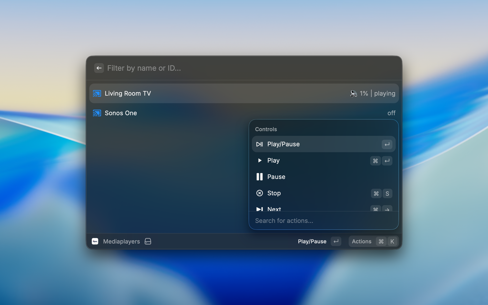
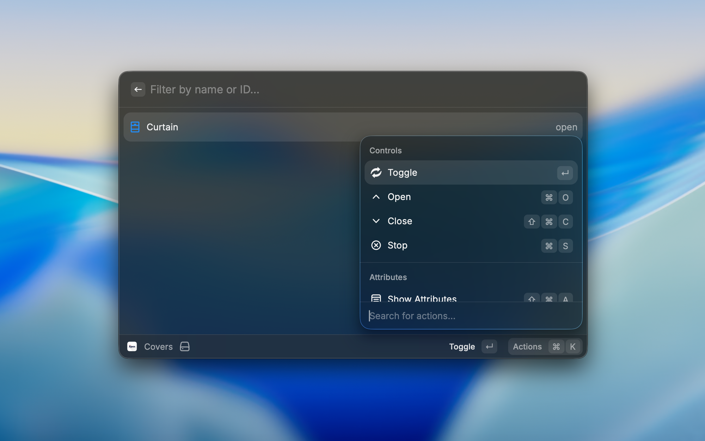

<div align="center">
  

  <h1>Apex Connect for Raycast</h1>

  <p>Control your ApexOS-powered smart home right from Raycast. 🚀</p>

  <p>
    
    
    
  </p>
</div>

---

Apex Connect is a [Raycast](https://raycast.com) extension for [ApexOS](https://apexinfosys.in). Search, view, and control every entity in your smart home — lights, covers, climate, media players, cameras, and more — without leaving your keyboard.

## Features

- Manage every entity type: lights, switches, covers, fans, climate, media players, cameras, vacuums, scripts, scenes, automations, and more
- Menu bar widgets for lights, covers, media players, batteries, weather, notifications, and arbitrary entities
- Real-time state updates over a WebSocket connection
- Automatic switching between an internal (home network) and external (cloud) URL based on WiFi SSID or reachability
- Optional deep-linking into the Apex Connect companion app instead of the browser

## Requirements

- [Raycast](https://raycast.com) on macOS
- An ApexOS instance reachable over HTTP(S), plus a long-lived access token

## Installation

This extension isn't published on the Raycast Store — install it in developer mode:

```bash
git clone https://github.com/AdvaitT17/apexconnect-raycast.git
cd apexconnect-raycast
npm install
npx ray develop
```

`ray develop` builds the extension and adds it to Raycast. Once it's running you can close the terminal — the commands stay available in Raycast.

## Setup

### Get an access token

1. Go to your ApexOS instance, e.g. `https://user.cloud.apexinfosys.in`
2. Click your profile (next to notifications) in the left sidebar
3. Scroll down to **Long-Lived Access Tokens**
4. Click **Create Token** and store it somewhere safe — Apex Connect won't show it again

### Configure the extension

Open the Raycast preferences for Apex Connect (or run any Apex Connect command) and set:

| Preference | Description |
| --- | --- |
| **Apex Connect URL** | Your instance URL, e.g. `https://user.cloud.apexinfosys.in` |
| **API Token** | The long-lived access token from above |
| **Internal Apex Connect URL** *(optional)* | Your instance's address on your home network, e.g. `http://apexconnect.local:1702` |
| **Home Network Detection** *(optional)* | WiFi SSID(s) that identify your home network |

### Home network detection

If you set an internal URL, Apex Connect uses it whenever it detects you're on your home network — either because the current WiFi SSID matches one you've listed, or because the internal URL responds to a ping (ping detection can be disabled if it's too slow for your setup).

**Example:**

- Apex Connect URL: `https://user.cloud.apexinfosys.in`
- Internal URL: `http://apexconnect.local:1702`
- Home WiFi SSIDs: `MyWifi1`, `MyWifi2`

On `MyWifi1` or `MyWifi2`, the internal URL is used. On any other network, it falls back to the Apex Connect URL.

## Commands

<details>
<summary>Full list of commands</summary>

| Command | Type | Description |
| --- | --- | --- |
| All Entities | view | Get/set states of all entities |
| All Entities with Attributes | view | Query entity attributes |
| Lights | view | Get/set states of lights |
| Switches | view | Get/set states of switches |
| Covers | view | Get/set states of covers |
| Fans | view | Get/set states of fans |
| Climate | view | Get/set states of climate entities |
| Mediaplayers | view | Get/set states of media players |
| Cameras | view | Query cameras |
| Vacuum Cleaners | view | Query vacuum cleaners |
| Sensors | view | Get/set states of sensors |
| Binary Sensors | view | Get/set states of binary sensors |
| Batteries | view | Query batteries |
| Motions | view | Query motion sensors |
| Doors | view | Entities with device class "door" |
| Windows | view | Entities with device class "window" |
| Persons | view | Get/set states of persons |
| Zones | view | Get states about zones |
| Weather | view | Get weather entity states |
| Automations | view | Manage automations |
| Scripts | view | Query scripts |
| Scenes | view | Query scenes |
| Buttons | view | Query buttons |
| Helpers | view | Get/set states of helpers |
| Updates | view | Get/set states of entity updates |
| Assist | view | Conversation with Apex Connect Assist |
| Dashboard | no-view | Open the Apex Connect dashboard |
| Connection Check | view | Check the connection to Apex Connect |
| Notifications Menu | menu-bar | Persistent notifications, low batteries, and updates |
| Weather Menu | menu-bar | Weather entity in the menu bar |
| Mediaplayer Menu | menu-bar | Media players in the menu bar |
| Lights Menu | menu-bar | Lights in the menu bar |
| Covers Menu | menu-bar | Covers in the menu bar |
| Batteries Menu | menu-bar | Batteries in the menu bar |
| Entities Menu | menu-bar | Arbitrary entities in the menu bar |
| Entity Menu 1 / 2 / 3 | menu-bar | A single entity pinned directly to the menu bar |

</details>

## Screenshots

|                                                     |                                                     |
| --------------------------------------------------- | --------------------------------------------------- |
|         |               |
|         |               |

## License

[MIT](./LICENSE)
