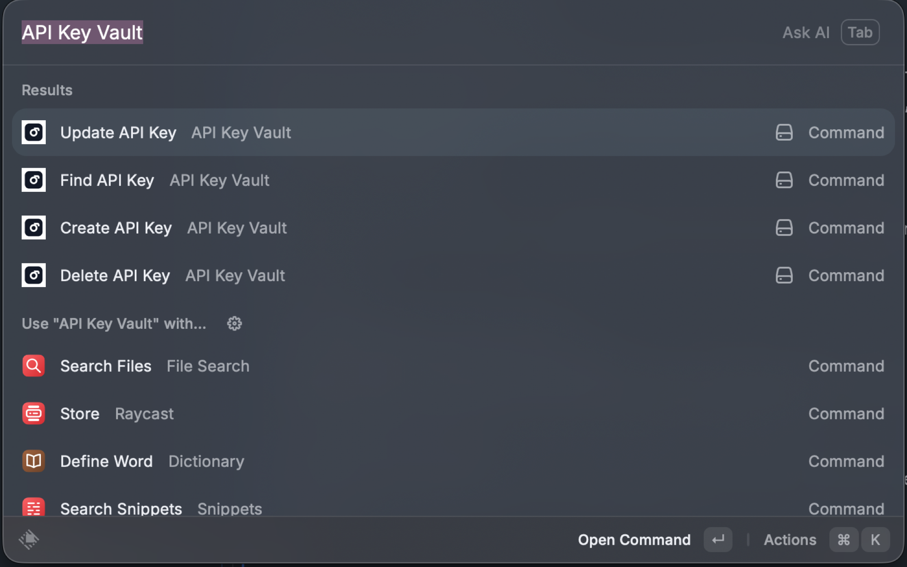
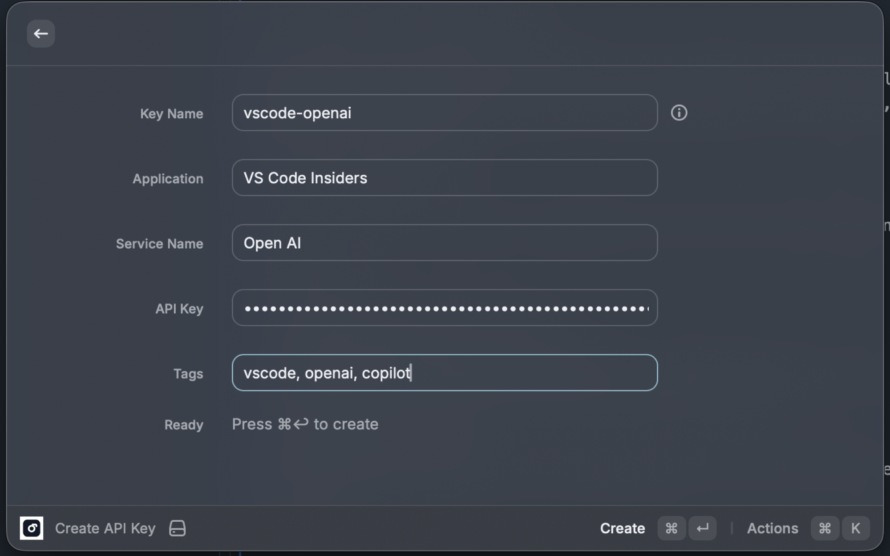
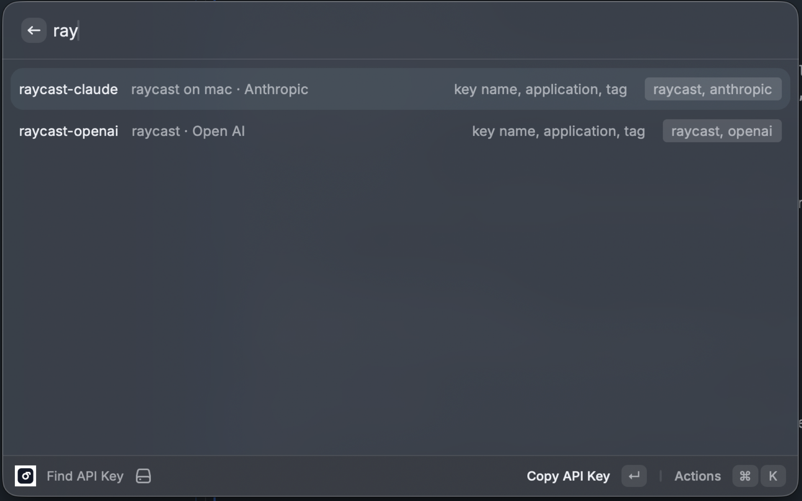

# API Key Vault

Store and retrieve API keys locally from Raycast.

## Commands

- **Find API Key**: Search by key name, tag, application, or service. Selecting an item copies the API key to the clipboard.
- **Create API Key**: Add a new API key entry.
- **Update API Key**: Select an entry (supports partial matching), then edit fields. The API key value stays unchanged unless you enter a new one.
- **Delete API Key**: Select an entry (supports partial matching), then confirm deletion.

## Screenshots

## Notes

- **Key names** are normalized to kebab-case and must be globally unique.
- **Storage**: Data is stored locally using Raycast LocalStorage.

## Sync

This extension can store data in **Raycast LocalStorage** (local-only) or in **macOS Keychain**.

- If you select **iCloud Keychain (macOS Keychain)** as the storage backend in the extension preferences, your vault should sync across Macs signed into the same Apple ID with **iCloud Keychain** enabled.
- Raycast Cloud Sync settings do not necessarily include extension LocalStorage secrets.

## Privacy

This extension stores data locally on your machine and does not send API keys over the network.
