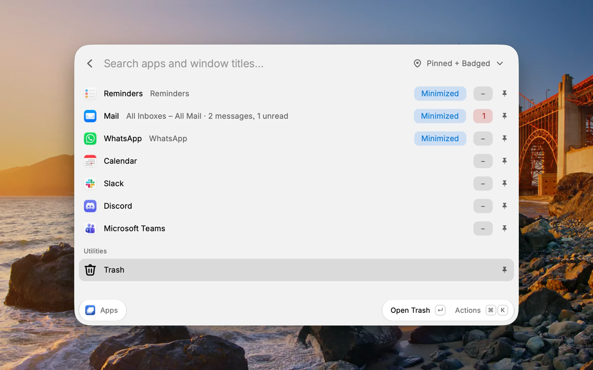
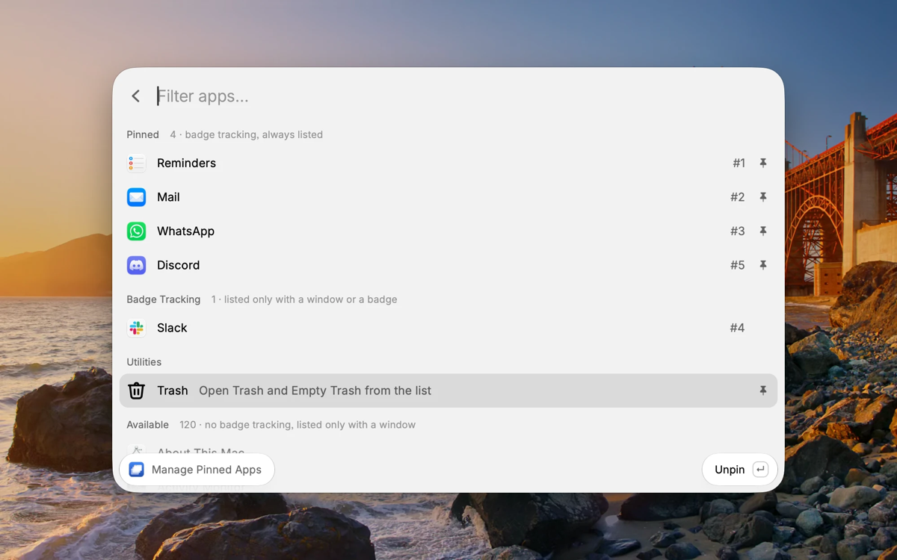
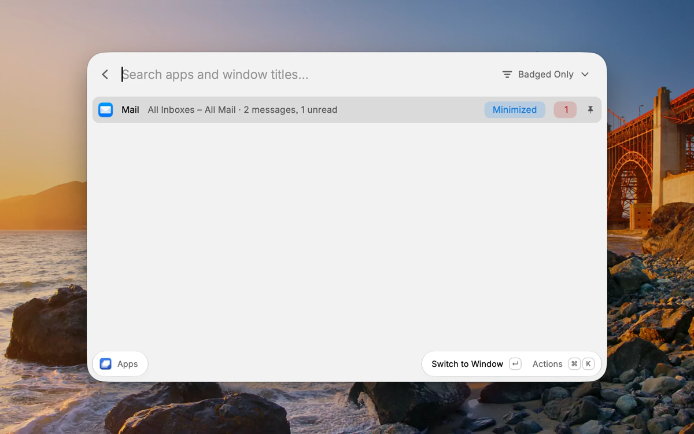

# Window Switcher & Badges

One hotkey opens a list of every running app and its windows: hidden, minimized, full screen, or on another Desktop.
Pick one and you land on that exact window. The apps you track show their Dock badges on the same rows, and pinned
apps stay in the list even with no window open, so it also works as a launcher.

Works with Raycast Free on Macs with Apple silicon. No Pro features, Screen Recording, network access, or background
process.







## Requirements

- A Mac with Apple silicon. On an Intel Mac the list shows "Requires a Mac with Apple silicon".
- Accessibility access for **Raycast** (System Settings → Privacy & Security → Accessibility; called Device Control and
  Data Access on macOS 27). The extension's helpers use Raycast's access; nothing else needs it.

Quit Raycast before turning its Accessibility access off. Turning it off while Raycast is running can freeze your
keyboard and mouse input.

## Set the hotkeys

Open Raycast Settings → Extensions → **Window Switcher & Badges** and record hotkeys for these commands:

- **Manage Apps**: your main hotkey. Every press reopens the list with a fresh window scan and badge read. **App List**
  is the screen it opens and needs no hotkey.
- **Quit Selected App** (optional): quits the app selected in the open list and keeps the list open. It also works for
  apps running without a window, such as Discord in the menu bar or Mail with its window closed. With a window row
  selected, it closes just that window and the app keeps its other windows; on the app's last window it quits the app.
  With no list open, or more than 30 seconds after your last selection, it just opens the list.
- **Quit Other Apps** (optional): quits every running app in the list except the selected one, after asking. Finder is
  never quit.
- **Manage Pinned Apps** (optional): opens the same screen as ⌘⇧C in the list.

In the list, ⌃Q and ⌃⇧Q do the same as the two quit commands. The commands exist so you can use them with Raycast's
Hyper Key, which works for command hotkeys but not for actions inside a list.

## Using it

Every press reads windows and Dock badges separately. Rows appear right away and fill in as each read finishes; if one
read fails, you still see what the other found.

**What a row shows**, left to right:

- The app icon and name, plus the window title when the row stands for one window (long titles are shortened; hover
  for the full title).
- Tags, when they apply: `N windows`, `Hidden`, `Minimized`, `k of N match` while searching, and `▸` when the app's
  windows are collapsed.
- The Dock badge, for tracked apps only: a number such as `3`; a red `•` for ten or more (hover for the count); an
  orange `•` or text for other badges; a gray `−` for no badge; or `Not in Dock`, `Not installed`, or a yellow
  `Unavailable`.
- At the far right: a pin for pinned apps, or a warning icon when windows could not be read.

**Windows.** Apps with two or more windows list them underneath (`↳ title`). Return on a window row switches to exactly
that window, even if it is minimized, hidden, or on another Desktop. Windows with the same title are numbered
(`2 of 3 with this title`). If a window has closed since the list opened, you get "That window closed" and a fresh
scan, never a different window.

**Return on an app row** switches to its only window, or to the first window listed under it (the action name says
which). On an app with collapsed windows it shows them, and on an app with no windows it opens the app.

**Search** matches every word you type against app names and window titles. Type part of a window title to narrow the
list to that window, then press Return. Typing an app's name shows that app with its windows, as in the full list. If several windows share a title, all
of them are listed (`2 of N match`) instead of one being picked for you.

**Filters** (⌘P, or ⌘⇧V to cycle):

- **All Apps** (default): every app with a window, plus tracked apps that are pinned, badged, or whose badge can't be
  read.
- **Pinned + Badged** and **Badged Only**: tracked apps only, in your order.

The list remembers your filter.

**Trash** has its own row in a **Utilities** section below the apps. Pin it (⌘.) to keep it at the end of All Apps and
Pinned + Badged; otherwise type `trash`, `empty`, or `bin` to find it there. Return opens the Trash in Finder.
**Empty Trash…** (in the ⌘K actions) always asks first, then hands off to Raycast's own Empty Trash command. Raycast
may ask too: once to let this extension run its command, and again if Raycast's own warning is on. This extension never
deletes files itself, and if Raycast's Empty Trash is turned off, nothing is erased.

**Sort** (⌘⇧S, All Apps only): **Alphabetical** (default) or **Recent in This Command**, which puts the apps you last
switched to or opened from this list first, then apps with windows on screen, then the rest alphabetically. It doesn't
track app use outside this command.

**Shortcuts in the list:**

| Keys           | Action                                                                                                |
| -------------- | ----------------------------------------------------------------------------------------------------- |
| ⌘R / ⌘⇧R / ⌘⌥R | Refresh everything / windows only / badges only                                                       |
| ⌘.             | Pin or unpin (pinning an untracked app also tracks its badge)                                         |
| ⌃Q             | Quit the selected app, or close the selected window when its app has others; the list stays open     |
| ⌃⇧Q            | Quit every other app in the list, after asking (never Finder)                                         |
| ⌥← / ⌥→        | Collapse or expand an app's windows (add ⇧ for all apps)                                              |
| ⌘⇧C            | Open Manage Pinned Apps                                                                               |
| ⌘⇧D            | Copy diagnostic info (includes window titles and badge text; kept out of Raycast's Clipboard History) |

The **Expand windows by default** preference sets whether apps start expanded.

## Manage Pinned Apps

Open it with ⌘⇧C in the list or with the **Manage Pinned Apps** command. It has four sections:

- **Pinned**: tracked apps that are always listed in All Apps and Pinned + Badged, even with no window open, so you can
  launch them from the list.
- **Badge Tracking**: apps whose Dock badge the list shows, listed only while they have a window or a badge. Tracking
  matters only for apps that show badges, like Mail, Slack, Discord, Messages, and Calendar.
- **Utilities**: the Trash row's pin.
- **Available**: every other installed app, listed only while it has a window. Select one and press Return to track it.

⌘⌥↑ and ⌘⌥↓ change the order the badge filters use, ⌘. pins or unpins, and ⌃X removes an app. Changes apply as soon
as you go back to the list.

It is a command rather than a set of preferences because Raycast preferences can't hold an ordered list.

## First run and your data

The first time it runs, the extension tracks and pins a default set of apps, where installed: Reminders, Mail,
WhatsApp, Calendar, Slack, Discord, and Microsoft Teams. Change them in Manage Pinned Apps. If you remove them all, they
stay removed. If the saved list ever can't be read, the defaults come back and a message says so.

The extension stores only its own settings in Raycast: the apps you track and pin, the Trash pin, your filter and
sort, and a short history of apps you switched to through the list (app IDs and times, at most 50). It never stores
window titles or badge values, and nothing leaves your Mac.

Uninstalling the extension in Raycast removes it and its settings. It installs nothing else: no login item and no
background process.

## How it works

Two small Swift helpers in `assets/` run on demand while the list is open, each with `execFile`, no shell, and a hard
timeout. No helper process exists while the list is closed.

| Helper                 | What it reads                                                     | Source                           | Build                                                                                               |
| ---------------------- | ----------------------------------------------------------------- | -------------------------------- | --------------------------------------------------------------------------------------------------- |
| `assets/window-helper` | Windows of running apps (Accessibility), their Desktop, and focus | `helper/window/*.swift`          | `npm run build:helper:window` (`swiftc -O -swift-version 5 -target arm64-apple-macos14`, Swift 6.4) |
| `assets/dock-badges`   | Dock items and their badge text (Accessibility)                   | `helper/badge/dock-badges.swift` | `npm run build:helper:badge` (`swiftc -O -target arm64-apple-macos14`)                              |

The source hashes are recorded in `helper/window/SOURCES.sha256` and `helper/badge/dock-badges.swift.sha256`, and
`npm test` fails if a committed binary or a Swift source differs from the recorded values. Rebuilding from these
sources with the commands above reproduced both binaries byte for byte.

**Undocumented macOS interfaces.** The window helper resolves eight undocumented symbols at runtime with `dlsym`, all
listed with their purpose in `helper/window/PrivateAPI.swift`: `_AXUIElementGetWindow` (window IDs),
`_AXUIElementCreateWithRemoteToken` (windows on other Desktops), `SLSMainConnectionID`, `SLSCopySpacesForWindows`,
`SLSCopyManagedDisplaySpaces`, `SLSManagedDisplayGetCurrentSpace` (which Desktop a window is on),
`_SLPSSetFrontProcessWithOptions` and `GetProcessForPID` (a fallback when normal activation does not bring the app
forward). The badge helper reads the Dock's undocumented `AXStatusLabel` attribute. If a future macOS removes any of
them, the affected read fails with a clear reason instead of a wrong result. AltTab and devadathanmb's Window Switcher
(both GPL) were read as documentation for these interfaces only; no code from them is included.

## Development

```bash
npm install
npm run dev         # imports the extension into Raycast
npm test            # node --test, pure logic and fake helpers (no Raycast needed)
npm run typecheck
npm run lint        # ray lint
```

`scripts/measure.sh` times the installed helpers from a terminal that has Accessibility; `scripts/count-helpers.sh`
counts helper runs with `pgrep`. `build` and `dev` never compile Swift; rebuild a helper only when its source changes.

## License

MIT. Copyright Bret Morin (`bretbuilds`).
