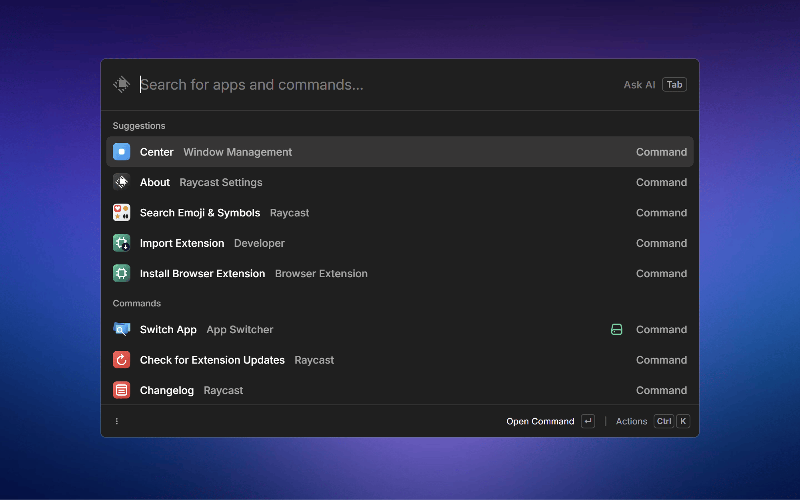

	
	<h1>App Switcher - Raycast Extension</h1>
	

		<b>Find and switch between open apps</b>
	

## Features

- **App Switching** - Find and switch to any open app
- **Smart Search** - Search by app name or window title
- **Close Apps** - Gracefully close apps
- **Desktop Filtering (PowerShell mode only)** - Filter apps by current desktop or all desktops

## Usage

1. Open Raycast and search for "App Switcher"
2. Browse or search through your open apps
3. Press `Enter` to switch to an app
4. Press `ctrl + k` for more actions

## Modes

App Switcher supports two modes of operation:

- PowerShell (Native): Runs bundled PowerShell scripts that call Win32 APIs for comprehensive window enumeration and control. This mode supports desktop-level filtering. Press `ctrl + p` to toggle between showing apps from the current desktop or all desktops.
- Raycast Window Management (API): Uses Raycast's Window Management API instead of external scripts. This mode avoids spawning PowerShell but may provide different metadata depending on Raycast's API surface.

Switch between modes with `alt + t` while in the extension.

Note: Raycast's Window Management API is under active development and may not expose the same level of detail as the native PowerShell approach.

## Platform Support

- ✅ **Windows 10/11** - Fully supported with native implementation
- 🚧 **macOS** - Support planned for future release

## Credits

This extension is inspired by:

- [PowerToys Window Walker](https://github.com/microsoft/PowerToys/tree/main/src/modules/windowwalker)
- [Switcheroo](https://github.com/kvakulo/Switcheroo)
