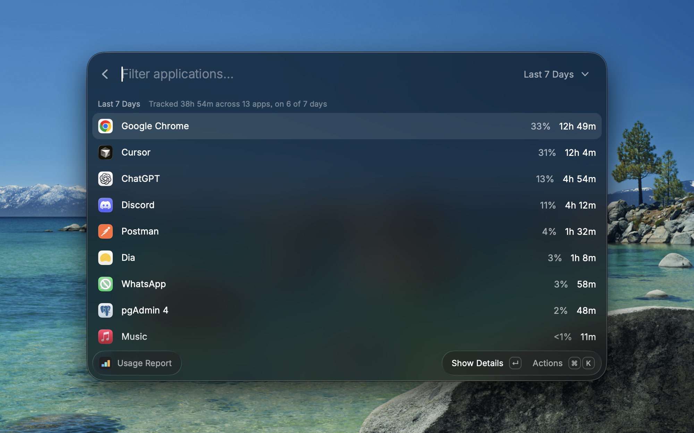
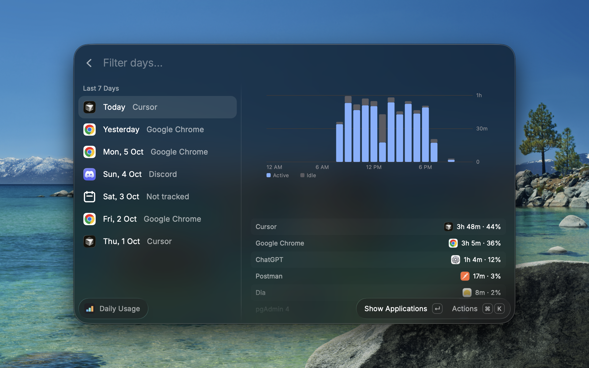
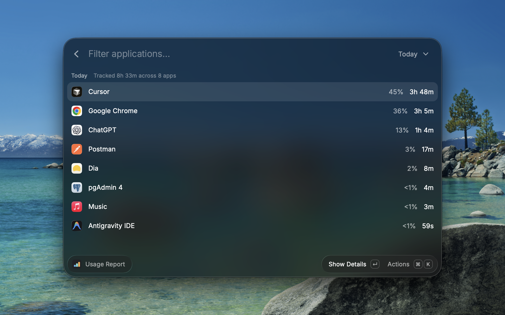
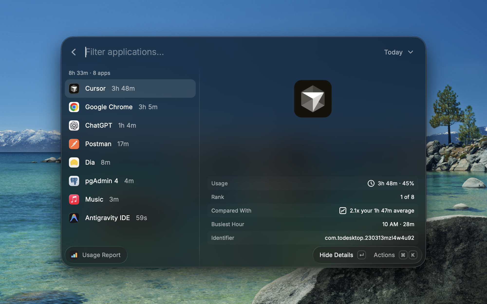

<p align="center">
  
</p>

<h1 align="center">App Usage</h1>

<p align="center">
  See your screen time and which apps you actually use.<br />
  Fully local, no account, no network.
</p>

<p align="center">
  
  
</p>

## How it works

A background command samples the focused application once a minute and writes the result
to disk. Nothing else happens: no window, no toast, no network call.

Time is attributed to the app that was focused when the sampling window opened, and idle
time is subtracted, so walking away from your desk does not inflate the numbers. Idle time
is recorded separately rather than discarded, so the report can show time at the machine
alongside time actually working.

## Getting started

Raycast leaves background commands off after a Store install, so nothing is recorded until
you do one of these:

- Open **Collect Usage** once from Raycast root search, or
- Enable **Collect Usage** in the extension's preferences.

Data appears a few minutes later. Until then, Usage Report and Daily Usage say that
tracking is off and offer a shortcut to the preferences.

## Screenshots

<table>
  <tr>
    <td width="50%">
      
      <p align="center"><sub>Three commands, right in Raycast's root search</sub></p>
    </td>
    <td width="50%">
      
      <p align="center"><sub>Daily Usage — hour-by-hour activity for any of the last 7 days</sub></p>
    </td>
  </tr>
  <tr>
    <td width="50%">
      
      <p align="center"><sub>Usage Report — every app, ranked, with total tracked time up front</sub></p>
    </td>
    <td width="50%">
      
      <p align="center"><sub>Drill into any app — rank, comparison to your average, and busiest hour</sub></p>
    </td>
  </tr>
</table>

## Privacy

1. **No network access whatsoever.** The extension makes zero HTTP requests.
2. **Application names only.** Never window titles, document names, URLs, or clipboard
   contents. Window titles would leak the contents of your work; app names do not.
3. **Local storage only.** Usage data is plain readable JSON under the extension's support
   directory, next to a cache of application icons copied out of the apps themselves.
4. **Excluded apps never hit disk.** An excluded app produces no record at all.
5. **One-action erase.** Clearing all data is a single action.
6. **Bounded retention**, 30 days by default, matching the longest range the report can show.

## Accuracy

The numbers are a good estimate, not a system-level audit. Be aware that:

- Sampling only happens while Raycast is running.
- The sample interval is one minute, so very short app switches are missed.
- Raycast schedules background commands with some tolerance to save energy, so the
  extension measures real elapsed time between ticks rather than assuming a fixed gap.

The Usage Report shows how much time it actually tracked, so you can see the coverage
rather than having to trust the total.

## Commands

| Command       | Runs                                                                                                  |
| ------------- | ----------------------------------------------------------------------------------------------------- |
| Collect Usage | Automatically, every minute in the background, once enabled (see [Getting started](#getting-started)) |
| Usage Report  | When you open it                                                                                      |
| Daily Usage   | When you open it                                                                                      |

Disabling **Collect Usage** stops all tracking.

## Development

```sh
npm install
npm test          # unit tests for the sampler and the store
npm run dev       # load into Raycast for local development
npm run build     # production build, does extra type checking
npm run lint
```

The logic in `src/core/` has no Raycast imports, so the accuracy rules are unit-testable
without a Raycast runtime.
