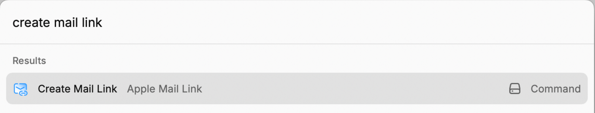

# [Apple Mail Link](https://github.com/kopach/apple-mail-link)

[Rycast](https://www.raycast.com) extension to create a link of the selected email in Apple Mail and copy it to the clipboard.

## Usage

This is useful for referencing emails in other applications. For example, you can paste the link in a task manager to reference the email in the task.

## Credits

- [John Voorhees](https://www.macstories.net/stories/generating-markdown-links-to-mail-messages-with-shortcuts-and-applescript/)
- [John Gruber](https://daringfireball.net/2007/12/message_urls_leopard_mail)
- [@sepulchra](https://github.com/sepulchra/alfred-mail-link)

## 📄 License

This software is licensed under the [Apache License 2.0](LICENSE).

## Stargazers over time

### Links

[kopach/apple-mail-link](https://github.com/kopach/apple-mail-link)
