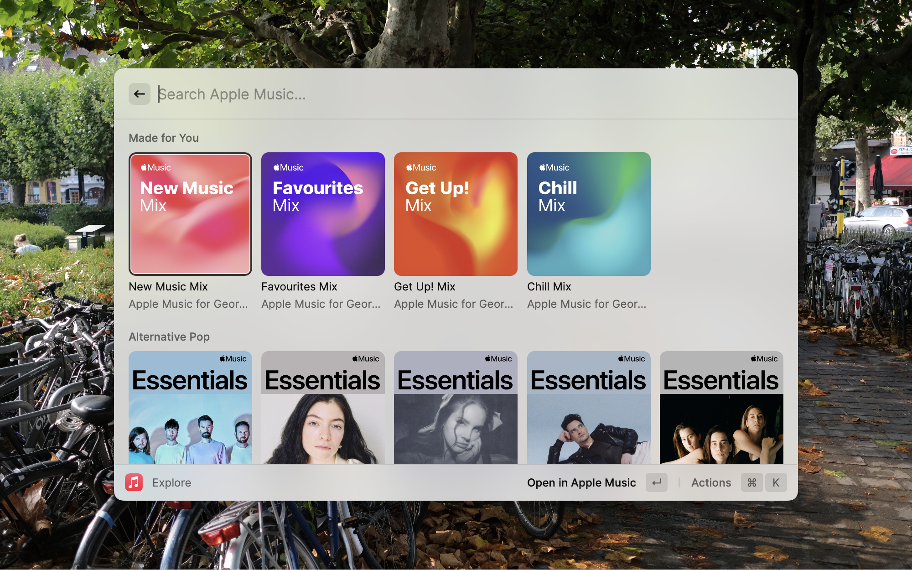
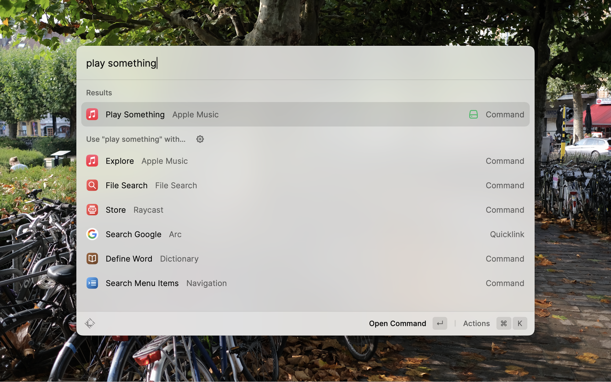

# Apple Music

A Raycast extension that allows you to explore the Apple Music catalog. Pairs nicely with the [Music Control](https://www.raycast.com/fedevitaledev/music) extension.

Log in to see your personal recommendations and listen to your personal radio station in one keystroke, or search for your favorite artists, albums, songs, and playlists.

## Explore

Shows your [personal recommendations](https://developer.apple.com/documentation/applemusicapi/get_default_recommendations) straight from Apple Music.

## Search

Search for your favorite artists, albums, songs, and playlists. Log in to see personalized results.

## Play Something

Play your personal radio station in one keystroke.