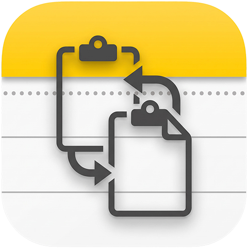

# Apple Notes Paste

Search Apple Notes, preview their contents, and paste a note into the previously active application. Your notes remain in Apple Notes, including iCloud-synced folders.

## Commands

- **Paste Apple Note** — Search and preview notes. Press Return to paste or open the selected note, according to your preference.
- **Create Apple Note** — Create a note directly in the configured default folder. The title is saved with Apple Notes' title formatting.

## Preferences

- **Default Folder** — Start searches in all notes or in a chosen Apple Notes folder.
- **Return Key Action** — Choose whether Return pastes note content or opens the note in Apple Notes.
- **Exclude First Line When Pasting** — Treat the first line as a title and omit it from pasted content. The detail view makes this explicit.

## Privacy

Apple Notes Paste reads the local Apple Notes database to populate its search list. Selecting a note loads its plain text locally; pasting sends it to the previously active application. The extension makes no application-level network requests and includes no analytics. Apple Notes and Raycast have their own synchronization and privacy policies.

Copying and pasting may put text in clipboard history. Creating a Raycast Snippet copies the note into Raycast's storage. This is a static copy: future edits in Apple Notes will not update it. Native Snippets provides keyword expansion; this extension does not monitor keystrokes.

## Setup

On first use, grant Raycast Full Disk Access when macOS asks. This permission is necessary to search Apple Notes. Choose **All Notes** or a specific folder from the dropdown in the command, or configure a default folder in the extension preferences.

Notes stored in an iCloud account are synchronized by Apple across devices signed into that same Apple Account. This extension does not manage that synchronization.

Allow Raycast to control Notes when macOS requests Automation permission. No Raycast Pro subscription is required by this extension. Notes stored only On My Mac remain local. iCloud synchronization is not a backup: deletions can propagate between devices.

## Limitations and troubleshooting

- Search matches titles and database previews, not every word of a long note. Selecting a note loads its full plain text separately.
- Pasting does not reproduce images, attachments, rich text, or table formatting.
- Protected notes must be opened and read in Apple Notes.
- The folder dropdown lists folders with indexed notes. Existing empty folders can still be entered in Default Folder for creation.
- If multiple folders have the configured name, creation stops instead of choosing an account silently. Use a unique folder name. Nested folders depend on Apple Notes' scripting support.
- After editing or syncing notes, use Refresh Notes or reopen the command.
- Apple Notes' local database format is not a public API and may change with macOS updates.

## Development

Run `npm ci` and `npm run dev` to develop locally. Before submitting changes, run `npm run lint`, `npm run build`, and `npx tsc --noEmit`. Public updates require a pull request and Raycast review.

## Credits

Based on the open-source [Apple Notes extension](https://github.com/raycast/extensions/tree/main/extensions/apple-notes), adapted for reusable text and pasting. Icon contributed by the project author. Licensed under MIT.
