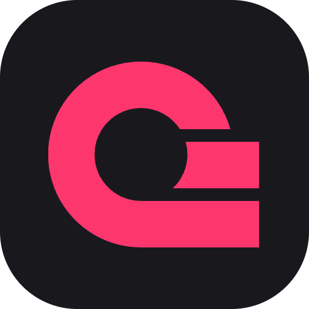

    

# Appwrite

This is a Raycast extension for [Appwrite](https://appwrite.io/) - _Build like a team of hundreds_. With this extension you can view various services in multiple Appwrite projects.

## 🤔 How It Works

Since:
    
1. there can be multiple Appwrite projects with a mix of self-hosted and hosted,
2. API keys are scoped to single projects,

...the extension allows you to add each project, securely store it via [Raycast Storage](https://developers.raycast.com/api-reference/storage), then view its serviecs. This means you can have, for example, 2 hosted Appwrite projects with different endpoints as well as multiple self-hosted projects.

## 🚀 Getting Started

1. **Install extension**: Click the `Install Extension` button in the top right of [this page](https://www.raycast.com/xmok/appwrite) OR `install` via Raycast Store

    

2. **Configure**:

    For each project you have, run the "Projects" command and add -

    - Local Name: This can be anything you want
    - Appwrite Endpoint: This will depend on your Appwrite instance e.g. "https://REGION.cloud.appwrite.io/v1" or "https://appwrite.example.com/v1"
    - Project ID - `Get` this from Project Settings
    - API Key: `Follow` instruction from [API keys - Docs - Appwrite](https://appwrite.io/docs/advanced/platform/api-keys)

---

Looking for more infra extensions? Try these:

