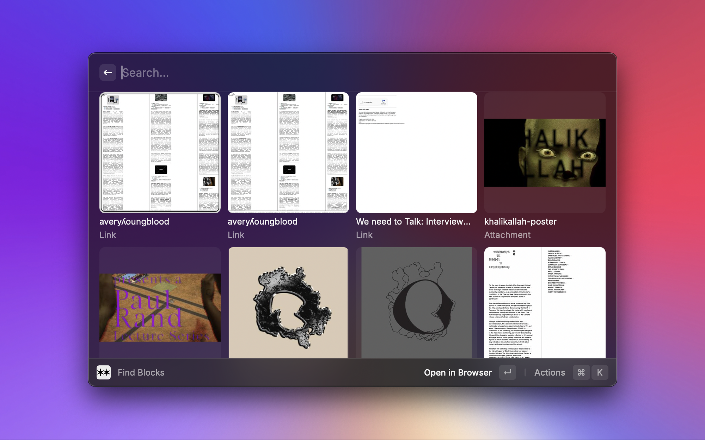
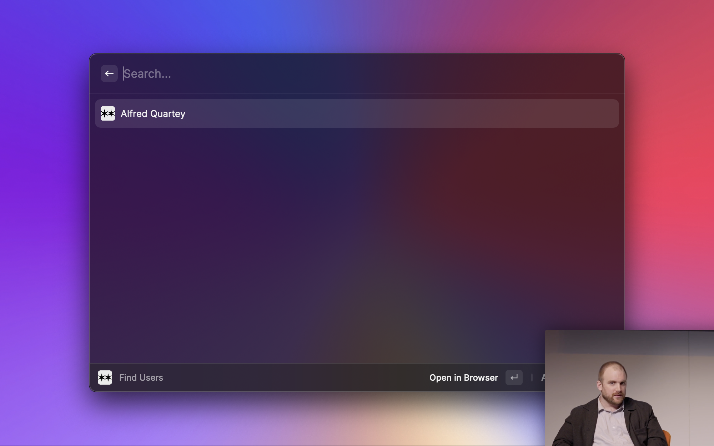
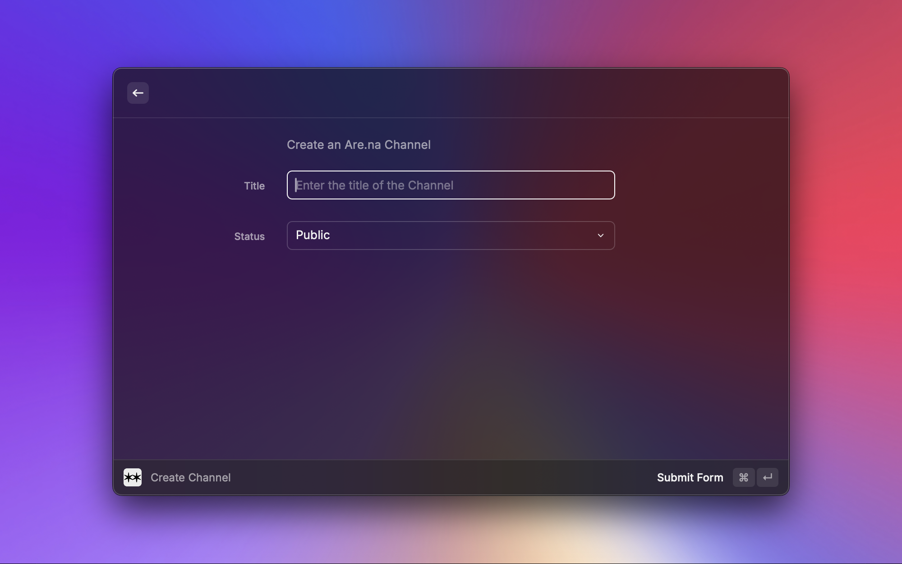
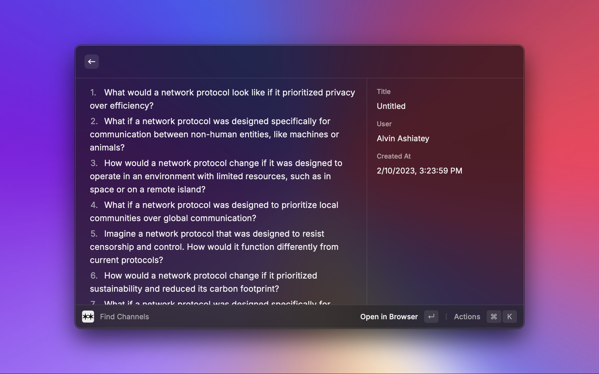
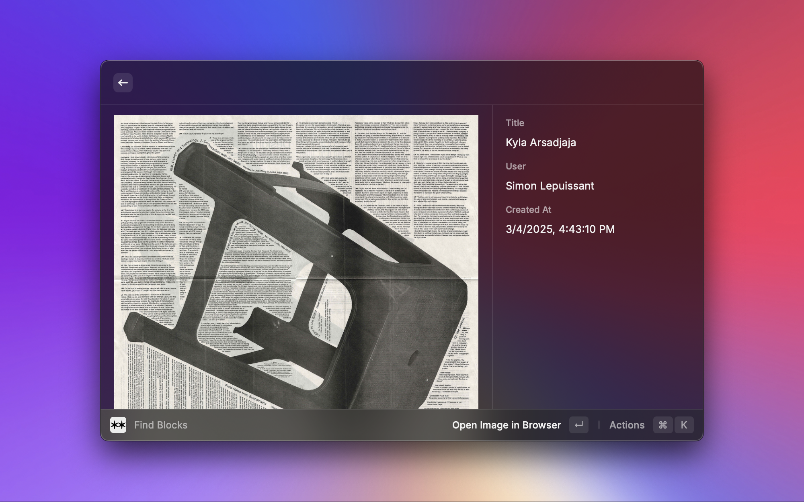
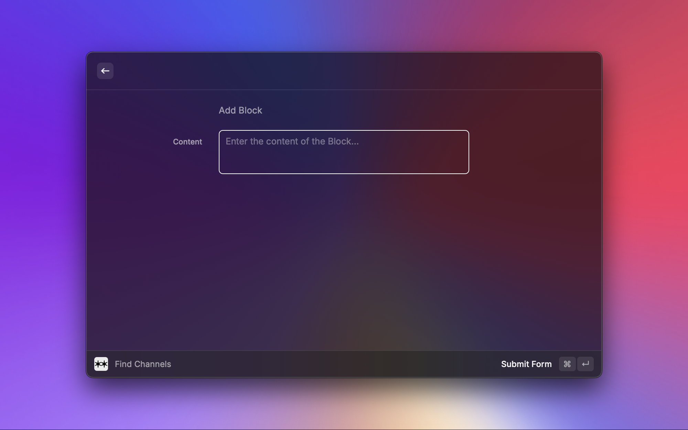

# Are.na

---

This extension allows you to interact with Are.na through raycast.

Here is a list of features currently available with this extension.

## Features

### Search for Channels on Arena

Quickly search for Are.na channels using the Search Are.na Channels command.

### Search for Blocks on Arena

Find specific blocks effortlessly with the Search Are.na Blocks command.

### Search for Users on Arena

Locate Are.na users with the Search Are.na Users command.

### Create an Arena Channel

Create new channels directly to your Are.na account using the Create Are.na Channel command.

### View Text and Image Blocks from Raycast

Easily preview text and image blocks straight from the Raycast command bar.

### Add Blocks to channels that are public

Conveniently add blocks directly to any public channel.

## Getting Started

To use this extension, you will need an Are.na `accessToken`. Follow these steps:

- Go to [Are.na Developer Applications](https://dev.are.na/oauth/applications/new).

- Create a new application to obtain your Personal Access Token.

- Enter this token in Raycast settings for the Are.na extension.

---

Developed by <a href="https://www.are.na/alvin-ashiatey/index">Alvin Ashiatey</a>.
Have feedback or questions? I'd love to chat! <a href="mailto:mail@alvinashiatey.com?subject=Raycast%20Extension">mail@alvinashiatey.com</a>

