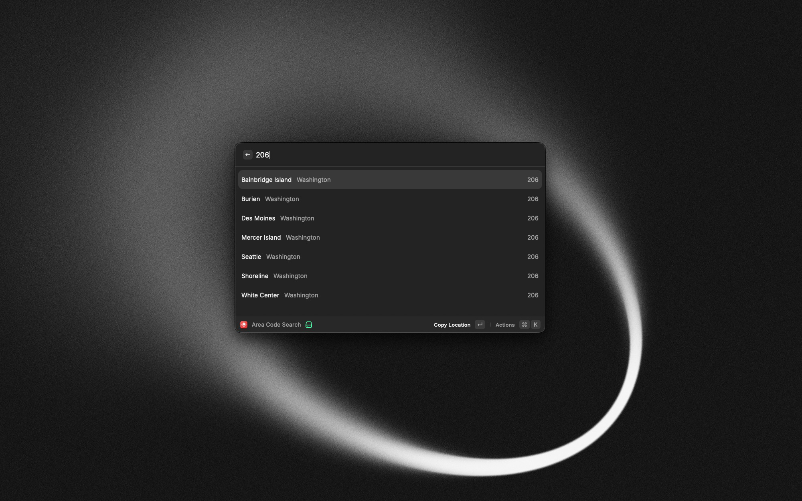
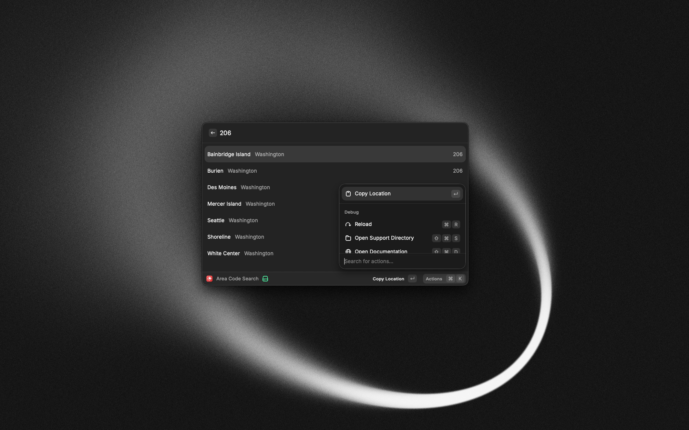

# Area Code Search

Search area codes and their corresponding locations in the United States. Find any US area code to instantly see the city and state it belongs to.

## Features

- **Fast Search**: Type any digits to instantly filter area codes
- **Comprehensive Database**: Complete database of US area codes with city and state information
- **Quick Actions**: Copy area codes or locations to clipboard with keyboard shortcuts
- **Empty States**: Helpful messages when starting a search or when no results are found

## Usage

1. Launch the extension by typing "Area Code Search" in Raycast
2. Start typing any digits (1-3 digits)
3. Browse the filtered results showing cities and states
4. Press **Enter** on any result to copy the location (city and state) to clipboard

## Use Cases

- **Unknown Callers**: Quickly identify where an incoming call is from based on the area code
- **Business Research**: Find the location associated with phone numbers for market research
- **Personal Reference**: Look up area codes before placing calls to different regions
- **Data Entry**: Quick reference while entering or validating phone numbers

## Screenshots

*Search for area codes by typing digits*

*View city and state for each area code*

*Quick action to copy location*
