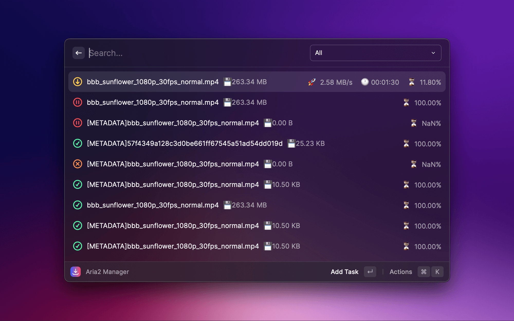

# Aria2 for Raycast Extension

   
   <h1 align="center">Aria2 for Raycast Extension</h1>
 

## 📝 Description

This Raycast extension provides functionality to manage and monitor Aria2 download tasks. With this extension, you can easily view and control your active, waiting, and stopped download tasks.

## 🚀 Features

- Display active, waiting, and stopped download tasks
- Real-time updates for download speed and remaining time of active tasks
- Show task name, file size, and progress
- Quick action buttons for easy management of download tasks (pause, resume, delete, etc.)

## 🛠️ Installation

1. Make sure you have the Raycast app installed and set up.
2. Download and install Aria2.
3. Open the Raycast Command Palette (Cmd+Shift+P).
4. Search for "Manage Extensions" and select the command.
5. In the Extensions page, search for "Aria2".
6. Click on the "Install" button to install the Aria2 extension.
7. Start using the Aria2 extension with the "aria2" command in Raycast.

## ⚙️ Configuration

Before using the extension for the first time, you need to configure the connection settings for your Aria2 server:

1. Open Raycast.
2. Enter the "aria2 config" command and press Enter.
3. Enter the WebSocket address, RPC key, and other configuration details for your Aria2 server.
4. Save the configuration and close the configuration window.

## 📖 Usage

Using the Aria2 extension is straightforward. Here are some common commands you can use:

- "aria2 active": Show active download tasks.
- "aria2 waiting": Show waiting download tasks.
- "aria2 stopped": Show stopped download tasks.
- "aria2 pause [gid]": Pause a specific task.
- "aria2 resume [gid]": Resume a specific task.
- "aria2 remove [gid]": Remove a specific task.

You can use these commands in Raycast to manage and monitor your Aria2 download tasks. The extension also provides an interactive interface for additional operations.

## 🤝 Contribution

If you encounter any issues or have suggestions for improvements, feel free to raise an Issue or submit a Pull Request. We welcome your contributions to make this extension even better! 🙌

## 📄 License

This extension is licensed under the [MIT License](https://opensource.org/licenses/MIT).

---

Welcome to the Aria2 extension for Raycast! If you have any questions or need assistance, please don't hesitate to contact us. Enjoy using the extension! 😊