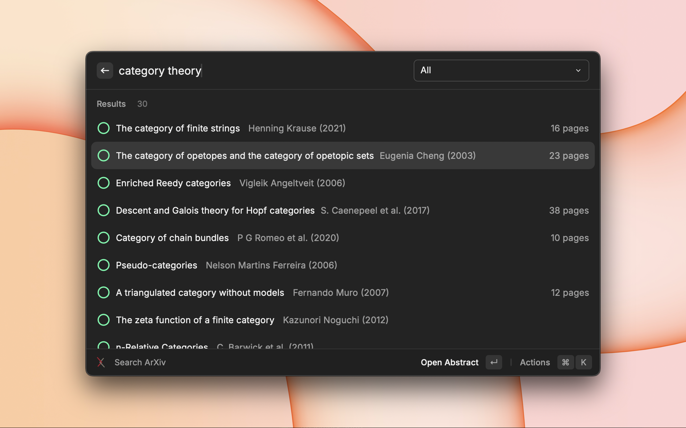

# arXiv Search for Raycast

Search arXiv papers, access multiple formats (PDF, TeX, HTML), and export citations in various academic styles.

  

## Features

- **Search arXiv papers** by title, author, or abstract
- **Filter by category**: Physics, Mathematics, Computer Science, Quantitative Biology, Quantitative Finance, Statistics, Electrical Engineering and Systems Science, and Economics
- **Publication information**: Shows journal/conference venues when papers have been published, extracts conference names from comments (e.g., "NeurIPS 2023"), and displays page counts
- **Multiple viewing formats**:
  - Abstract page
  - HTML version (via ar5iv, if available)
  - LaTeX source code
  - PDF document
- **Copy citations** in multiple formats:
  - BibTeX
  - Computer Science & Engineering: ACM, IEEE
  - Humanities: Chicago, Harvard, MLA, Turabian
  - Social Sciences: APA
- **Quick actions** to copy paper links
- **Metadata display**: Publication date, authors, categories, journal/conference venues
- **Keyboard shortcuts** for fast access to common actions

### Hovering Over Titles

When hovering over a paper title, you'll see:
1. The full citation in your selected citation style
2. The arXiv category codes (e.g., "cs.CL, cs.LG")

### Category Codes

These are standard subject classifications used by arXiv to categorize papers:

- **cs.CL**: Computer Science - Computation and Language (Natural Language Processing)
- **cs.LG**: Computer Science - Learning (Machine Learning)
- **math.CO**: Mathematics - Combinatorics
- **physics.optics**: Physics - Optics
- **q-bio.NC**: Quantitative Biology - Neurons and Cognition
- **stat.ML**: Statistics - Machine Learning

Papers can belong to multiple categories, helping researchers quickly identify the paper's subject areas. The complete list of categories is available at [arXiv Category Taxonomy](https://arxiv.org/category_taxonomy).

## Preferences

- **Search Result Info Display**: Choose what information to display on the right side of search results:
  - **Time Since Published** (default): Shows how long ago the paper was published (e.g., "3 months ago")
  - **Publication Details**: Shows venue (journal/conference) and/or page count when available; blank if neither is available

## Usage

### Search Papers
1. Open Raycast and search for "Search ArXiv"
2. Type your search query (title, author, or abstract keywords)
3. Optionally filter by category using the dropdown
4. Select a paper from the results
5. Use the available actions with keyboard shortcuts:
   - **Open Abstract** (⌘⏎)
   - **Open HTML** if available (⌘H)
   - **Download LaTeX Source** (⌘T)
   - **Open PDF** (⌘D)
   - **Copy Abstract Link** (⌘⌥L)
   - **Copy PDF Link** (⌘⇧L)
   - **Copy BibTeX** (⌘B)
   - **Copy Citation** in selected style (⌘C)
   - **Select Citation Style** (⌘S)

### Select Citation Style
1. Open Raycast and search for "Select Citation Style"
2. Browse available citation formats organized by discipline
3. Select your preferred default citation style
4. This preference will be remembered and used when copying citations from search results

## Acknowledgments

Thank you to arXiv for use of its open access interoperability.
This project is not affiliated with arXiv.
