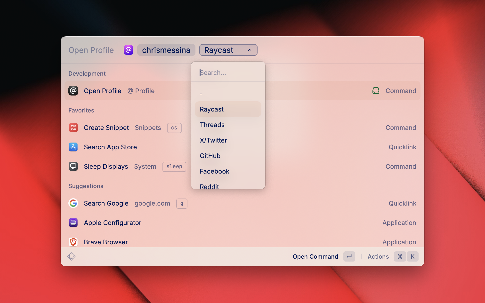

# @ Profile

Quickly visit social profiles. Access a history of the profiles you visit and add your favorite social apps.



## Features

- **Open Profile Command**: Quickly open profiles across multiple social apps
- Support for profiles, handles, and profile IDs
- **Manage Apps Command**: Add and remove custom social apps

Includes support for major social apps:

- X, Instagram, LinkedIn, GitHub, Reddit, YouTube, and more

## Usage

### Quickly Open Profile

1. Use the "Quick Open" command
2. Enter a Profile identifier
3. Select your desired app from the dropdown
4. Press Enter to open the profile in your browser

### Open Profile

1. Use the "Open Profile" command
2. Enter a Profile identifier
3. Select your desired app from the __dynamic dropdown
4. Press Enter to open the profile in your browser

## Managing Apps

1. Use the "Manage Apps" command to access the management interface
2. **Default Social Apps**: Toggle built-in apps on/off
3. **Custom Social Apps**: Add, edit, or remove your custom apps
4. **YAML Settings**: Export/import your configuration for backup or sharing

### Adding Custom Apps

1. In the "Manage Apps" command, select "Add Custom Social App"
2. Fill in the app details:
   - **Name**: Display name for the app
   - **URL Template**: Template with `{profile}` placeholder (e.g., `https://example.com/user/{profile}`)
3. Save and the app will be immediately available

### YAML Configuration

Export your settings to YAML format for:

- Backing up your custom apps
- Sharing configurations with team members
- Version control of your app settings

## Development

### Architecture

The extension now uses a dynamic app system:

- App data is managed through `src/types/default-apps.ts`
- Custom apps are stored using Raycast's local storage
- App settings (enabled/disabled) are persisted separately

### Adding Built-in Apps

To add new default apps, edit `src/types/default-apps.ts`:

```typescript
export const defaultApps: App[] = [
  // ... existing apps
  {
    name: "New App",
    value: "newapp",
    urlTemplate: "https://newapp.com/{profile}"
  }
];
```

### File Structure

- `src/quick-open.tsx` - Quick open interface (no-view)
- `src/open-profile.tsx` - Open profile interface
- `src/history.tsx` - Profile History
- `src/types/default-apps.ts` - Default app definitions and utilities
- `src/manage-apps.tsx` - App Management
- `src/import-apps.tsx` - Import Apps
- `src/export-apps.tsx` - Export Apps
- `src/yaml-settings.ts` - YAML import/export functionality
- `src/utils/custom-app-utils.ts` - Custom app utilities and storage helpers
