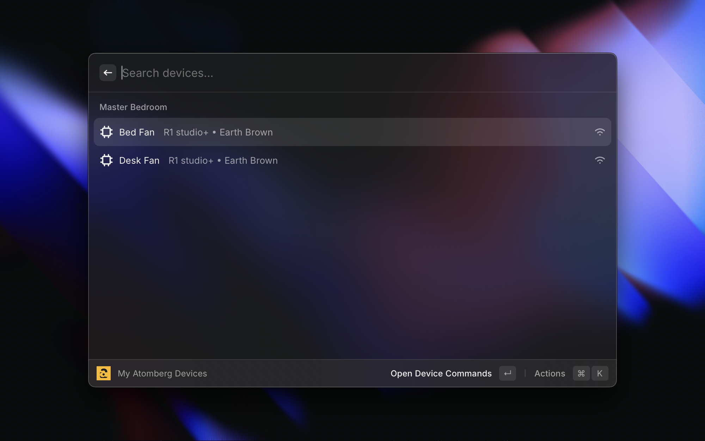
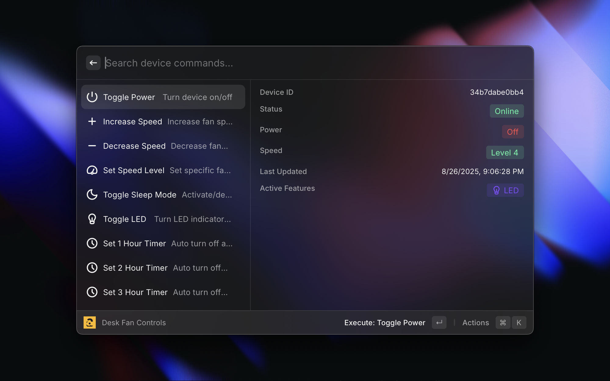
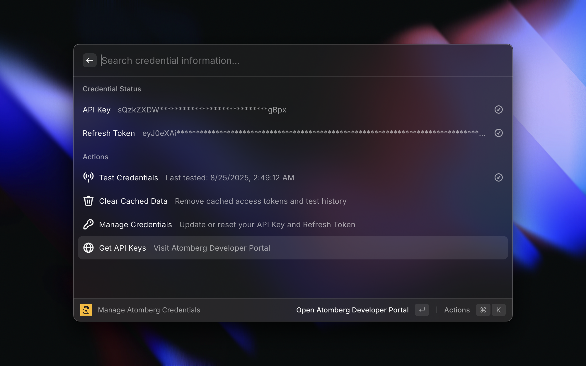

# Atomberg Smart Home

Control your Atomberg smart appliances directly from Raycast with ease and security.

> [!NOTE]
> This is an unofficial extension not affiliated with Atomberg Technologies.

## metadata

### Video

https://github.com/user-attachments/assets/a4d04adb-0e76-4fec-8e0b-5079610fc722

### Screenshots

## Features

- **Device Management**: View and control all your Atomberg smart fans and appliances
- **Speed Control**: Adjust fan speeds and settings remotely
- **Timer Management**: Set timers for your appliances
- **Secure Authentication**: Uses your official Atomberg API credentials
- **Quick Access**: Control your devices without opening the Atomberg app

## Tested On

> [!WARNING]
> This extension is not tested on all Atomberg appliances. If you encounter any issues, please create an issue on this GitHub repository. If it works for you, please let me know so I can add it to the list.

- [Atomberg Studio+ R1 Ceiling Fan](https://atomberg.com/atomberg-studio-plus-bldc-motor-with-remote-3-blade-ceiling-fan)

## Setup

### 1. Get Your API Credentials

1. Visit the [Atomberg Home Public APIs Portal](https://developer.atomberg-iot.com/#overview) to understand how to get your API credentials

> [!IMPORTANT]
> This extension requires valid Atomberg API credentials to function. Make sure to keep your credentials secure and never share them publicly.

### 2. Configure the Extension

1. Open Raycast and search for "Manage Atomberg Credentials"
2. Enter your API Key and Refresh Token
3. The extension will automatically authenticate with Atomberg

### 3. Start Using

1. Search for "My Atomberg Devices" in Raycast
2. View all your connected appliances
3. Control speeds, set timers, and manage your devices

## Commands

- **My Atomberg Devices**: View and control all your Atomberg appliances
- **Manage Atomberg Credentials**: Update your API credentials when needed

## Requirements

- Atomberg smart appliances (fans, lights, etc.)
- Valid Atomberg account
- API Key and Refresh Token from the developer portal

## Privacy & Security

- Your credentials are stored securely in Raycast preferences
- No data is sent to third-party services
- All communication goes directly to Atomberg's official API
- Your credentials are encrypted and stored locally

## Troubleshooting

### Authentication Issues

- Verify your API Key and Refresh Token are correct
- Ensure your Atomberg account is active
- Check if your API credentials have expired

### Device Not Showing

- Make sure your device is connected to the Atomberg app
- Verify the device is online and accessible
- Try refreshing the device list

### Performance Issues

- Check your internet connection
- Ensure your Atomberg appliances are online
- Try restarting the extension

## Support

If you encounter any issues:

1. Check the troubleshooting section above
2. Verify your API credentials are correct
3. Ensure your devices are online
4. Create an issue on this GitHub repository if the issue persists

## Privacy Policy

This extension only communicates with Atomberg's official API using your provided credentials. No personal data is collected, stored, or transmitted to any third-party services.
