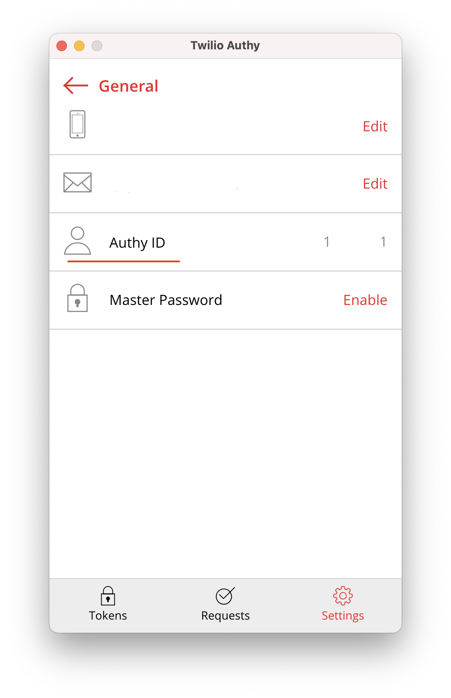
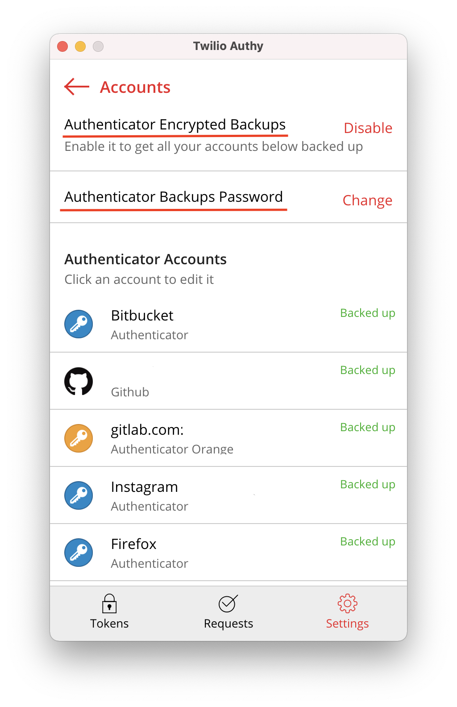

# Raycast Authy integration

----------

Warning: This extension is using Authy private api and may not compliant with the Terms of Service of Authy. Use at your own risk.

----------

## Setup
Required parameters is Authy Id and Backup Password you can get it from Authy App.

To get your Authy Apps and 3rd party Services inside the Raycast. You should enable backups
