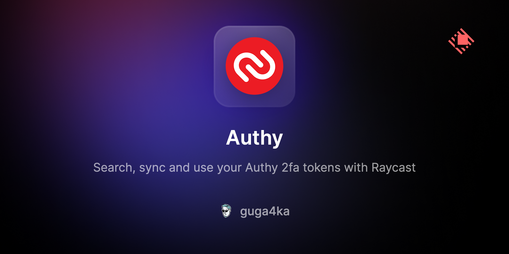
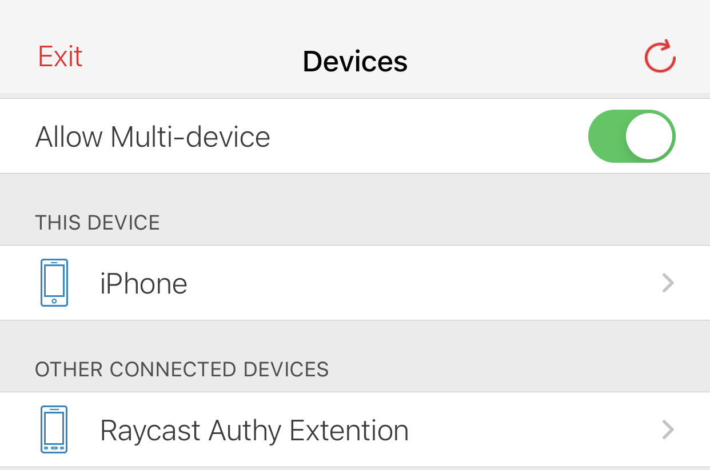
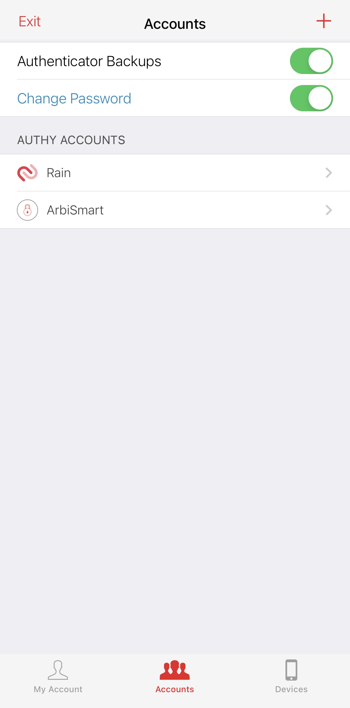
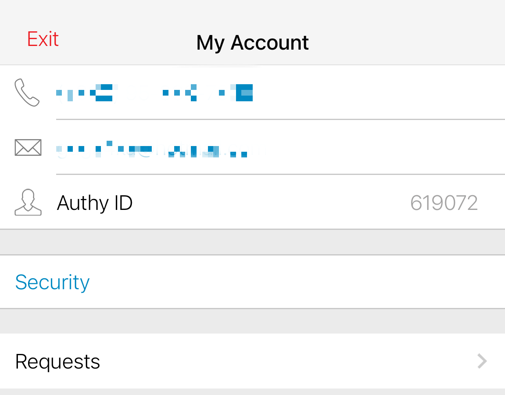
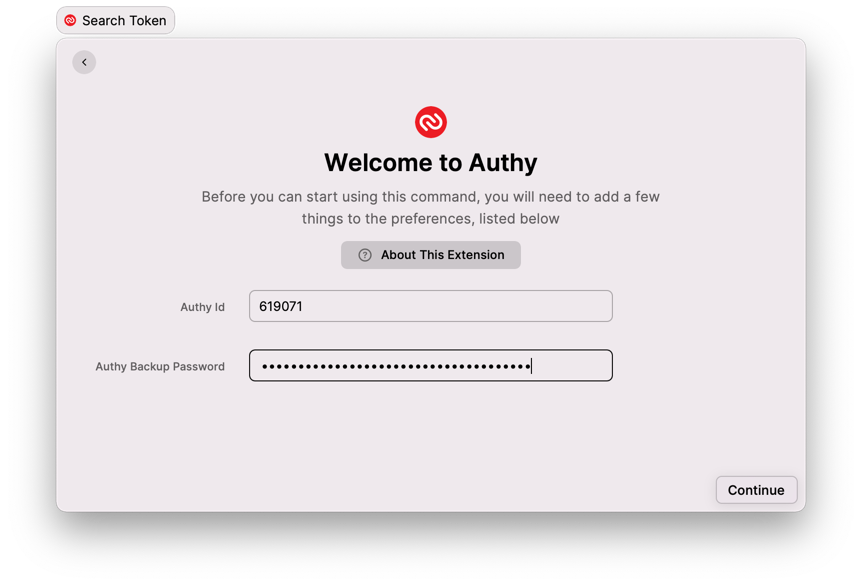

---

Warning: This extension is using Authy private api and may not compliant with the Terms of Service of Authy. Use at your own risk.

---

# Extension current state
Due to changes in the Authy API, new installation onboarding is currently impossible. I recommend exporting your extension data to enable migration to other 2FA apps.

## Setup

Pre-requirements:
1. Enable _Allow Multi-device_ option to allow extension to connect to your account.  
   
 
Screenshot
  

2. Enable _Authenticator Backups_ to get your data synced. Set your backup password.
   
 
Screenshot
  

3. You can find _Authy Id_ in the settings main tab.
   
 
Screenshot
  

### Q&A

Q: I got too many attempts error

A: This should be really rarely error, please wait a time mentioned in error and try again

Q: I've added a new account in the Authy App, but it's missing in the extension

A: Try to refresh the extension data `cmd + r`

Q: I got my token damaged error during refresh

A: Try a few time, in case problem hasn't been resolved try to re-install extension, any way all synced services should work fine

Q: I got `corrupted` OTP for some of my records

A: That means the extension couldn't decrypt your OTP, pls submit a [GitHub issue](https://github.com/raycast/extensions/issues/new/choose) for Authy extension. 

Q: I got `corrupted` OTP for ALL of my records

A: That means the extension couldn't decrypt any of your OTPs, The likely cause is that your Authy Backup Password is incorrect. Please check or reset the password.

Q: Can I export data that using by the extension?

A: Yes. Use Export Tokens action (⌘ + K ⇒ ⌘ + E on any of OTPs) 