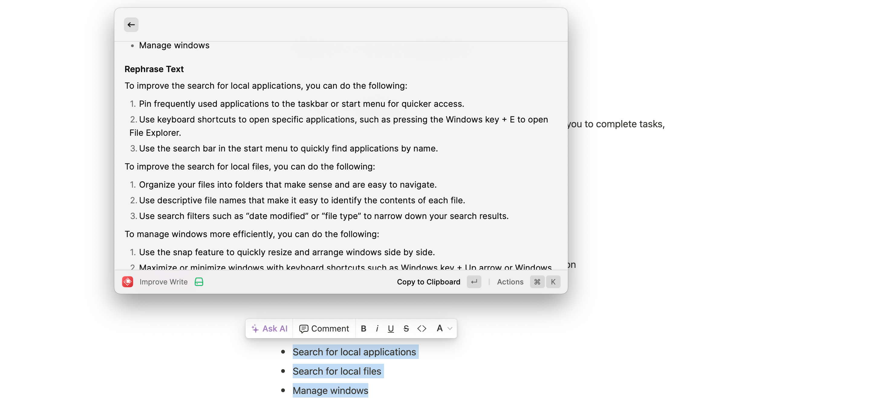
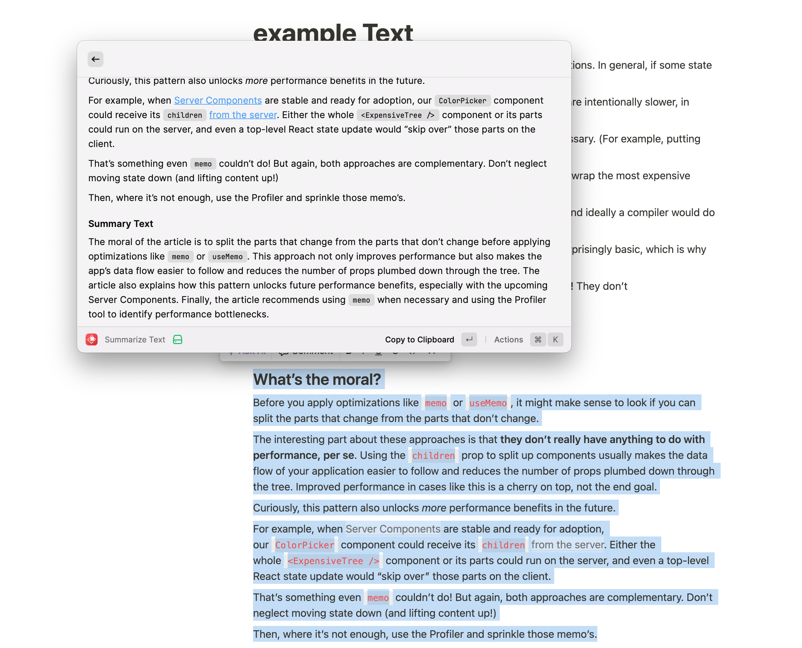
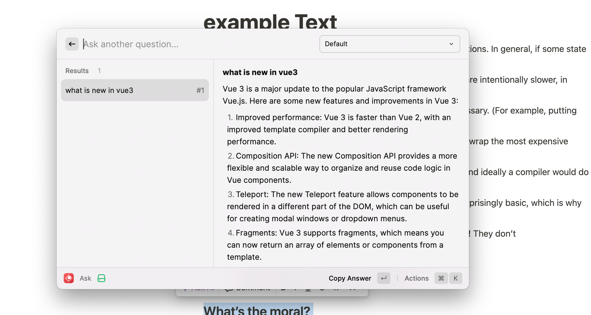

# auto-work

# Motivation

- Clear and concise writing, Attention to detail
- Collaborative approach to work
- Adaptable and flexible mindset
- Time management and prioritization skills
- Strong work ethic and dedication to meeting deadlines
- Continuous learning and improvement mindset.

# Feature

- Improve write
- Summary text
- Ask question an get answer

# Technical solutions

- Tech stack: react + openai  + @raycast/api  + axios;

# How to use 

- Input your openai key

### Improve write
- Select or copy text from anywhere
- Use improve write to rewrite your choose text
- Click enter to parse the text to the clipboard.

### Summary text
- Select or copy text from anywhere.
- Use summary text to get a summary of the text.
- Click enter to parse the text to the clipboard.

### Ask question
- Input your question
- Use ask question mode get answer
- Click enter to parse the text to the clipboard.

