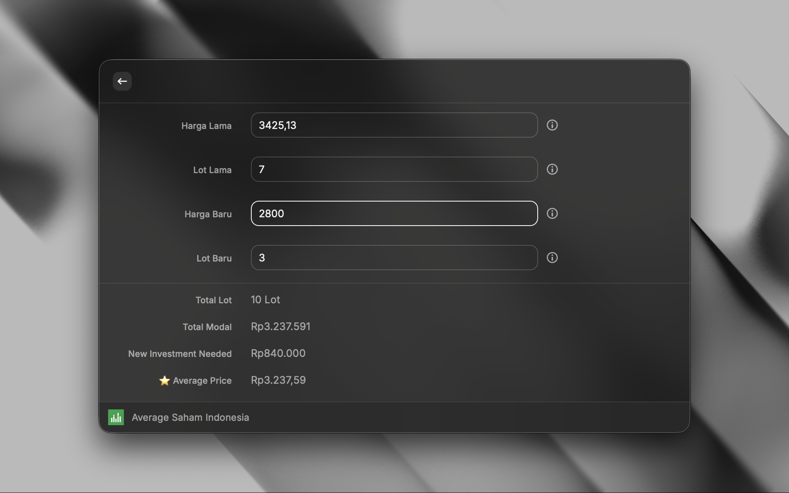

# Average Saham Indonesia

A simple and fast [Raycast](https://raycast.com) extension for Indonesian stock investors to calculate their new average stock price (Average Up / Average Down) — instantly, right from Raycast.

## What is this?

Average Saham Indonesia solves one problem really well:

> "I want to know my new average price after buying additional shares."

No login. No internet connection. No portfolio tracking (yet). Just type in your existing position and your new purchase, and get your new average price instantly as you type.

Calculations follow the Bursa Efek Indonesia (IDX) standard: **1 Lot = 100 Shares**.

## Features

- ⚡️ Instant, real-time calculation — no submit button, no loading state
- 🇮🇩 Indonesian-first UI (Harga Lama, Lot Lama, Harga Baru, Lot Baru)
- 🧮 Accurate average price (Average Up / Average Down) calculation
- 🔒 100% offline — no network requests, no accounts, no tracking
- ⌨️ Keyboard-first, minimal UI

## Screenshots



## Installation

This extension isn't published to the Raycast Store yet. To run it locally:

1. Clone this repository
2. Install dependencies
   ```sh
   npm install
   ```
3. Start it in development mode
   ```sh
   npm run dev
   ```
4. Open Raycast and search for **Average Saham Indonesia**

## Usage

1. Open Raycast and search for `Average Saham Indonesia`
2. Fill in the form:
   - **Harga Lama** — your previous average buy price
   - **Lot Lama** — how many lots you already own
   - **Harga Baru** — the price of your new purchase
   - **Lot Baru** — how many lots you're buying now
3. Read your result instantly:
   - **Total Lot** — your total lot holding after this purchase
   - **Total Modal** — your total capital invested
   - **New Investment Needed** — cash required for the new purchase alone
   - **Average Price** — your new average price (Average Up / Average Down)

### Example

| Field      | Value  |
| ---------- | ------ |
| Harga Lama | 106.97 |
| Lot Lama   | 15     |
| Harga Baru | 80     |
| Lot Baru   | 10     |

Result:

```
Total Lot               25 Lot
Total Modal             Rp240.455
New Investment Needed   Rp80.000
Average Price           Rp96,18
```

## Formula

```
Old Shares = Old Lot × 100
New Shares = New Lot × 100

Old Investment = Old Price × Old Shares
New Investment = New Price × New Shares

Total Investment = Old Investment + New Investment
Total Shares     = Old Shares + New Shares

Average Price = Total Investment / Total Shares
```

## Project Structure

```
├── assets/
│   └── icon.png
├── src/
│   ├── average.tsx          # Form, validation, state, live calculation
│   ├── components/
│   │   └── Result.tsx       # Renders Total Lot / Total Modal / New Investment / Average Price
│   ├── utils/
│   │   ├── calculator.ts    # Pure calculation logic
│   │   └── formatter.ts     # Rupiah / lot / price formatting
│   └── types.ts
├── package.json
└── tsconfig.json
```

## Roadmap

This is the Version 1 (MVP) release: a focused, single-purpose calculator. Upcoming features:

- Copy result (`⌘C`), reset form (`⌘R`)
- Multiple buy calculator with an editable transaction list
- Average Down planner (how many lots to reach a target average)
- Profit target & break-even calculator (with fees)
- Stock symbol + calculation history
- Portfolio mode & summary
- Average Up / Down simulator with interactive planning
- Import/export portfolio (CSV/JSON)
- Dividend & yield calculator
- Complete Indonesian investor toolkit

## Tech Stack

- [Raycast API](https://developers.raycast.com)
- React + TypeScript
- Node.js

## License

MIT
