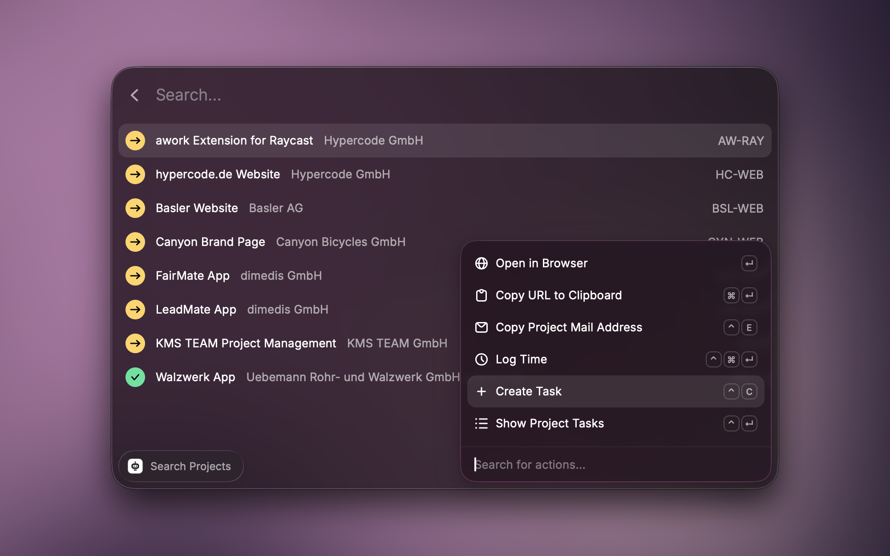
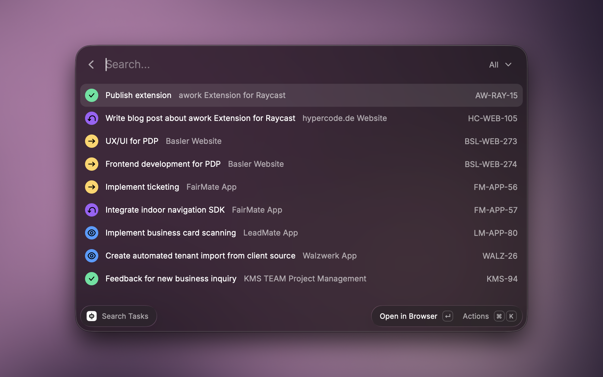
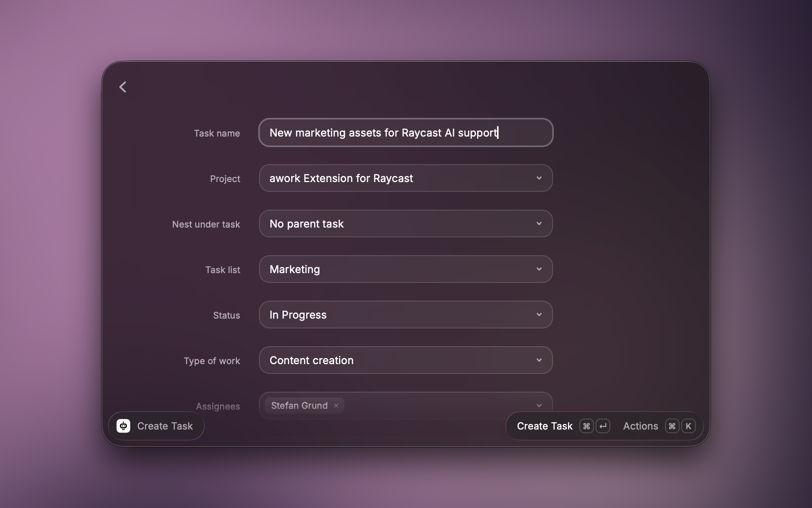
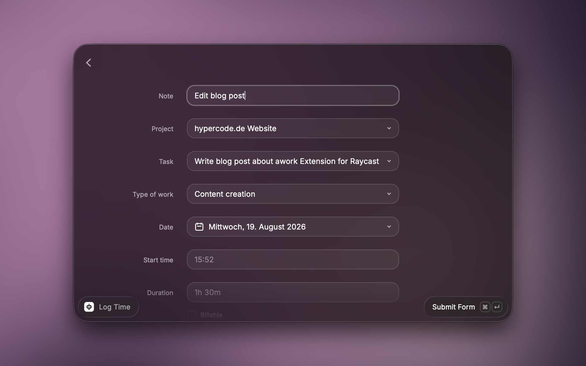

# awork for Raycast

This is a Raycast extension with commands for the work management platform [awork](https://www.awork.com/).

## Installation & Authorization

To use this extension you need to add an API client to awork. You can add this under "(Workspace) Settings / Integrations / API clients" and you may need admin rights. However, the users of the extension will only be able to see/access the projects that they are individually allowed to see in your workspace.

Please enter something like:

- Name: `awork Extension for Raycast`
- Client ID: `raycast-awork-extension`
- Redirect URI: `https://raycast.com/redirect?packageName=Extension` (hit the "+")

Then copy/save the generated new client secret.

After installing the extension from the Raycast store, you'll need to enter your _client ID_ and _client secret_. You will be prompted to login on an awork login page, which will then redirect you back to Raycast. That's it.

## Commands

### Search Projects

Browse/search your projects by project or client name.

The following actions are available:

- Open in Browser `⏎`
- Copy URL to Clipboard `⌘⏎`
- Copy Project Mail Address `⌃E`
- Log Time `⌃⌘⏎`
- Create Task `⌃C`
- Show Project Tasks `⌃⏎`

### Search Tasks

Browse/search your tasks and optionally filter them by project.

The following actions are available:

- Open in Browser `⏎`
- Copy URL to Clipboard `⌘⏎`
- Edit Task `⌃E`
- Create Subtask (if available) `⌃C`
- Copy Task ID `⌃I`
- Log Time `⌃⌘⏎`

### Create Task / Edit Task

Create project or private tasks without leaving Raycast, either with the Create Task command or with `⌃C` in the
project search, which prefills the selected project. In the task search, `⌃C` creates a subtask of the selected task
and `⌃E` opens it prefilled for editing.

Tasks without a project are created as private tasks. Selecting a project enables parent-task and task-list selection,
workflow-specific statuses, and assignees. All tasks support type of work, description, start and due dates, planned
effort, and priority.

Press `⌘⏎` to save the task or `⌘⇧⏎` to save it and open it in the browser.

### Log Time

Log time for a task or project right in Raycast. Press `⌘⏎` to submit.

### Raycast AI

Use `@awork` to search projects and tasks, log time, or create and edit project and private tasks in natural language.
Raycast AI can resolve project task statuses, task lists, assignable project members, and other task details. Creating
or editing a task always shows a confirmation with the requested details before anything is written to awork.

## Credits

The awork Extension for Raycast was developed by [Hypercode](https://hypercode.de/), a digital product studio based in Cologne, Germany.

## Disclaimer

This project is not affiliated with, associated with, authorized by, endorsed by, or in any way officially related to awork. The official awork website can be found at https://www.awork.com/. "awork" and related names, marks, emblems and images are registered trademarks of their respective owners.
